# verification-report.md — PHASEWALK（四相行者）可玩性文档

## v0.3 相位陷阱（M3 对抗式切相，2026-08-15）✅ — 相锁区 + 逆相栅

**机制**：`Trap` 类型（`phase_lock`/`phase_fence`）+ `LayerData.traps` + `simulation/traps.ts`。`resolveTraps` 作为 `step()` 的**前置步**（不动既有步骤序列）——相锁区内 `switchPhase` 请求被取消；逆相栅在 `collision.ts` 按 `t.phase !== player.phase` 门控为实心墙（只放行本相）。F3 息井教学两处：井口相锁区（进井前切气相）+ 井道气栅（气相无实形穿过）。

**渲染**：`SceneManager.buildTraps()` — 相锁区 = 琥珀半透明笼（`#c9a227` 0.16 + `#e0b84a` 边线）；逆相栅 = 相纸半透明墙（`PHASE_PALETTE[t.phase].paper` 0.34 + 墨线）。teardown 与 rebuild 已接线。

**HUD**：`isPhaseLocked` → 「相锁区 · 此处无法切相」；附近逆相栅 → 「逆相栅 · 只有X能穿过」。

**验证**：headless 断言 4/4（相锁区内锁切相 / 区外可切；逆相栅挡固 / 放行液）· `tsc --noEmit` 0 error · `npm run build` green。

## v0.4 相灵守层者（M3 boss，2026-08-15）✅ — 追踪开火守门眼 ×4

**机制**：`Emitter.boss?: boolean` + `gateOpen()` 要求无存活守层者（≥3 相尘 AND 反射摧毁）。每个守层者 = 该层相反面：F1 石翁/固、F2 流姬/液、F3 息童/气、F4 焰司/焰；`aim: 'player'` 追踪开火。战斗 = 相位解谜的对抗版（boss 出题开火、玩家切焰相解题），非数值对砍。F5 相核室无 boss。

**渲染**：`buildEmitters()` 区分 boss 眼——更大暗红体（`#3c1f2a`）+ 猩红虹膜（`#e5534b`）+ 更宽环。

**HUD**：近 boss →「相灵守层者 · 切焰相反射子弹摧毁它」；集齐 3 相尘但 boss 未除 →「守层者还在守门 · 切焰相反射子弹摧毁它」（替换原「金门已开」误示）。

**验证**：headless 断言 4/4（活 boss 挡门 / 摧毁开门 / 无 boss 层兼容 / 相尘仍必需）· `tsc --noEmit` 0 error · `npm run build` green。

## v4.1 打磨轮（2026-08-15）✅ — correctness + visual + perf + determinism

**正确性**：切相队列在强制重置（死亡 / 重开 / 登层 / 打散 / 换层）后清空（`InputManager.clearQueuedInput`），杜绝"重生瞬间重放冷却期排队的相请求"造成的虚假 min-switch；`layer_intro` 跳跃开始不再顺带触发首帧跳跃；死亡 / 打散 / 重开 / 登层后 `lastPhase` 重同步（消除虚假切换音）；删除死状态 `introT` / `INTRO_DURATION`（types / constants / phasePhysics / GameSim 全链路）。

**视觉**：幽灵层 −40% 饱和度改作用于 `material.color`（r185 只采样 ramp R 通道作标量步进，原"ramp 预降"无效）；相尘 shard 补 4 阶 gradientMap + 幽灵降饱和 + 描边 1.15→1.03；玩家头部补相位 gradientMap（`setPhase` 同步换 ramp）；共享调参抽到 `constants.ts`（`GHOST_ALPHA` / `GHOST_DESAT` / `OUTLINE_SCALE`）。

**性能 / 确定性**：`__perf` 帧时环缓冲（60fps 验证门）；结算屏显示历史最少切相（`bestSwitches` 求和）；雷云云团改种子 PRNG（`mulberry32` 按 hazard id 播种）→ 场景逐层可复现。

**验证**：`tsc --noEmit` 0 error + `npm run build` green。

## v4.2 打磨轮 2（2026-08-15）✅ — 6 项对抗性审查修复

**正确性（2）**：
- `layer_clear` 不再被残留 Space 跳过——`clearQueuedInput` 现同时清空 `pressed` 边沿集，且进门（gate→结算）时调用，玩家按一次跳（Space）不再导致结算屏一帧即自动进入下一层。
- 「最佳切相」改为读取 `bestSwitches[末层]`（= 累计到塔顶的最少切相），不再把 5 个累计前缀相加——原先虚高 3–5×。

**性能（1）**：`SceneManager.rebuild()` 现 dispose 旧层的几何体与 per-floor 材质（共享相材质/子弹几何+材质/ramp/纸纹跳过），跨层推进与整塔重开不再单调泄漏 GPU 显存。

**文档（3）**：
- art-direction §3.2：无相区（致命）灰白 `#cfcfd4` → 玫红 `#b0556a`（出生点安全灰斑保留 `#cfcfd4`），回写冻结调色板契约。
- JOURNEY：sfx 配方计数 10 → 14（补 jump/burst/land/shot）。
- TDD §4：补 `SHARD_COLLECT_RADIUS 0.7` 与 `BULLET_STAGE_MARGIN 3` 到冻结数值表。

**验证**：`tsc --noEmit` 0 error + `npm run build` green。

## v4.3 打磨轮 3（2026-08-15）✅ — R 重生语义 + boss 提示 + 死字段清理

**正确性（1）**：`restartLayer`（按 R 重置当前层）不再清零 run 级累计——`switches`/`deaths`/`phaseDust`/`elapsed` 现跨层保留（与 `advanceLayer` 一致）。原实现经 `createInitialState` 把死亡数与切相数一并归零：死亡数被抹除，且进门前按 R 可把 min-switch 分数清零（分数漏洞）。

**UX（2）**：
- HUD：集齐 2 枚相尘的提示在 boss 层（F1–F4）现读作「再集 1 枚，并除守层者」，不再误称「再集 1 枚金门即开」（v0.4 守门眼之后金门还需反射摧毁 boss）。
- LayerIntro / LayerClear：「按任意键」改为「按 空格 / 回车」——实际只有 Enter/Space 触发进入/登层。

**死代码（1）**：删除 `PlayerState.checkpoint`（只赋值从不读取，且与死亡政策「永远回出生点、无同点复活」矛盾）；`Platform.kind 'moving'` / `move?` 标注 M2+ 暂缓（移动平台未实现，box() 现只发 static）。

**验证**：`tsc --noEmit` 0 error + `npm run build` green。

## v4.4 打磨轮 4（2026-08-15）✅ — 17 代理对抗审查 → 12 项确认修复

> 对抗式审查工作流（5 finder + 逐项 refute 验证）产出 21 项原始发现、12 项高置信，逐项落地。

**正确性（2）**：
- `restartLayer` 相尘 farming：round 3 让 `phaseDust`/`totalPhaseDust` 跨层保留，但重克隆 shards 全置 `collected:false`，导致同层相尘可反复重采刷分。现于重克隆前统计 `collectedThisFloor`，从 `totalPhaseDust` 与 `player.phaseDust` 各回滚该层贡献。
- 金门视觉同步：`SceneManager.sync()` 门环/门盘高亮原只判 `collected >= 3`、无视守层者——现改用 `gateOpen(s)`（≥3 相尘 AND 无存活 boss），与 sim 判定一致。

**死代码（4）**：删 `beginPlay`（无调用者；devtools `__beginPlay` 独立保留）、`applyDeath`（全相地面使虚空死不可达）、HUD「换一相探索」行（动词提示恒先返回）、LayerClear「塔顶已近」回退（`layer_clear` 必有下一层）。

**GPU 泄漏（3）**：`disposeLayerResources` 现回收 trapMeshes（含 LineSegments 边框）、shard 的 ghost 材质（`userData.shardGhost`，切相换材质时被换下即漏）、相液池 `liquidMat`/`frozenMat`（换下的那个漏）。

**关卡数据（5）**：F2/F3/F4/F5 出口 y 抬高至「平台顶 + 0.3」（原半埋在平台里）；F1 `lock1` 注释澄清（相锁区禁切任何相，`phase` 字段对 phase_lock 无实义，进井前切息相）。

**文案（1）**：HUD 楼层提示「液相/气相」→「流相/息相」（对齐 `PHASE_LABEL`）。

**文档同步**：`types.ts` elapsed 注释改「run timer」；TDD/AGENTS 树补 traps.ts + LayerClear.tsx、§3 API 增 restartRun/advanceLayer 删 beginPlay、§4 门规则补 boss；JOURNEY C8/命题链/关卡树叶补守层者、发射器计数含 boss、step 顺序删 applyDeath；GDD F1「2 发射器」→「3 发射器」；03 §2 澄清普通发射器不门控、boss 眼门控；expansion-plan §2.2 标记相锁区/逆相栅已落地。

**验证**：`tsc --noEmit` 0 error + `npm run build` green。

## v4.5 打磨轮 5（2026-08-15）✅ — 对抗审查（77 agent）→ 9 项确认修复

> 第二轮对抗式审查工作流覆盖此前未审的移动/子弹/音频/引擎文件，77 代理产出 9 项高置信发现（refute 投票 ≥2/3），逐项落地。

**手感 / 移动（3）**：
- **走下平台失去二段跳/爆冲**：`canJump`/`canBurst` 的空跳条件 `jumpsUsed === 1` 只在「真跳过第一跳」时成立；走下边缘（`jumpsUsed` 保持 0）一旦 coyote 过期，空跳/爆冲永久失效。现于 `resolveCollisions` 末尾把「离地未跳」判为消耗地面跳（0 → 1），跳/爆分支改 `jumpsUsed === 0 ? 1 : 2`——走下边缘的空跳不再被吞，且 coyote 跳不会重设 1 而多赠一跳成三连跳。
- **陈旧 `burstBuffer` 落地重放**：空爆冲改向缓冲在冷却内按下、落地时未被清空，冷却一好 `canBurst` 就经 `grounded` 项自动爆冲一次（无新输入）。落地（平台 + 地面）现清零 `burstBuffer`。
- **`jumpBuffer` 跨相泄漏**：液/气按跳（用 `jumpHeld`）也写 `jumpBuffer`，0.12s 内快切回固/焰会重读成未请求的跳/爆。缓冲写入现仅限固/焰两相。

**子弹（1）**：液相被打散原只清当前命中弹并 `return`，同帧第二枚重叠弹下一帧以固相结算成死亡——「软惩罚不死」被两弹同至打破。现打散时清掉所有与玩家重叠的弹（它们都在玩家仍液相时命中，一起散开）。

**音频 / 氛围垫（2）**：
- **暂停「duck」没静音干净**：`setPadMuted` 只拉主增益，LFO 仍经 `lfo→lfoGain→gain.gain` 以 ±0.02 呼吸余音渗过暂停。现同步把 LFO 深度拉归零。
- **强制相位重置不重调 drone 根音**：死亡/打散/R/登层预同步 `lastPhase` 跳过了切换音守卫，`setPadPhase` 也被跳过，drone 停在旧相位频率。现四处强制重置点显式 `setPadPhase`。

**持久化（1）**：`restartLayer` 的相尘回滚只在内存——`saveProgress` 只在门事件触发，R 重开 + 刷新会把已回滚的相尘重新计回（跨会话 farming）。现 R 分支重开后立即 `saveProgress` 落盘回滚值。

**粒子（1）**：`ParticleSystem` 无 `reset()`，`particles` 只构造一次，`trailOn`/`trailTimer` 与池子跨 `restartLayer`/`restartRun`/`advanceLayer`/死亡残留——重开前的空切拖尾继续喷、旧爆裂继续渲染。新增 `reset()` 并在死亡/R/登层四处调用（死亡特效在 reset 之后再爆，避免被清）。

**验证**：`tsc --noEmit` 0 error + `npm run build` green。

## v4.6 打磨轮 6（2026-08-15）✅ — 对抗审查（37 agent）→ 9 项确认修复

> 第三轮审查覆盖前两轮未及的子模块（输入 / 渲染重建 / 存档校验 / 事件契约），37 代理产出 9 项确认发现（refute 投票 ≥2/3），全部落地。

**事件契约（1）**：子弹死亡的 `step()` 早退在拷贝 `bev.fired`/`bev.destroyedEmitter` 之前 `return`——同帧「被弹杀 + 另一眼发射」或「被弹杀 + 反射弹毁眼」时状态已变但事件被丢，枪口闪光 / 毁眼反馈静默缺失。现所有子弹事件在早退前统一拷贝。

**反馈（1）**：`respawnAtSpawn` 把 `grounded` 置 `false`，但出生点正压在出生平台上——死亡后的下一帧 `resolveCollisions` 把传送后的玩家判为「空中→落地」，`landed=true` 触发一次紧贴死亡音的落地音效。现重生命为 `grounded=true`（与 `createInitialState` 一致）。

**输入（4）**：
- **径向菜单不吞跳跃动词**：Tab 按住时 `poll()` 只把 x/z 归零，`jumpPressed`/`jumpHeld` 原样透传——选相菜单开着时按空格仍会跳/游/浮。现 `poll()` 里 Tab 按住时同步门控跳与按住跳跃。
- **暂停时径向菜单残留**：Tab 按住时按 Escape，`tabHeld` 只在 Tab keyup/blur 清，径向菜单盖在暂停屏上仍可交互。新增 `InputManager.closeRadial()`，暂停 / 过门 / 胜利时强制关闭。
- **空格穿暂停不恢复按住跳跃**：`jumpHeldDown` 只在 keydown 且 `simActive()` 时置位，暂停中按下并按住空格跨到恢复后 `jumpHeld` 仍是 false，与移动键（每次 poll 从 `keys` 读）不一致。现 `jumpHeld` 直接派生自 `keys`（`isDown('Space')`），与移动键同源；删掉 `jumpHeldDown`。
- **RadialMenu 未按 phase 门控**：菜单渲染只查 `radial.active`，不查 `sim.phase`，会在非游玩屏残留。现 `<RadialMenu />` 仅在 `phase === 'playing'` 渲染。

**渲染（2）**：
- **背景只建一次**：`buildBackdrop` 的 ground + 三墙按 `hallHalf` 定尺，但只在构造函数调用——各层 `hallHalf` 不同（F1=[7,8,7] vs F3=[6,10,6]），换层后地面/墙不随层扩缩，小层无墙、大层墙太远。现拆出 `buildBackdropWalls()` 并在 `rebuild()` 里拆除重建（含 geometry/material dispose）。
- **揭示状态不重置**：`revealed`/`revealAlpha` 是长命实例字段、只增不重置，`restartRun` 后新 climb 的四相同现 ghost 淡入不再重放（App 闭包 `revealed` 也跨 run）。新增 `SceneManager.resetReveal()`，victory-R 重开时重置两处，首次 Tab 重新触发揭示。

**存档校验（1）**：`loadProgress` 只校验 `bestSwitches` 是对象、不校验其值为有限数——损坏 blob 里的字符串值（如 `"fast"`）经 `Math.min(score ?? Infinity, …)` 只有 null/undefined 会被 `??` 兜住，字符串转 NaN 毒化最小切换分。现逐项剥离非有限数条目，`totalPhaseDust` 也加 `Number.isFinite` 兜底。

**验证**：`tsc --noEmit` 0 error + `npm run build` green（vite 59 modules）。

## v4.7 打磨轮 7（2026-08-15）✅ — 对抗审查（17 agent）→ 3 项确认修复

> 第四轮审查回归第六轮修复 + 终扫物理/渲染/数据，17 代理产出 3 项确认发现（refute 投票 ≥2/3），全部落地。

**手感 / coyote（1）**：`collision.ts` 在玩家走出平台瞬间把 `jumpsUsed` 从 0 抬到 1（"离地即消耗地面跳"），导致固/焰相 coyote 窗口内起跳被当空中跳（1→2），地面跳被静默吞掉；同时 `coyote > 0` 项因「离地 ⟹ jumpsUsed≥1」恒不成立而成为死代码（`COYOTE_TIME` 对固/焰跳零作用）。现移除此抬升，改由 `phasePhysics` 用 coyote 时间保留地面跳（离地 0.10s 内起跳 = 地面跳 0→1，仍有空中跳）；宽限窗过后、未起跳的离地者直接跳到空中跳（0→2），绝不吞掉那仅剩的一跳。固（二段跳）与焰（二段爆冲）同规则。

**渲染 / 全 hue ramp（1）**：three r185 的 `MeshToonMaterial` 只采样 `gradientMap` 的 R 通道作标量（`gradientmap_pars_fragment.glsl`），乘 `material.color`——每相 4 阶相位色 ramp 的 G/B 通道（各阶 hue）从不被读取，塌缩成「paper 色 × R 亮度」的单 hue 亮度带（液暗阶 #17857a 变近黑、固受光/高光两阶同为 R=0xff 塌成同一色）。新增 `applyFullHueRamp`（`onBeforeCompile` 改写采样为 `texture2D(...).rgb`）并配白色 base color，使每阶 hue 保留；幽灵层 −40% 饱和度同步改作用于 ramp 每阶（白色 base color 已无 hue 可降）。相尘 / 玩家头 / 平台 / 塔柱全链接通。

**数据（1）**：F1 `p10` 设计注释为「焰相爆冲台」却声明 `'solid'`——`collision.ts` 只按 `pl.phase === player.phase` 碰撞，焰相玩家在此落脚直接穿落，与注释相悖（F4 焰相路线 p1–p4 均为 `'plasma'` 佐证意图）。现改 `'plasma'`。

**验证**：`tsc --noEmit` 0 error + `npm run build` green。

## v4.8 打磨轮 8（2026-08-15）✅ — 对抗审查（17 agent）→ 3 项确认修复

> 第五轮审查回归第七轮修复 + 终扫音频 / 相机 / 覆盖层 / 模拟核心，17 代理产出 3 项确认发现（refute 投票 ≥2/3；另有 1 项 autoplay 锁存被 3/3 驳倒——启动覆盖层 onClick 已是可信用户手势，`started` 门控保证 AudioContext 首次创建即在内），全部落地。

**音频 / AudioContext 泄漏（1）**：`AudioManager` 无完整 teardown——`this.ctx` 在 `ensure()` 惰性创建后从不 `close()`，App 卸载清理（`App.tsx` cleanup）只调 `audio.stopPad()`（仅停 drone 振荡器）。每次重挂载（Vite HMR / 重进）都弃置一个仍运行的 AudioContext，累积到浏览器 ~6 个硬件上下文上限后 `new AudioContext()/resume` 抛错，当次会话后续音频全哑。新增 `AudioManager.dispose()`（`stopPad()` + `void ctx.close()` + `ctx = null`），App 清理改调 `audio.dispose()`。

**覆盖层 / 死后再现圆圈（1）**：`ev.died` / `ev.dispersed` 处理器只调 `input.clearQueuedInput()`（清 switchQueue/jumpEdge/pressed）而**不** `input.closeRadial()`（清 tabHeld/highlighted），不像 pause（L82）/ gate（L180）。按住 Tab 选中某相时被击杀/打散，重生后圆圈菜单仍渲染且高亮仍为旧相；松开 Tab 触发 `onKeyUp` 把陈旧高亮推进 switchQueue，而重生清零 `switchCooldown`，下一 `poll()` 即排空并套用「固→旧相」切换、`switches++`，虚增 min-switch 分数（玩家重生后没做过的切换）。现死亡/打散处理器均补 `input.closeRadial()`。

**模拟核心 / destroyedEmitter 标量丢并发（1）**：`stepBullets()` 用单个字符串 `ev.destroyed`（`ev.destroyed = em.id`）追踪发射器摧毁，`GameSim` 映射为单值 `StepEvents.destroyedEmitter`，而 `fired` 是数组（正确多值）。同一定时步内两发反射弹同时命中两个不同发射器时，第一个 id 被第二个覆盖，引擎只对第二个做 destroy 音效 + 粒子反馈（状态本身已正确双双置 `destroyed=true`）。改为 `destroyed: string[]`（`push`）→ `StepEvents.destroyedEmitters: string[]` → App 逐项迭代反馈，与 `fired` 同构。

**验证**：`tsc --noEmit` 0 error + `npm run build` green。

## v4.9 打磨轮 9（2026-08-15）✅ — 对抗审查（15 agent）→ 2 项确认修复

> 第六轮审查回归第八轮修复 + 终扫陷阱/拾取/持久化/粒子/移动/组件，15 代理产出 2 项确认发现（refute 投票 ≥2/3；另有 1 项「爆冲缓冲方向未冻结」被 3/3 驳倒——注释只承诺「不吞输入」，未承诺方向捕获，是既定设计）。4 个 finder 返回空（traps/pickups/storage/particles 无真实缺陷）。

**手感 / 落地再爆冲被吞（1）**：`phasePhysics.ts` 的爆冲缓冲只覆盖「空中 redirect」（`jumpsUsed===1 && !p.grounded`）。落地把 `jumpsUsed` 归 0 但不清 `burstCooldown`，低天花板下地面爆冲 ~0.23s 即落地、冷却仍余 ~0.17s，此时地面再按跳只设 0.12s `jumpBuffer`、比剩余冷却短，爆冲被静默吞掉（与代码自己的「早按应缓冲不吞」哲学相悖）。现将缓冲条件放宽为 `jumpsUsed < 2 && burstCooldown > 0`，落地再爆冲与空中 redirect 一样在冷却清零瞬间触发，不再丢。

**输入 / R 重启残留圆圈（1）**：`App.tsx` 的 KeyR 重启处理器只调 `input.clearQueuedInput()`（清 switchQueue）而漏 `input.closeRadial()`，不像 pause/death/disperse/gate 四个强制重置路径。按住 Tab 选相时按 R 重启，重生后圆圈菜单仍渲染且高亮仍为旧相；松开 Tab 把陈旧高亮推进 switchQueue，重生清零 `switchCooldown` 后下一 `poll()` 即套用「固→旧相」切换、`switches++`，虚增 min-switch 分数。现 R 处理器补 `input.closeRadial()`（覆盖 floor 重启与 victory 新爬两条分支）。

**验证**：`tsc --noEmit` 0 error + `npm run build` green。

## v4.10 打磨轮 10（2026-08-15）✅ — 对抗审查（9 agent）→ 1 项高危确认修复

> 第七轮审查回归第九轮修复 + 终扫 SceneManager/渲染-纸纹/devtools-store/常量-类型/模拟边角，9 代理产出 1 项高危发现（refute 3/3 全票确认）。其余 5 个 finder（含 3 个 stall 后重试成功）返回空。

**渲染 / 全 hue ramp 静默 no-op（1，高危）**：第七轮的 `applyFullHueRamp` 在 `onBeforeCompile` 里 `.replace('return vec3( texture2D( gradientMap, coord ).r );', ...)`——但 three r185 的 `onBeforeCompile`（`WebGLRenderer.js:2216`）拿到的是**尚未展开 `#include` 的原始 ShaderLib 源码**（`WebGLPrograms.js:194-195` 直接赋 `shader.fragmentShader`），`resolveIncludes` 在其后（`WebGLProgram.js`）才展开 `#include <gradientmap_pars_fragment>`。目标字符串只在 `gradientmap_pars_fragment.glsl` 的 include 块里，`.replace` 匹配 0 次、静默 no-op——四相全部按 R 通道灰阶渲染（固纸 #f2c57c R≈242 变近白灰、液青 #2ec4b6 R≈46 变暗灰、焰薰衣草 #b26bff 丢弃），核心美术 toon ramp 完全失效。修复：改为替换 `#include <gradientmap_pars_fragment>` 指令本身，内联成一份采样返回 `.rgb` 的该块副本（`.r`→`.rgb`），配白色 base color 使每阶 hue 保留。`TDD.md §5` 同步补「不能对 include 块内那行做 replace，须替换 include 指令」的踩坑。

**验证**：`tsc --noEmit` 0 error + `npm run build` green。

## v4.11 打磨轮 11（2026-08-15）✅ — 对抗审查（7 agent）→ 1 项确认修复

> 第八轮审查回归第十轮修复（GLSL 全 hue ramp 无回归）+ 完整性终扫 + 跨文件模拟不变量 + 入口 UX，7 代理产出 1 项确认发现（refute 投票 2/3）。`fix-regression-r10`（回归第十轮 GLSL 修复）与 `integration-invariants`、`entrypoint-ux` 返回空——第十轮修复站住了，无新回归。

**模拟不变量 / 玩家无上行界而子弹有（1，低危）**：`collision.ts` 只对 x/z 用 `hallHalf[0]/[2]` 夹场界，y 轴唯一界是底部地面（y=0）；三个垂直动词（液泳 `LIQUID_SWIM_MAX_VY=5` / 气飘 `GAS_HOVER_MAX_VY=4` / 焰爆冲 `PLASMA_BURST_VY=12`）都只封**速度**、不封**位置**——按住空格上浮的液/气会把玩家无限抬升，越过无顶大厅（x/z 墙 18m 高、雾 `near=24`）飘进虚空，且越远幽灵层渲染（`GHOST_RENDER_RADIUS=8`）越清空世界，直到相机远平面吞掉玩家；而子弹在 `bullets.ts` 明确三轴界外销毁（`hallHalf + margin`）——一个非对称世界：玩家能向上逃出但侧向被夹。现 `resolveCollisions` 在 x/z 夹界后补**天花夹界**：`top = hallHalf[1] + STAGE_MARGIN`，`position.y + PLAYER_HALF_HEIGHT > top` 时夹回 `top - PLAYER_HALF_HEIGHT` 并清零向上速度，与子弹共用同一条场界（`BULLET_STAGE_MARGIN` 更名 `STAGE_MARGIN`，注释改为「场界 = hallHalf + margin 三轴：子弹越界销毁、玩家越上夹回」）。各层验证：最高出口 F5 y=10.8、最高平台 F5 p6 顶 10.5（玩家中心 ~11.1），各层天花 `hallHalf[1]+3` 最低 F1=11 均高于最高合法可达点且低于墙高 18——夹界只拦住「蓄意上漂进虚空」，不碰任何出口/平台。

**验证**：`tsc --noEmit` 0 error + `npm run build` green。

## v4.12 打磨轮 12（2026-08-15）✅ — 对抗审查（22 agent）→ 4 项确认修复

> 第九轮审查回归第十一轮修复（天花夹界）+ 状态机 + 性能/GC + 完整性终扫，22 代理产出 4 项确认发现（refute 投票 ≥2/3；另有 2 项被驳倒——固定 dt 每步 ~12 小对象分配被判为可忽略微分配、对角输入 ~41% 加速被判为平台尺寸内不可达）。`fix-regression-r11` 返回空——第十一轮天花夹界修复站住了，无回归。

**输入 / 暂停残留跳跃边沿（1，中危）**：暂停切换（`App.tsx` Escape/KeyP）只调 `closeRadial()` 不调 `clearQueuedInput()`，而死亡/门/重开/换层四个强制过渡都调——`jumpEdge` 只在 `poll()` 里被消费，暂停期间 `while` 步进门控关闭、`poll()` 从不跑，Space+Escape 同帧按下的跳跃边沿会穿过整段暂停、恢复瞬间被读成 `jumpPressed` 触发一次无输入跳跃/爆冲（可能把人推下平台或浪费一次爆冲）。现暂停分支补 `input.clearQueuedInput()`（与其它强制过渡一致）。

**输入 / Enter 确认残留跳跃边沿（2，低危）**：layer_intro 有两条开始路径。Space 路径在 while 循环内把 `inState.jumpPressed=false` 抑制「开始键顺带起跳」；Enter 路径在循环外先 `phase='playing'`，循环到达该抑制守卫时 phase 已非 `layer_intro`，守卫被跳过——按住 Space 再按 Enter，仍锁存的 `jumpEdge` 在首帧被消费成一次固跳（与 Space 路径行为不一致，代码注释第 115 行明确承诺抑制）。新增 `InputManager.clearJumpEdge()`（只清跳跃边沿、保留 layer_intro 期间 Tab 预选的相请求），Enter 路径调用之。

**性能 / gateOpen 每帧 filter 分配（3，低危）**：`gateOpen()` 用 `s.shards.filter((sh)=>sh.collected).length`，而 `SceneManager.sync`（App 每 RAF 帧无条件调用）用同一 `gateOpen` 镜像金门辉光 + 定步 `checkGate` 又调一次——`filter()` 每次分配一个即弃数组，每帧至多两次。改为无分配计数循环（`for ... if (sh.collected) collected++`），热路径零分配。

**持久化 / 中段相尘丢失（4，低危）**：`totalPhaseDust`（累积相尘，跨会话持久）只在 gate 事件与 R 重开两处 `saveProgress`；拾取/死亡/换层/退出均不存，且无 `beforeunload` 处理器——中段拾取相尘后关页/重载即永久丢失（`loadProgress` 只读上一次 gate/R 快照，结算屏「累积相尘」少计）。现补「每枚相尘拾取即 save」+ `beforeunload` 兜底（退出/重载前 flush），与既有 gate/R save 合围。

**验证**：`tsc --noEmit` 0 error + `npm run build` green。

## v4.13 打磨轮 13（2026-08-15）✅ — 对抗审查（77 agent）→ 7 项确认发现（5 修 + 2 接受）

> 第十三轮换新 lens 扫引擎/组件/存储/物理 + 回归第十二轮修复。77 代理产出 23 项原始发现，refute 投票（≥2/3）后 8 项存活——其中「bump 空转」被 storage 与 react-components 两个 finder 独立命中 = 7 项去重。5 项修复、2 项论证后接受不改（均低危、无可观察玩家差异）。

**输入 / 暂停吃掉排队切相（回归，中危）**：第十二轮把暂停分支改成 `clearQueuedInput()`，但它同时清空 `switchQueue`——一个仍在 0.15s 冷却中的合法切相被静默吃掉（暂停不清零冷却、`poll()` 只在 playing drain，恢复后本应照常生效）。改回 `clearJumpEdge()`：只清跳跃边沿、**保留 switchQueue**，回归修复。

**物理 / 焰相爆冲缓冲被落地清零（中危）**：`collision.ts` 落地无条件 `burstBuffer = 0`（平台 + 地面两处），与 `phasePhysics` 的 "the burst never drops" 注释矛盾——空中改向按压落地后冷却清零时静默丢失（早按丢、晚按重爆的不对称）。移除两处 reset，落地只复位 `jumpsUsed`。

**物理 / 液相上浮常数单位错标（低危）**：`LIQUID_SWIM_ACCEL` 注释写 "8 m/s²"，实为 lerp 速率常数（`vy += (MAX−vy)·min(1, k·dt)`，指数逼近上限、与 TURN_SPEED 同形）。改注释为 "1/s 速率常数"，`phasePhysics` 加一行说明。

**性能 / version bump 空转（中危）**：`App` 无条件每 3 帧 `bump()`，静态屏（暂停/结算/层卡）在非 playing 相也 20Hz 空转 reconcile。改为：`playing` 才周期 bump（HUD 是唯一实时覆盖层）+ 相态切换单独 bump 一次（静态屏渲染一次）。

**性能 / 粒子池非真池（低危）**：`ParticleSystem` 名 "pooled" 名不副实——`burst`/`trailPoint` 每帧 `new` 对象字面量 + `splice` O(n) 移除。改为真对象池（240 `Particle` 预分配 + free-list 复用 + swap-remove O(1)），热路径零堆分配。

**接受 / reveal ramp 每帧 setPhase 重遍历（低危）**：四相同现 reveal 期间每帧 `setPhase(this.current)` 重遍历 4 组重赋材质，但只有 `revealAlpha` 相关透明度在变、其余幂等 no-op，~18 帧一次性、无可观察差异。拆 `applyRevealAlpha` 有签名时刻视觉风险、无玩家可感收益——接受不改。

**接受 / stepPlayer 先于 resolveCollisions 的 coyote +1 帧（低危）**：走崖帧刷新 coyote 时位置尚未 integrate，`grounded` 是正确的「帧首在台」值，宽限精确 = `COYOTE_TIME`。重排 step 管线有回归风险——接受 1 帧 grounded 陈旧（≤17ms，无可感差异）。

**验证**：`tsc --noEmit` 0 error + `npm run build` green。

## v4 四相重做（2026-08-15）✅ — 基线（v4.1 打磨其上）

> **推翻 v3 的自动寻路**：液/气/焰三相互动从"骑管 / 乘风 / 沿电线"（零选择零手感）重做为**独立（垂直）又互补**的四套技能，并加入**相灵弹（子弹事件）** + **Tab 圆圈 UI**。v3 的管道 / 风井 / 电线全部删除。详见 `docs/design/03-phase-interaction-v4.md`。
>
> 以下各小节标题带「历史」者 = 已被本节取代，保留作踩坑记录，不代表当前玩法。

### 四相 = 物质态（一个移动动词 + 一个物质动词）

| 相 | 移动动词 | 物质动词 | 子弹交互 |
|---|---|---|---|
| 固 solid | **跳**（精准平台跳跃 + 二段跳，基线） | **固化造路**——走近相液池凝成桥，跨过无相区 | 中弹 → **死亡**（被吃相） |
| 液 liquid | **泳**（按住空格上浮 / WASD 三维转向 / 松缓沉） | **分离**——流体过窄缝（数据冻结 M2+） | 中弹 → **打散**（软惩罚：逼回固相 + 清动量，不死） |
| 气 gas | **飘**（极轻 + 强横向漂移 + 按住空格悬浮，无跳） | **穿过**——无形 | 子弹**直接穿过**（免疫） |
| 焰 plasma | **爆冲**（按空格能量爆冲，二段爆 + 冷却 0.4s） | **吸收反弹**——吸弹反射回发射器 | 吸收 → **反射拆塔** |

**互补链**：固冻结成桥 → 气穿弹绕行 → 焰反射拆发射器（液=移动机动）。四相各回答一个不同问题，不是"怎么往上走"的四次重复。

### 子弹系统（相灵弹 / 相灵眼）

- **发射器 Emitter（相灵眼）**：固定位置，周期发射慢速中性子弹（可躲）。F1 有 2 个：em1 东侧横射焰/气路（快），em2 出生台前横穿主路（慢，教学弹）。
- **交互由玩家当前相决定**（上表第 4 列）。焰相反射的子弹飞回发射器，命中即摧毁（金色爆裂粒子）。

### 输入：Tab + 圆圈 UI

- **按住 Tab** → 圆形四象限菜单淡入；**WASD/方向键**高亮某象限；**松开 Tab** → 切到高亮相。
- 象限映射：**↑=气 · ↓=固 · ←=液 · →=焰**。删除 `1/2/3/4` 数字键。
- **快切**：Tab+方向连击 = 近瞬切（不驻留菜单），保住相弹手速。

### 截图 + GIF（新机制）

**Tab 圆圈 UI**（按住 Tab 呼出四象限菜单，方向高亮）：

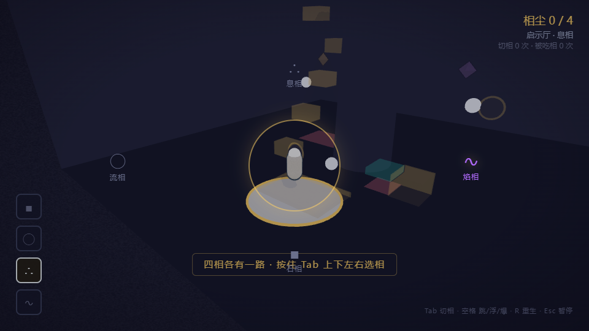

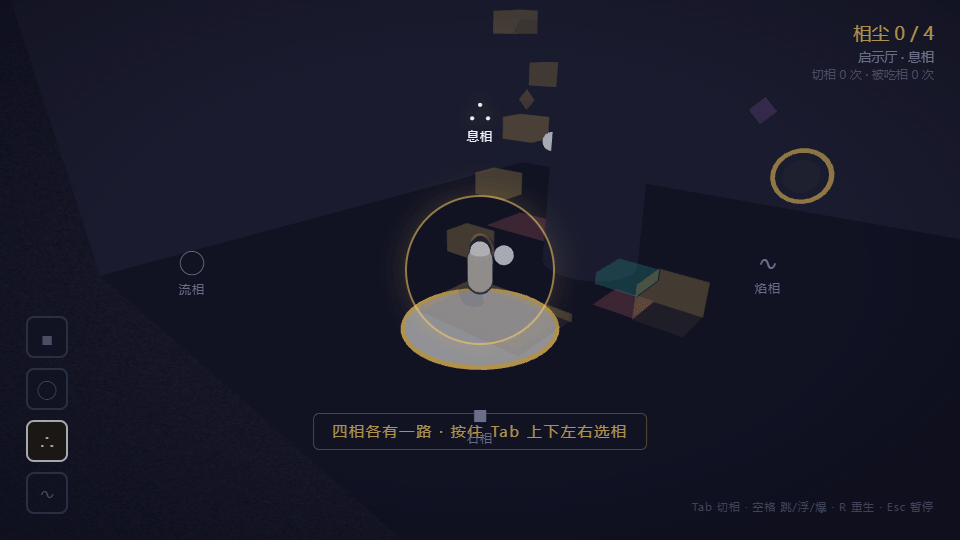

**相灵眼 + 子弹**（发射器金色虹膜 + 飞行中的中性子弹）：

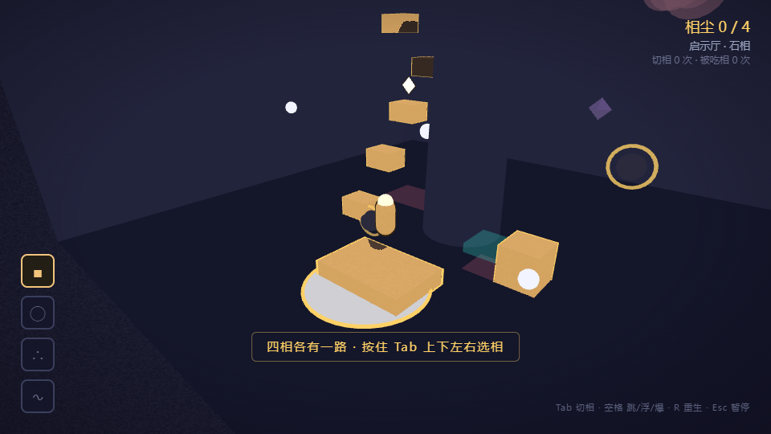

**固化造路**（固相走近相液池，把它凝成可踩的桥）：

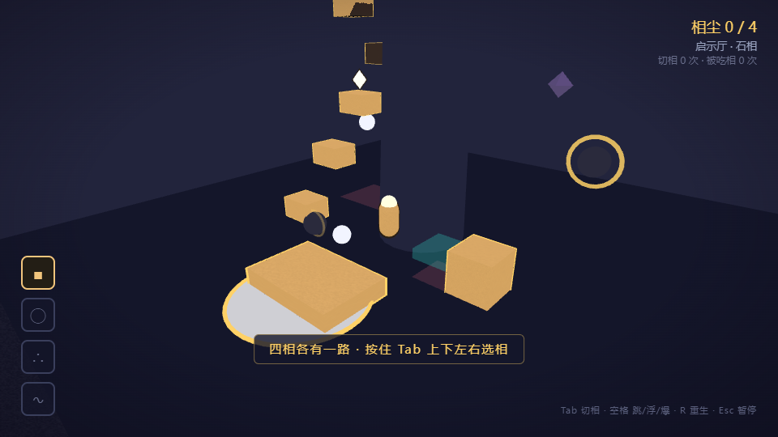

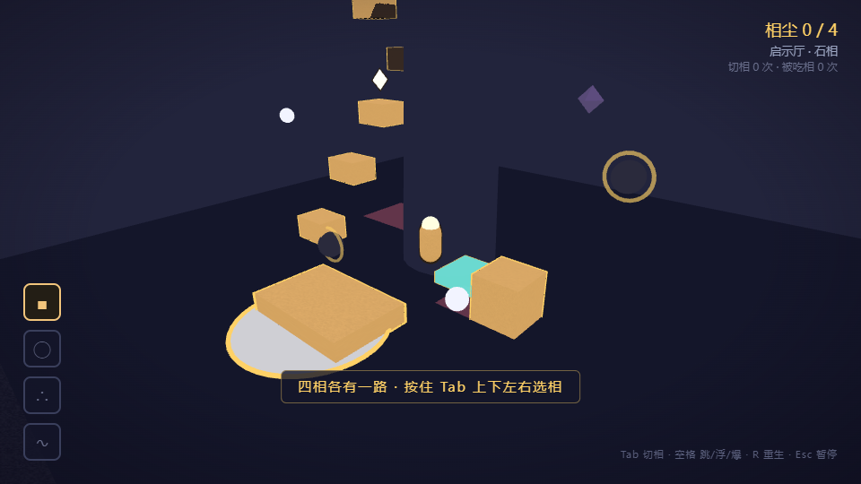

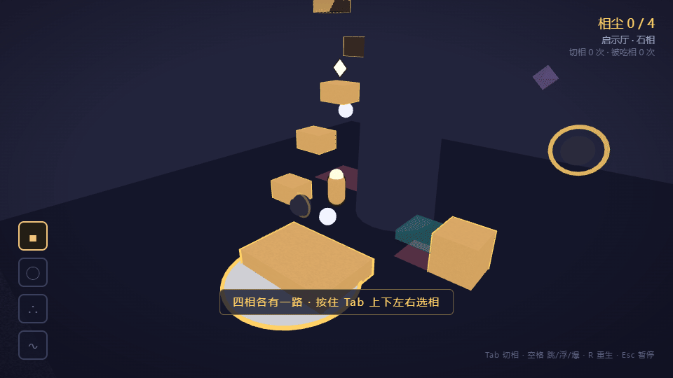

**液相游泳**（按住空格上浮）：

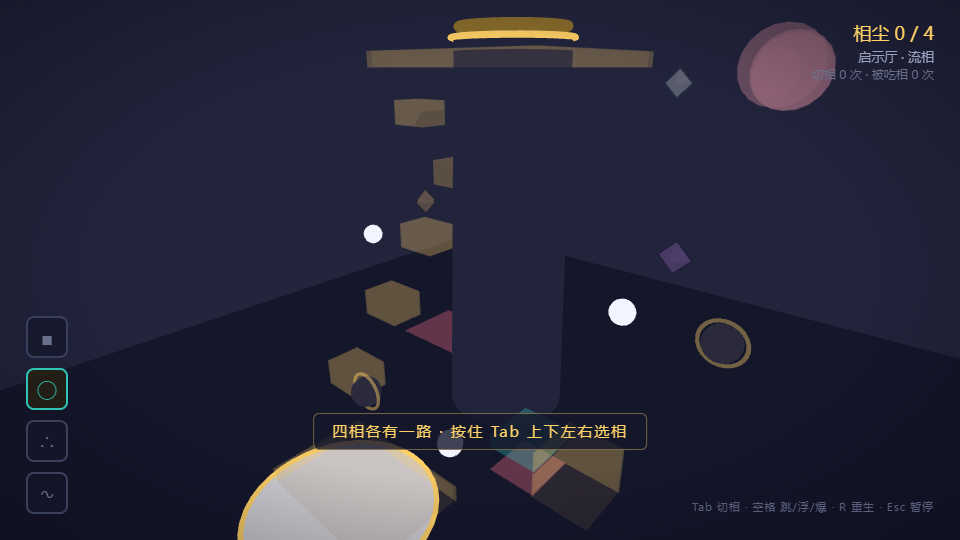

**焰相反射拆塔**（子弹命中焰相 → 反射回发射器 → 摧毁，金色爆裂）：

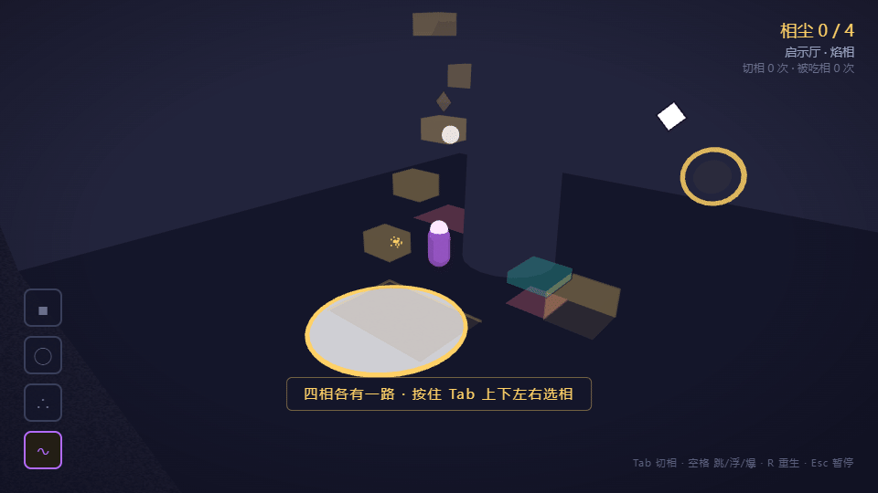

**结算**：

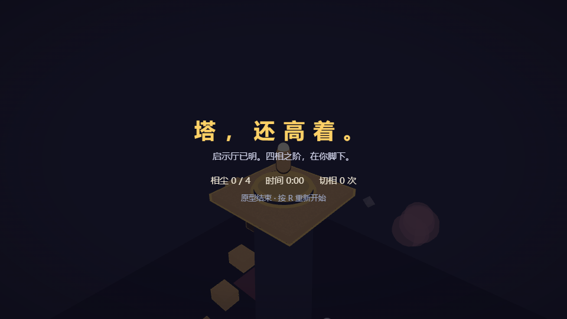

### v4 验证门（实测全过）

| 门 | 结果 |
|---|---|
| `npx tsc --noEmit` | ✅ 0 errors |
| `npm run build` | ✅ green |
| 四相移动逐项 trace | ✅ 固跳 vy=10.5 / 液泳 vy=4.7 / 气悬浮 vy=1.8 / 焰爆冲 vy=11.6 |
| Tab+W 圆圈切相 → 气相 | ✅ phase=gas |
| 子弹交互（确定性：传送进 em2 弹道） | ✅ 固中弹死 deaths 0→1 / 液中弹打散回固 / 气穿弹 0 死 / 焰反射摧毁 em2 |
| 固化造路 | ✅ pool1.solidified=true |
| 金门 3 相尘 → victory | ✅ gamePhase=victory, finished=true |
| 0 console/page error | ✅ |

---

## 中央塔 v3 redesign（2026-08-14, playtest round 2）✅（历史）

用户反馈：坠落死亡重置"no go" + 重设计 intro 层。自审根源：① 地面只对固相碰撞 = 空中切相即被世界吞噬（设计错误）；② v2 大厅 22×20m 太大、四路入口离出生点远；③ 雷云悬在风井正上方 = 惩罚路线教学行为；④ 风井助推后无减速 = 火箭撞云。

| 项 | v3 设计 | 实测 |
|---|---|---|
| 坠落永不致死 | **地面全相实心**；虚空死亡删除（安全网 y<−6 仅兜底） | gas 5m 坠落到地面 0 死亡 ✓ |
| 紧凑大厅 | 14×14m 中央塔；金门在塔顶；四路从塔四面攀塔，出生点一眼四路汇聚；路线平台锁链金描边 + 出生金环 | 截图 06 ✓ |
| 固路 | 南面石阶 p0→p6；上升进入薄平台落台面（速度判向碰撞） | 跳上 p1 落顶 ✓ |
| 液路 | 西面流槽→塔顶上方 0.6m 停驻→切固落地 | 全骑乘 + s2 + 落地 ✓ |
| 气路 | 北面风井 + **巡航悬停**（超速阻尼回 4 m/s，修风井火箭 bug）；雷云改为**东侧方向护栏**（井柱内永远安全，漂错方向撞可见云团） | 3s 悬停 0 死亡 + s4 + 漂移落 p6 ✓；向东漂 = 公平死亡 ✓ |
| 焰路 | 东面电线→端点停驻→离场跳/切相落地 | s3 + 落地 ✓ |
| 危险 | 无相区 hB（石阶北侧坠台）/ hA（电线台东侧跳空）/ 雷云；全部可视化 | hB 击杀 ✓ 雷云只杀气 ✓ |
| 金门 | 3/4 相尘 → 胜利 | ✓ |

**截图**：`screenshots/06-tower-hall-v3.png`（塔式大厅四路汇聚）

---

## 四路汇聚 redesign（2026-08-14, playtest 反馈）✅（历史）

用户反馈：让玩家会死、四相各有通关路、死亡不回原地点、探索不同相才有解法。

| 项 | 设计 | 实测 |
|---|---|---|
| 四路汇聚 | 固=石阶(最稳) / 液=上行流槽 / 气=风井+悬停 / 焰=电线；四路终点都在金门平台 p6 | 液路骑满→终点停驻→切固落地 ✓ 气路采 s4 ✓ 焰路到端点落地 ✓ |
| 探索驱动 | 金门 3/4 相尘 = 必须掌握 ≥3 相；HUD 探索阶梯提示（0枚→换相探索→差2→差1→金门） | gate 3 相尘→victory ✓ |
| 死亡有代价 | 危险：无相区灰斑(全相即死) / 引流管 pipe2_drain(液陷阱,吸进虚空) / 雷云(气专属) / 虚空；死亡→出生点+相位重置固+坠落计数，**无同点重试** | 引流管坠亡 ✓ 无相区击杀固相 ✓ 雷云击杀气相 ✓ 固相穿云安全 ✓ |
| 相弹进平台 bug | 液管终点原在 p6 底面下，切相动量把玩家顶进薄平台被推穿 → ①碰撞改**速度判向**（下落=落台面/上升=顶天花）②管道终点抬高至台面上方 1m | 跳上 p1 ✓ 电线落地 ✓ 液路落地 ✓ |
| 无相区压管道 bug | hA 全相即死区恰好盖住液管主线 → 拆成两块夹住管道留走廊 | 液路 0 死亡过区 ✓ |

**截图**：`screenshots/05-four-routes.png`（四路汇聚布局）

---

> 本文件是**可玩性文档**：用静态截图 + 动画 GIF 证明游戏端到端可玩。顶部「v4 四相重做」为**当前玩法**（启动 → 切相 → 相弹 → 固化造路 → 泳/飘/爆冲 → 反射拆塔 → 金门结算）；下文带「历史」的小节演示的是已被 v4 删除的 v3 管/线/风井路线。所有资产由 puppeteer（headless Edge）+ ffmpeg 自动采集。

---

## 0. 快速上手（How to play）

| 按键 | 动作 |
|---|---|
| `W` `A` `S` `D` | 移动（按住 Tab 时 = 指向四象限选相） |
| `Tab` | 按住呼出**圆圈四象限菜单**，松开切到高亮相（↑气 ↓固 ←液 →焰） |
| `Space` | 动词：**固=跳**（可二段跳）· **液=按住上浮** · **气=按住悬浮** · **焰=爆冲**（二段爆） |
| `Enter` | 确认启示厅层卡 / 进入游戏 |
| `R` | 重开本层 |
| `Esc` / `P` | 暂停 |

**目标**：收集 3 枚相尘开门（≥3 相），随后走进金门通关。切相 = 切层——当前相的物块为实体，其余三相变幽灵纸片（非实心）。**四相各回答一个问题**：固造路（凝固相液池）/ 液机动（泳）/ 气穿弹绕行 / 焰反射子弹拆发射器。

**四相物理**（`constants.ts` 冻结契约）：

| 相 | 颜色 | 重力倍率 | 下落上限 | 移动机制 | 子弹交互 |
|---|---|---|---|---|---|
| 固 solid | 金黄 `#f2c57c` | 1.0 | 25 m/s | 跳 11（二段跳） | 中弹死 |
| 液 liquid | 青 `#2ec4b6` | 0.6 | 4 m/s | 泳：按住上浮 →5 m/s 封顶 | 中弹打散回固 |
| 气 gas | 冷白 `#eef4f8` | 0.18 | 3 m/s | 飘：按住悬浮 →4 m/s | 穿弹免疫 |
| 焰 plasma | 紫 `#b26bff` | 0.9 | 25 m/s | 爆冲 12 m/s（二段爆，冷却 0.4s） | 吸弹反射 |

---

## 1. 端到端可玩性演示（历史 — v3 管/线/风井）

> ⚠️ 本节演示的是**已被 v4 删除**的管/线/风井玩法，仅作历史记录。当前玩法见顶部 **v4 四相重做** 一节。
>
> 以下 9 张截图 + 6 张 GIF 按通关顺序排列。截图 960×540。

### 1.1 启动 → 出生（boot → spawn）

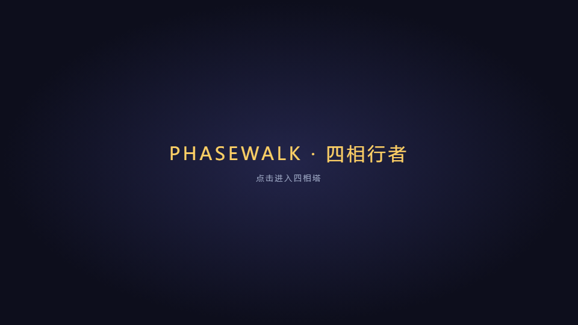

*启动覆盖层：点击进入四相塔。*

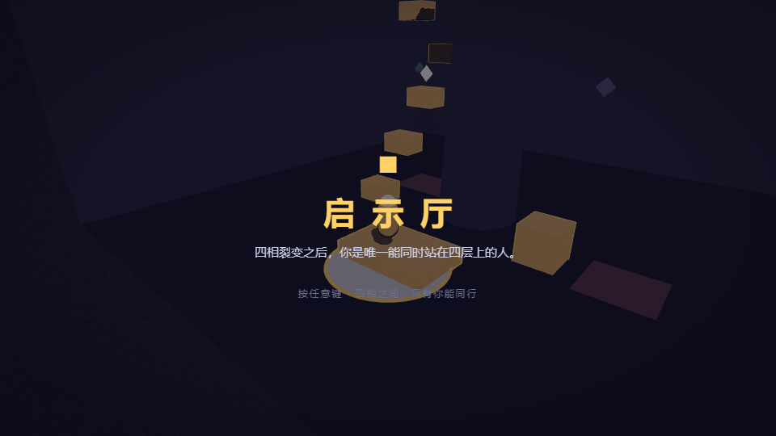

*启示厅层卡（按 Enter 进入）。*

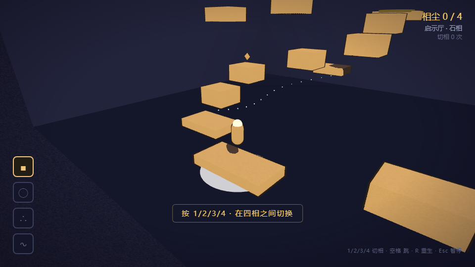

*出生：仅**固相**石阶实体可见，其余三相为隐藏幽灵（符合世界观剧本 0:00–0:12 出生拍）。*

### 1.2 四相同现揭示（first switch → four-phase reveal）⭐①

首次切相触发**四相同现**：幽灵层 0.3s 淡入 + 音叉三连音（液 330 / 气 440 / 焰 660 Hz）。

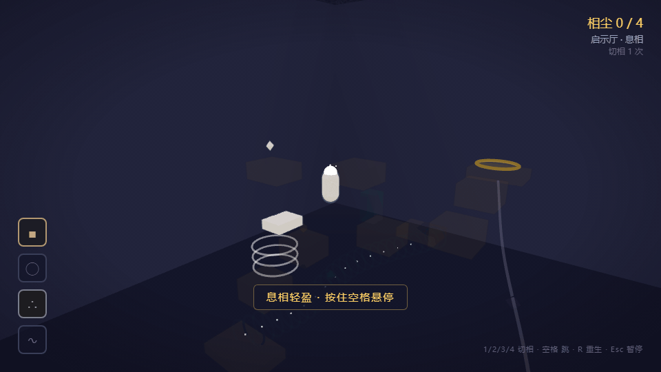

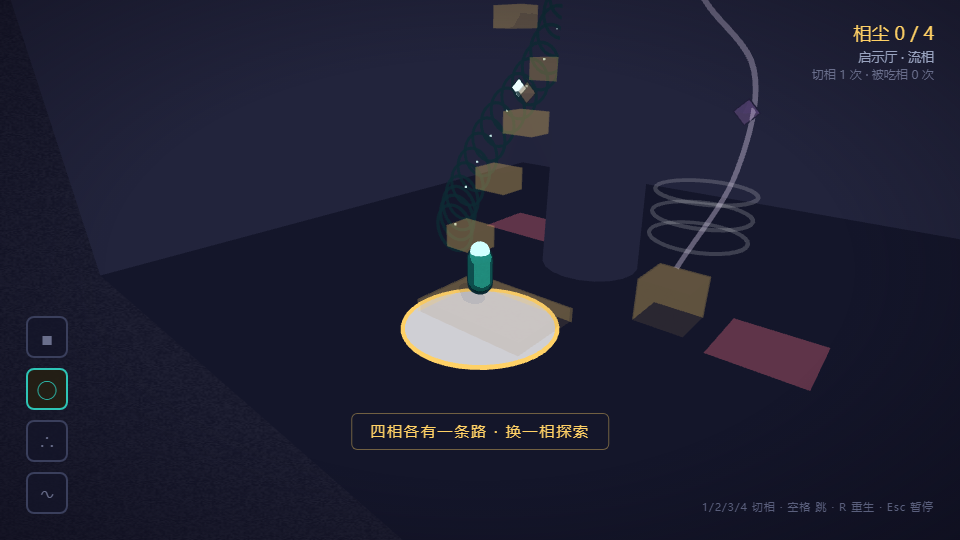

*揭示后：固相石阶转幽灵、液管/气井/电线淡入显现。*

### 1.3 相弹拖尾（air switch → momentum trail）⭐②

空中切相动量守恒，触发 0.5s 动量拖尾 + 上行滑音 300→700 Hz。

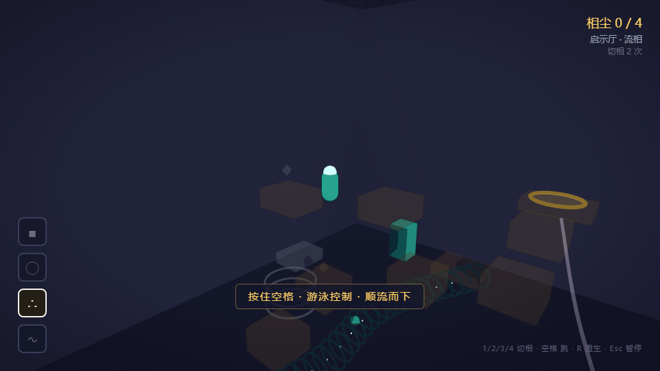

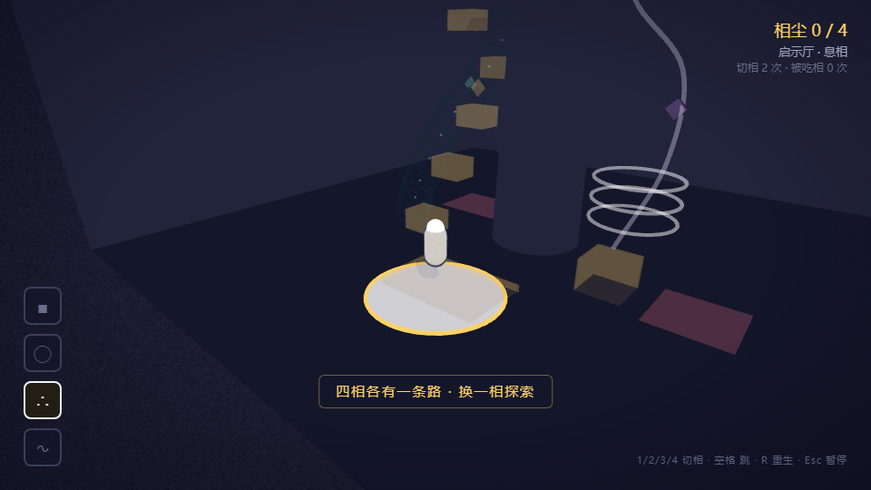

### 1.4 液相管道顺流（liquid pipe）

切液相 → 贴近流槽即被捕获，沿中线弧长推进过拐角（解析投影，不甩出）。

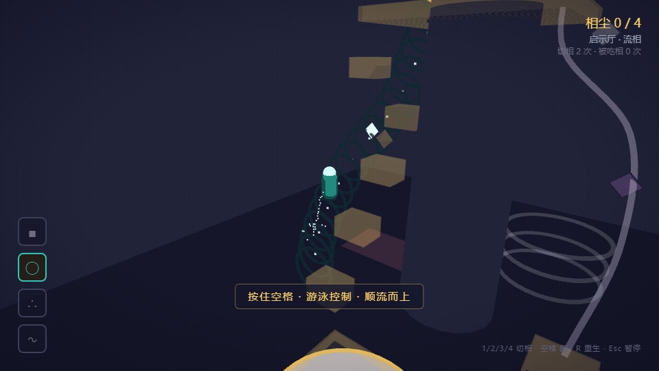

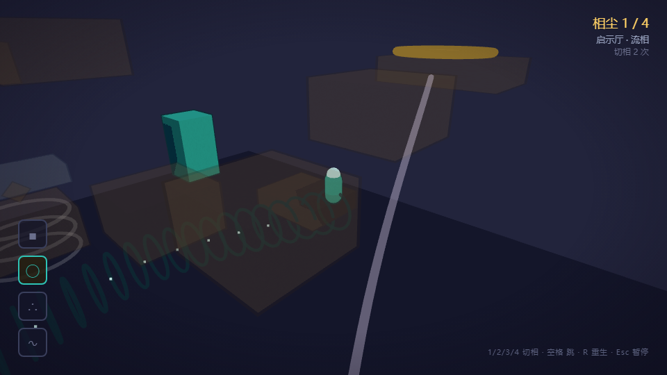

### 1.5 气相风井抬升（gas vent）

切气相 → 进入风井被气流抬升，收集气相相尘 s4。

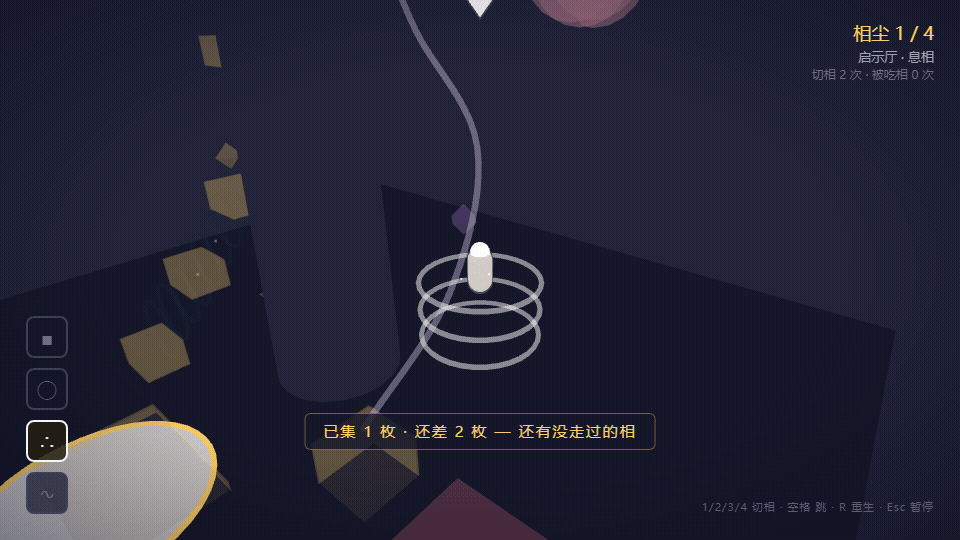

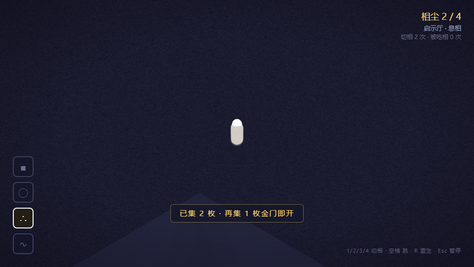

### 1.6 等离子电线滑行（plasma wire）

切等离子 → 贴近电线即被捕获，滑行至末端停驻（可按住 Space 离场跳）。

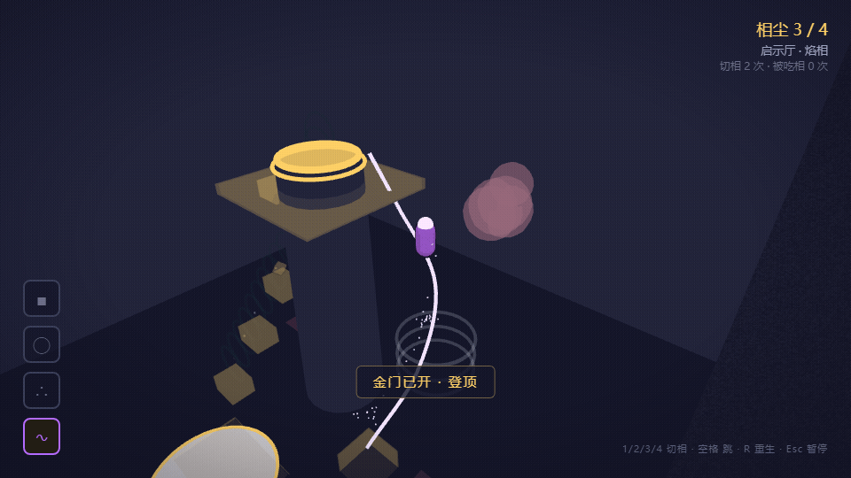

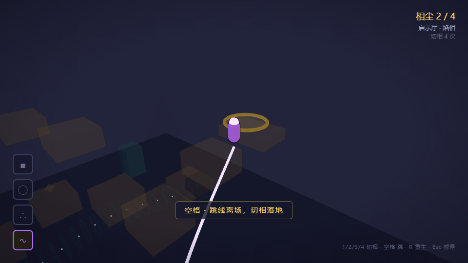

### 1.7 金门 → 结算（gate → victory）

集满相尘后切回固相，走进金门触发结算。

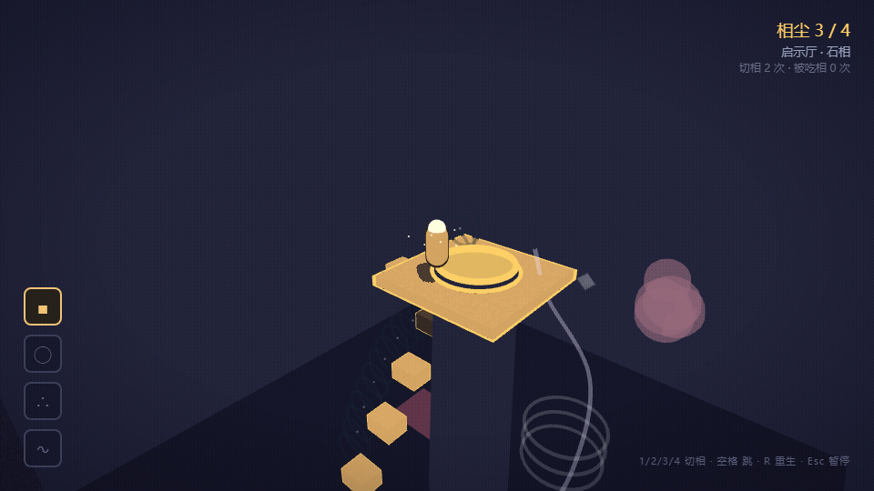

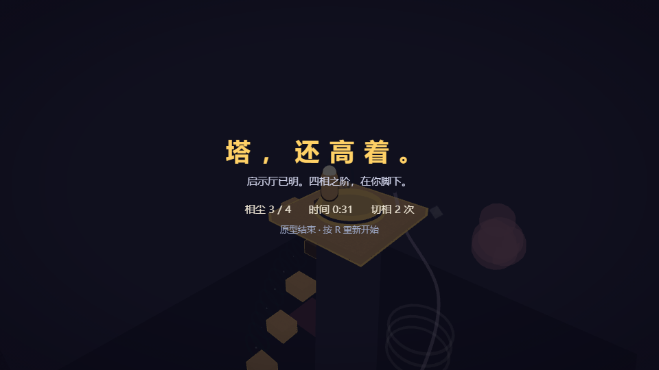

---

## 2. 本轮修复（2026-08-13，等离子电线 ×2）（历史）

`src/core/simulation/traverse.ts` 的 `applyWires` 两个真实 bug，均经 puppeteer 逐帧 trace 定位：

| # | 症状 | 根因 | 修复 | 验证 |
|---|---|---|---|---|
| W1 | 玩家骑线时震荡、被抛飞（vy −44.9 → +28.4，y 冲到 21.6） | `if (velocity.y > 2.5) return false` 误释放——电线陡段的骑线速度本身 3.49–5.08 m/s > 2.5，每帧都被判定为「离场」 | 删除该速度阈值；释放只由 `wireReleased`（离场跳）控制 | trace：y 1.2→6.5 平滑滑行，无震荡/抛飞 ✓ |
| W2 | 电线末端**缓慢下沉** ~0.45 m/s（设计意图是「末端停驻」），且污染冻结关卡数据 | `atEnd` 分支 `position = wire.points[last]` 是**引用赋值**；下一帧 `stepPlayer` 的 `position.y += vy*dt` 直接改写了共享的 `wire.points[last].y`（即 `LAYERS` 冻结数据），端点永久下沉并传染后续骑线 | 改为**克隆端点** `{x,y,z}`，不再引用 | trace：末端 y=6.5 恒定 25+ 帧，零下沉 ✓ |

> W2 是一个隐蔽的**数据污染** bug（不只是观感）：每次骑线到末端都会改写 `levels.ts` 的 wire 端点，直到刷新页面才复位。液相 `applyPipes` 无此问题，因为 `pointAt` 每次返回新对象。

---

## 2.5 本轮修复（2026-08-14，焰路端点自动通关 + v3 全路复验）（历史）

| # | 症状 | 根因 | 修复 | 验证 |
|---|---|---|---|---|
| W3 | 焰路骑线至终点附近**自动通关**（(0.85,7.91,-0.52) 距门 0.97m），跳过"落地"步骤；与液路（终点距门 1.94m，须切固落地）不一致 | 电线端点 (0.5,8.4,0) 距金门 (0,8.3,0) 仅 0.51m < 1.2m 触发半径 | 端点移到 p6 东缘 (1.5,8.6,-0.5)，距门 1.61m；y 8.4→8.6 对齐液管"台面上方 0.6m"（同时消除切相时脚陷 p6 的 0.2m 重叠） | trace：骑线末端停驻 (1.5,8.6,-0.5) vy=0、phase 仍 `playing`（3 相尘不自动通关）→ 切固 grounded 落地 p6 → 走向门 victory ✓ |

**v3 全路 + 危险逐帧复验（puppeteer，headless Edge）**：

| 项 | 实测 |
|---|---|
| 无相区 hA/hB（全相即死） | 击杀固相 deaths++ ✓ |
| 雷云 hC（只杀气） | 击杀气相 ✓；固相穿云 0 死亡 ✓ |
| 坠落永不致死 | gas 10m 坠落 0 死亡 ✓ |
| 气路巡航悬停（超速阻尼） | 按住 Space vy 8.72→4.0 阻尼回落，s4 采集，无火箭 ✓ |
| 液路流槽 | 全骑乘 + s2 + 终点停驻 ✓ |
| 焰路电线 | 停驻 → 切固落地 → 金门 victory ✓ |
| 金门 | 3/4 相尘 → victory ✓ |

---

## 2.6 本轮修复（2026-08-14，audit round 3 — 固路可达 + 手感 + 危险电报）（历史）

并行 audit（代码 / 可玩性 / 视觉 / 边界）产出 11 项修复，按严重度分级：

| # | 级别 | 症状 | 根因 | 修复 | 验证 |
|---|---|---|---|---|---|
| R3-1 | **critical** | 固路 p5→p6 跳不上去——p5 被 p6 吞没（垂直间隙 0.6m < 玩家高 1.2m），固路实际断在 p5 | p5 在 p6 正下方，p6 底 7.4 < p5 顶 7.2+1.2 | p5 西移（x −4.0..−3.0，与 p4 同 z 对齐）＋ p6 抬高 0.6m（y 8.0..8.3）＋ 固相 MOVE_SPEED 8→5.5（台阶落地台 1m，8 m/s 会冲过头） | trace：p5 站立 ✓ → p6 跳上落顶（feet 8.3）✓ |
| R3-2 | **major** | 暂停/结算会"存时间"——恢复后 dt 追补，玩家瞬移/坠亡 | `App.tsx` 无条件 `acc += dt`，暂停帧也累加 | 只在 `playing`/`layer_intro` 累加 | trace：暂停 2s 恢复 drift=0.000，无时间扭曲 ✓ |
| R3-3 | **major** | 空中跳（二段跳）无法触发——落地前按跳无效 | `canJump` 缺 `jumpsUsed === 1`（第一跳后空中不可再跳） | 加 `jumpsUsed === 1` 条件（固/液/气各一次空中跳，焰无跳） | trace：jumps 0→1→2，第 3 次忽略 ✓ |
| R3-4 | **major** | 结算屏"相尘 4/4"读成累计值，误导 | `VictoryScreen` 用 `totalPhaseDust`（跨局累计） | 改 `phaseDust / 4`（本局） | ✓ |
| R3-5 | **major** | 无相区读成安全灰——与出生金环同色 `#cfcfd4`，玩家误踩 | 危险色 = 安全色 | 无相区 `#cfcfd4`→`#b0556a`（opacity 0.55）；出生金环保留 `#cfcfd4` | 像素分析：无相区 rose/mauve 787px（旧灰 0）✓ |
| R3-6 | **major** | 雷云（只杀气）颜色平淡 `#8f8fa8`、实际跨度大于击杀盒 → 不可见死亡 | 云硬编码 ±1.6 跨度 > 击杀盒 | 云 `#9a6a7c`（opacity 0.6）；blob 分布 clamp 到 `(w−1,h−1,d−1)` | ✓ |
| R3-7 | minor | HUD"坠落 3 次"与新死亡语义不符 | 死亡 = 被吃相（无相区/雷云），非坠落 | 改"被吃相 N 次" | ✓ |
| R3-8 | minor | 重生后 coyote/jumpBuffer 残留 → 落地瞬间误跳 | respawn 未清输入缓冲 | `respawnAtSpawn` 加 `coyote=0`/`jumpBuffer=0` | ✓ |
| R3-9 | minor | 相尘切相后变幽灵，丢失自发光 | `setPhase` 只切 `phaseMat`，相尘无 per-phase 材质 | 每枚相尘建 `current`/`ghost` 两份 toon 材质（自发光保留） | 切相相尘发光不灭 ✓ |
| R3-10 | minor | 玩家身体切相只是改 `.color`，梯度贴图没换 → 相弹颜色脏 | `playerBody.material.color.set` | 改 `material = mats[phase].solid`（换 gradientMap） | ✓ |
| R3-11 | minor | 气相图标冷白与纸色 `#f4f2ea` 分不清 | gas active 色 = 纸色 | 改 `#eef4f8`（冷云白） | ✓ |

另有 3 处代码卫生修复（非 bug）：`applyVents` 硬编码 `* 0.016` → `* dt`（帧率无关）；`setPhase` traverse guard 让流动点（`THREE.Points`）按幽灵处理（原来误当 mesh）；死亡强制相位重置不再触发切相音（`lastPhase` 死亡后同步，非玩家切相）。

**本轮关键判定（p10 不动）**：audit 曾建议把 p10（焰路起点台）改成 plasma 相以增强"焰路专属"，但焰相无跳跃（`JUMP_VELOCITY=0`）且 p10 若变 plasma 实体会挡住地面电线捕获，破坏焰路——故 p10 保持 solid（无害地标）。

---

## 2.7 本轮修复（2026-08-15，v4 polish round 1 — 相灵弹场外残留）

| # | 症状 | 根因 | 修复 | 验证 |
|---|---|---|---|---|
| W4 | 相灵弹飞出场外（塔墙 x/z=±10）仍继续穿行至 ±25，6s 生命期内最多 6-8 枚幽灵弹残留虚空（观感杂物） | `stepBullets` 只按 `BULLET_LIFE` 计时清除，无场界判定；相灵弹无形穿过塔墙后仍在雾中可见 | `constants.ts` 加 `BULLET_STAGE_MARGIN=3`；子弹越过 `hallHalf + margin`（±10）即 splice 清除 | 确定性 trace：em1 弹 x 5→-9.33（t=2.5s，life=3.13）→ x<-10 清除；em2 弹 →x 9.45（t=3.25s，life=2.35）→ x>10 清除。两者均在 life=0 前 ~3s 于场界清除 ✓ |

---

## 3. 资产清单（screenshots/）

### v4 新增资产（当前状态）

| 资产 | 类型 | 内容 |
|---|---|---|
| `v4-01-tab-radial.png` | 截图 | Tab 圆圈四象限菜单（→焰高亮） |
| `v4-02-emitters.png` | 截图 | 相灵眼 + 飞行中子弹 |
| `v4-03a-pool-liquid.png` | 截图 | 相液池未凝固（半透明青） |
| `v4-03b-pool-solidified.png` | 截图 | 相液池凝固成桥（不透明 + 金描边） |
| `v4-04-liquid-swim.png` | 截图 | 液相游泳上浮 |
| `v4-05-victory.png` | 截图 | 结算画面 |
| `gifs/v4-radial.gif` | 动画 | Tab 圆圈切相（呼出→高亮→切换） |
| `gifs/v4-solidify.gif` | 动画 | 固化造路（相液池→桥） |
| `gifs/v4-reflect.gif` | 动画 | 焰相反射子弹拆发射器 |

### v3 历史资产（已被 v4 取代）

| 资产 | 类型 | 内容 | 采集方式 |
|---|---|---|---|
| `doc-01-boot.png` | 截图 | 启动覆盖层 | `page.screenshot` |
| `doc-02-intro.png` | 截图 | 启示厅层卡 | `page.screenshot` |
| `doc-03-spawn.png` | 截图 | 出生：仅固相实体 | `page.screenshot` |
| `doc-04-four-phase.png` | 截图 | 揭示后四层同现 | `page.screenshot` |
| `doc-05-trail.png` | 截图 | 相弹后气相 + 拖尾 | `page.screenshot` |
| `doc-06-liquid-pipe.png` | 截图 | 液相管道 | `page.screenshot` |
| `doc-07-gas-vent.png` | 截图 | 气相风井 | `page.screenshot` |
| `doc-08-plasma-wire.png` | 截图 | 等离子电线 | `page.screenshot` |
| `doc-09-victory.png` | 截图 | 结算画面 | `page.screenshot` |
| `gifs/reveal.gif` | 动画 | 四相同现揭示（700ms @12fps） | 帧序列 → ffmpeg |
| `gifs/phasebounce.gif` | 动画 | 相弹拖尾（600ms @15fps） | 帧序列 → ffmpeg |
| `gifs/pipe-flow.gif` | 动画 | 管道顺流（2000ms @10fps） | 帧序列 → ffmpeg |
| `gifs/gas-rise.gif` | 动画 | 风井抬升（1500ms @10fps） | 帧序列 → ffmpeg |
| `gifs/wire-slide.gif` | 动画 | 电线滑行（2200ms @10fps） | 帧序列 → ffmpeg |
| `gifs/gate-victory.gif` | 动画 | 金门结算（1800ms @10fps） | 帧序列 → ffmpeg |

> 采集脚本为一次性 throwaway（`_capture.mjs` / `_probe.mjs` / `_dbgwire.mjs` + `screenshots/_frames/` 原始帧），交付前删除，不进 git。

---

## 4. 验证门

| 门 | 结果 |
|---|---|
| `npx tsc --noEmit` | ✅ 0 errors |
| `npm run build` | ✅ green（761 KB / gzip 208 KB） |
| dev server 5187 + 浏览器加载 | ✅ 0 console error |
| v3 全路 + 危险逐帧复验（spawn / 固液气焰 4 路 / 3 危险 / 坠落 / 金门） | ✅ 全命中目标状态（见 §2.5） |
| 电线末端停驻 | ✅ (1.5,8.6,-0.5) 恒定 vy=0、无自动通关（W3 修复后） |
| **round 3** 固路 p5→p6 跳上 | ✅ p5 站立 → p6 落顶（feet 8.3） |
| **round 3** 二段跳 | ✅ jumps 0→1→2，第 3 次忽略 |
| **round 3** 暂停时间扭曲 | ✅ 暂停 2s 恢复 drift=0.000 |
| **round 3** 危险电报颜色 | ✅ 无相区 rose/mauve（旧灰 0）；雷云 `#9a6a7c` |

---

## 附录：历史轮次（M1 → Polish → Polish round 2）

### Polish round 2（极致时刻①四相同现 + 极致时刻②相弹拖尾 + 纸纹）— 已修复 ✅

按 `worldview-first §4` 极致时刻验收 + `TDD §5` toon 管线补齐 5 项：

| # | 项 | 实现 | 验证 |
|---|---|---|---|
| R1 | 四相同现揭示 | 幽灵层出生隐藏（opacity 0），首次切相 0.3s 淡入至 15%（`SceneManager.reveal()` + `revealAlpha`） | 像素分析：liquid 0→274、gas 0→384、solid 2294→617 |
| R2 | 音叉三连音 | 首次切相 3 连音琶音（液 330 / 气 440 / 焰 660 Hz，间隔 0.1s） | 0 console error |
| R3 | 纸纹颗粒 | `PaperFX.ts`：128px canvas 噪声 `map`（~4% 明度抖动）叠加 toon 材质 + 幕布背景 | 0 console error |
| R4 | 幽灵层 8m 渲染半径 | `GHOST_RENDER_RADIUS=8`，玩家 8m 外幽灵层 `visible=false` | 远距等离子线剔除 |
| R5 | 相弹 0.5s 拖尾 | `ParticleSystem` 空中切相触发 0.5s 动量拖尾 + 上行滑音 300→700 | 空中切相 grounded:false 触发 |

### Polish round（playtest 反馈 4 项 + 自审）— 已修复 ✅

| # | 问题 | 修复 |
|---|---|---|
| U1 | 气相读成黄色、跳跃不像气 | 气改冷云白 `#eef4f8`；气相悬浮（按住跳 +11 m/s² 至 4 m/s 封顶）+ 下沉上限 3 m/s |
| U2 | 水相不沿流/无法控制 | 解析投影 + 弧长推进（贴中线过拐角）；液相游泳 |
| U3 | 水相穿过冰管 | 改**开放式流槽**（墨线环 + 流动粒子） |
| U4 | 等离子图标是闪电 | 图标 ⚡ → ∿ |
| 自审 | 等离子离线永远漂浮 / 电线端点抖动 / 无教学 | 等离子重力 0.9 + 电线端点停驻 + 离场跳（`wireReleased`）+ HUD 上下文提示 |

**管道 bug 根因**（重要踩坑）：`nearestArc` 的 9 点粗采样产生**不动点**——最近采样点滞后于真实弧长，`pointAt(arc+流速)` 又落回原地。修复 = 解析投影（点到线段投影取全局最近）。

### M1 原型（垂直切片落地 ✅）

世界观先行文档 + 5 分钟体验剧本先行，随后原型按剧本 1:1 实现。

| 门 | 结果 |
|---|---|
| `npx tsc --noEmit` | ✅ 0 errors |
| `npm run build` | ✅ green |
| dev server 5187 + 浏览器加载 | ✅ 0 console errors |
| 启动流 | ✅ boot → 启示厅层卡 → playing |
| 键盘切相 | ✅ Digit2 → liquid，切相计数 +1 |
| 相弹法则（动量守恒） | ✅ 切相前后 velocity 逐分量相等 |
| 液相管道 | ✅ 顺流 |
| 气相风井 | ✅ y 1.0 → 2.4 上升 |
| 等离子电线 | ✅ 滑行 |
| 收集 + 金门 | ✅ 3/4 相尘开门 → 触门 → victory |

### M2 内容完整（F2–F5 落地 ✅，2026-08-15）

全塔 5 层落地：F2 流廊 / F3 息井 / F4 焰网 / F5 相核室 + `advanceLayer`（层间前进，run 级累计 phaseDust/switches/deaths/elapsed 携带）+ `SceneManager.rebuild`（逐层拆除重建四层场景，F1 塔柱只在 F1）+ 层清卡 `LayerClear` / 全塔结算 `VictoryScreen`（20 相尘）。登层机制：金门 → `layer_clear` → Enter/Space → `advanceLayer` → 下一层 `layer_intro`；F5 → `victory`；胜利 R → `restartRun` 回 F1。

| 门 | 结果 |
|---|---|
| `npx tsc --noEmit` | ✅ 0 errors |
| `npm run build` | ✅ green（58 modules） |
| headless 核心逻辑（esbuild+node 临时脚本） | ✅ 25/25（5 层数据 · advanceLayer 累计携带 · restartRun · checkGate） |
| dev server 5187 + 浏览器端到端 playtest | ⏳ 待补（本次无浏览器桥） |

### 待办里程碑

- [ ] M1 收尾：全键盘 5 分钟剧本手动通关 ×3
- [x] M2 — F2–F5 + 20 相尘 + 结算落地（端到端 playtest 待补）
- [ ] M3 — 相灵 mini-boss + 相位陷阱 + polish loop
- [ ] RC — 60fps 全塔 + 15 分钟首通
