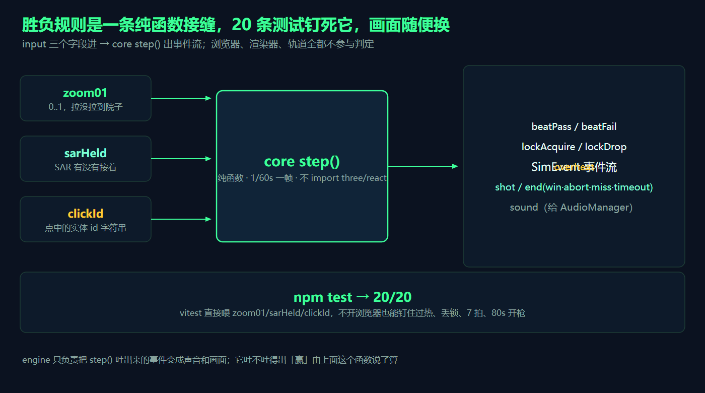
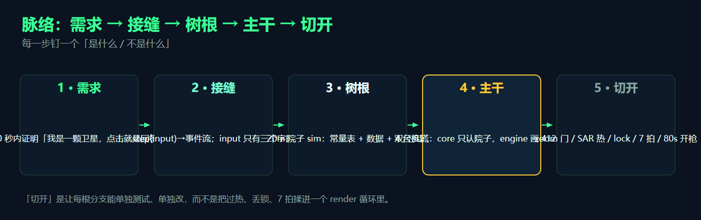
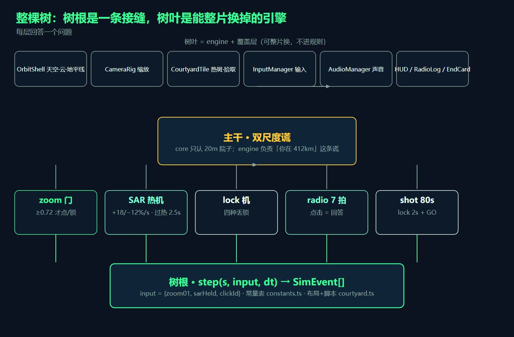
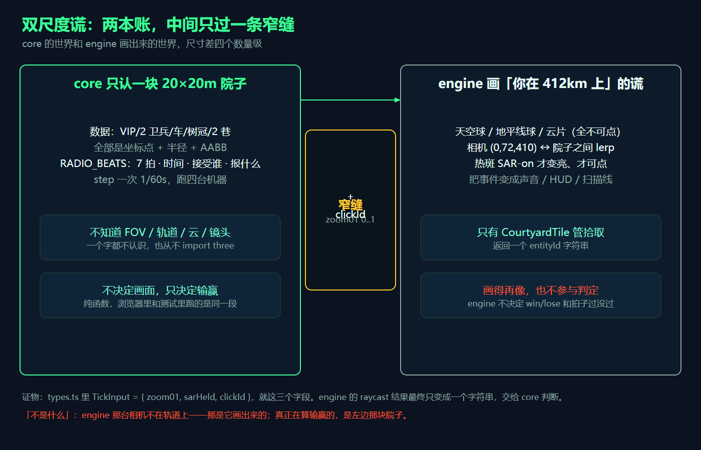
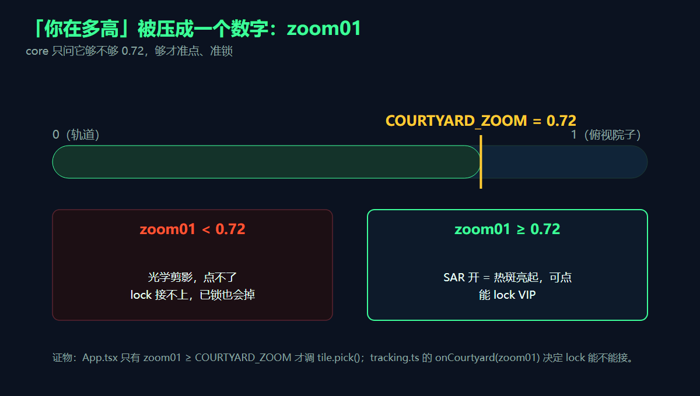
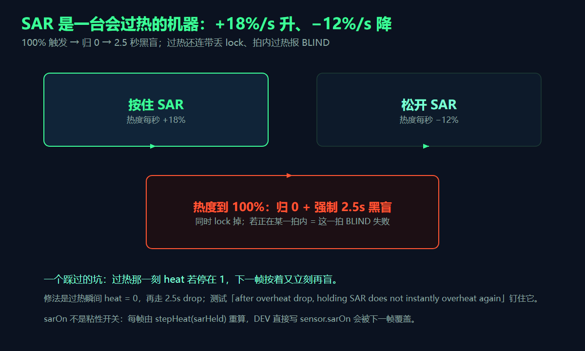
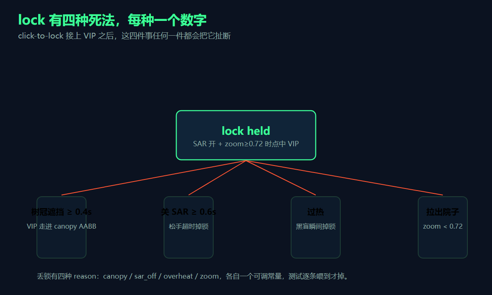
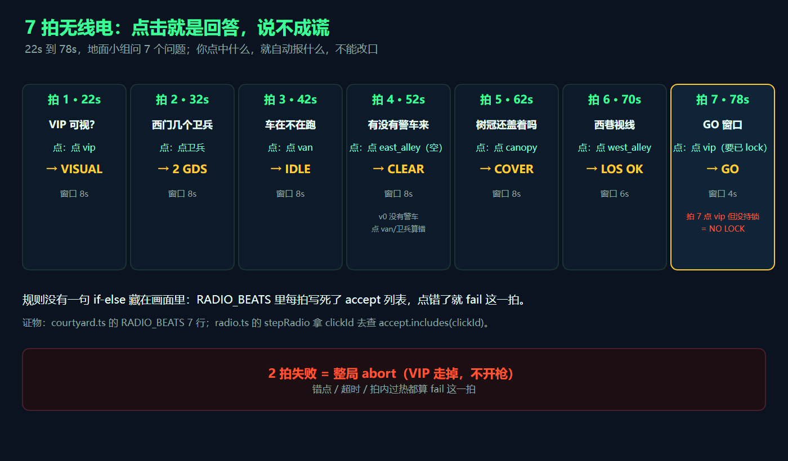

# 别造地球了：我的卫星游戏，只模拟了一块 20×20 米的院子

## TL;DR

- 这颗卫星的「轨道」是引擎层画出来的一条谎：核心逻辑从头到尾只模拟一块 20×20 米的院子，412 公里的视角、云、地平线它一个字都不认识。
- 「你在多高、看到多广」被压成一个 0..1 的数字 `zoom01`，核心只问它够不够 0.72，够才能点、才能锁。
- 点击就是回答，说不成谎：你点中什么，就自动给地面小组报什么，输赢由一张 7 拍脚本表决定。
- 全部胜负规则钉死在一条纯函数接缝里，20 条 vitest 就能覆盖过热、丢锁、7 拍、80 秒开枪——不用开浏览器。
- 你从头到尾不扣扳机。

> 我维护这套系统时……[作者补一句：一段第一人称亲历，讲你为什么非得把「卫星」做成一块院子，或者哪个 bug 让你看清了这条缝。]

## 先说我到底在压哪条承诺

EYE-13 的立项只有一句话：90 秒内证明「我是一颗卫星，点击就是回答」。为压住这句话，我把两条运行时承诺焊死在架构里：

1. **规则可测。** 胜负不靠肉眼判断，靠一个纯函数 `step()`，喂三个输入、吐一串事件，20 条测试钉死。
2. **谎可换。** 「看起来像在 412 公里高空」这件事，跟「能不能点中东西、赢不赢得」彻底解耦。将来把院子换成城市、把轨道视角换成无人机，核心那层一行不用改。

图 01 是这条接缝的全貌。

三个输入就是全部的世界真相：`zoom01`（拉没拉到院子）、`sarHeld`（SAR 有没有按着）、`clickId`（点中的实体 id）。核心每 1/60 秒跑一次，吐出一串事件——`beatPass`、`lockDrop`、`overheat`、`shot`、`end`。渲染器、相机、轨道高度，一个都不在判定里。后面每一节都会回到这张图，先记住一句话：画面再花，它进不了那个函数。

## 你第一反应一定是错的

听到「卫星游戏」，第一反应是：造一颗行星、架一台轨道相机、在轨道高度做射线拾取，然后俯冲穿云。这是错路，而且设计约束里白纸黑字写着——「No planet mesh」。在 412 公里高度做拾取，你点什么？点空气。

正路是反过来想：玩家以为自己在一颗卫星上，不等于要真的做一颗卫星。你要做的只有两件事——一块 20 米院子承载所有规则，一层会骗人的引擎承载「你在高空」的幻觉。

这里藏着全文的主线，我把它说完整：

**轨道是引擎画出来的谎，不是核心模拟的东西。**

核心的世界是平的、20 米见方、只有坐标点和半径；引擎的世界有天空球、地平线球、云片，还有一台在 (0, 72, 410) 和院子之间来回插值的相机。两个世界尺寸差了四个数量级，靠一条窄缝连接。

## 脉络：五步走到能玩

需求 → 接缝 → 树根 → 主干 → 切开，每步钉一个判断。

| 步 | 是什么 | 不是什么 |
|---|---|---|
| 需求 | 90 秒证明「我是一颗卫星，点击就是回答」 | 一份待办说明书 |
| 接缝 | `step(input)` → 事件流，input 只有三个字段 | 一条会改 UI 的调用链 |
| 树根 | 20 米院子 sim：常量表 + 数据 + 4 台纯函数机器 | 认识 FOV / 轨道 / 云的渲染层 |
| 主干 | 双尺度谎 | 两个独立游戏 |
| 切开 | zoom 门 / SAR 热 / lock / 7 拍 / 80 秒开枪 | 揉进一个 render 循环的大杂烩 |

## 整棵树

- 树根：`step(s, input, dt) → SimEvent[]`，加一张常量表、一份院子数据。
- 主干：双尺度谎。
- 五根分支：zoom 门、SAR 热机、lock 机、radio 七拍、80 秒开枪。
- 树叶：OrbitShell、CameraRig、CourtyardTile、InputManager、AudioManager、HUD——全是可以整片换掉的引擎，不进规则。

下面按枝往下讲。每一根分支都对应接缝里的一段逻辑，也各有一个能单独喂、单独改的数字。

## 双尺度谎：两本账，一条窄缝

这是整篇文章的地基，放大看。

左边是核心，右边是引擎。核心的实体全是一组 (x, z) 坐标加半径加 AABB；引擎负责把「你在 412 公里高空」画得可信——天空球、地平线球、云片，全部关掉 raycast，不可点。

两边中间只有一条窄缝，就两个字段：`zoom01`（一个 0..1 的数）和 `clickId`（一个字符串）。引擎的射线命中结果，最终只变成一个字符串交回核心；核心拿它去查「这一拍收不收」。《types.ts》里 `TickInput` 就是这三字段结构，没有第四样——这是我最想让你看的一行，它划定了「规则」和「表现」的边界。

## 你在多高？一个数字说了算

核心不知道相机在哪，它只认一个 0..1 的数 `zoom01`：0 是轨道，1 是俯视院子，中间是插值。核心只问一句：够不够 0.72。

`COURTYARD_ZOOM = 0.72`。够了，SAR 一开热斑亮起、可以点、可以锁；不够，光学剪影点不了，已经锁上的也会掉。《App.tsx》里只有 `zoom01 >= COURTYARD_ZOOM` 才调 `tile.pick()`；《tracking.ts》的 `onCourtyard(zoom01)` 决定 lock 接不接得上。缩放这一整件事，从轨道俯冲到贴地，最终在规则里只是一个大小比较。

## SAR 是一台会过热的机器

按住 SAR 每秒涨 18% 热度，松开每秒降 12%。到 100%，热度归零、强制 2.5 秒黑盲，同时丢 lock；如果正在某一拍内过热，这一拍直接判 BLIND 失败。

这是「按住不放有代价」的实心版本：按多久，自己算。两个踩过的坑值得记：

- 过热那一帧如果热度停在 1，下一帧一按又立刻再盲。修法是过热瞬间 `heat = 0`，再走 2.5 秒 drop。
- `sarOn` 每帧由 `stepHeat(sarHeld)` 重算，不会粘住。DEV 里直接写 `sensor.sarOn`，下一帧就被覆盖——测试和调试都得走 `InputManager.forceSar`。

## lock 有四种死法，每种一个数字

点中 VIP 接上 lock 之后，四件事任何一件都会把它扯断：

- 树冠遮挡 ≥ 0.4 秒（VIP 走进 canopy 的 AABB）；
- 关 SAR ≥ 0.6 秒；
- 过热；
- 拉出院子（zoom < 0.72）。

四种死法各对应一个可调数字，测试逐条喂到才掉。丢锁必须是可读的——这是手感要求里明写的一条「lock drop is readable」，玩家得看得出是哪种死法，别让锁莫名其妙没了。

## 7 拍无线电：点击就是回答

22 秒到 78 秒，地面小组连问 7 个问题：「VIP 可视吗」「西门几个卫兵」「车在不在跑」「有没有警车来」……你怎么回答？点击。点中什么，就自动报什么——拍 1 点 VIP 报 VISUAL，拍 4 点空巷报 CLEAR，拍 7 点 VIP 报 GO。没有口述环节，没有自由发挥，点错就是 fail 这一拍。

规则没有一句 if-else 藏在画面里：《courtyard.ts》的 `RADIO_BEATS` 七行写死每拍的时间、窗口、接受谁、报什么；《radio.ts》拿 `clickId` 去查 `accept.includes(clickId)`。

两个边界：

- 拍 4 是「警车来了吗」，v0 里根本没有警车，答案是空巷 CLEAR——点车、点卫兵都算错。这个空拍让「没东西可点」本身成了一个可玩的回答。
- 拍 7 点 VIP 但没持 lock，报 NO LOCK——它要的是「早就锁住了」，同一帧的点击即锁不算数。

2 拍失败，整局 abort，VIP 走掉，不开枪。

## 80 秒开枪：赢要踩两条，输有四扇门

80 秒那一刻只看两件事：拍 7 有没有报 GO，lock 有没有持满 2 秒。

- 赢：两样都有，VIP down。
- abort：2 拍失败，任意时刻都可能触发。
- miss：拍 7 没在 80 秒开枪前报上 GO。
- lockdrop：GO 了但 80 秒那一刻 lock 掉了。
- timeout：90 秒到，安全网。

《GameSim.ts》里 `elapsed >= 80` 时读 `beat7` 和 `lock.heldFor`，有一不满足就按 miss / lockdrop 收，90 秒 timeout 走不到。测试里专门有一条「no GO at 80s → miss, not 90s timeout」，钉的是 80 秒这把闸，90 秒 timeout 只是安全网。

## 收获和结论

**收获：**

1. **把「你在哪」压成一个 0..1 数字加一个 id 字符串**——规则层不碰渲染，引擎就能整片换掉。（不是把相机、FOV 塞进核心。）
2. **胜负逻辑放进纯函数**——测试不需要浏览器，不需要画面。（不是靠肉眼一条条点过去。）
3. **谎 / 真分离**——引擎只负责骗，核心只负责判。（不是「画面更真就更接近赢」。）
4. **点击即回答，不能说谎**——输赢由数据表的 accept 列表决定。（不是让你自由描述看到什么。）
5. **数字都带参照物，且全是可调常量**——+18/−12%/s、2.5 秒、0.4 秒、0.6 秒、0.72、80 秒。（不是散落各处的魔法数。）
6. **三种失败各留出口，测试要预设前置结果**——空跑到拍 4 会先 abort。（不是等到 90 秒 timeout 才兜底。）

**结论：** 回到开头那条主线。玩家以为自己在一颗 412 公里的卫星上，而在算输赢的，是脚下一块 20 米的院子——轨道只是引擎画出来的谎。这篇能让你搬走的，是这套切法本身，文件名带不走：把「不可能感」拆成「一个纯规则 sim + 一层会骗人的渲染 + 一条只有三个字段的窄缝」。规则越小越纯，谎就画得越放肆、越安全。

**讨论口：** 如果这颗卫星要加第二个电台员，你会把「另一份答案」切进核心的哪一层？还是干脆在引擎层再画一层谎，让两个玩家各看各的院子？

**PS.** 只带走一句：那条不会随画面改的纯函数接缝，比画面多像重要得多。

**PPS.** 这篇讲的是「怎么把轨道做成可抽换的谎」；「怎么把 SAR 渲染得更好看」是 CourtyardTile 的活，跟输赢无关。

**PPPS.** 文里的数字是 v0.1 冻结值，playtest 可能重调百分比但不会改形状。你系统里最容易裂的那一刀，是「哪部分状态属于规则、哪部分属于表现」——先想清楚这个，再动手。
