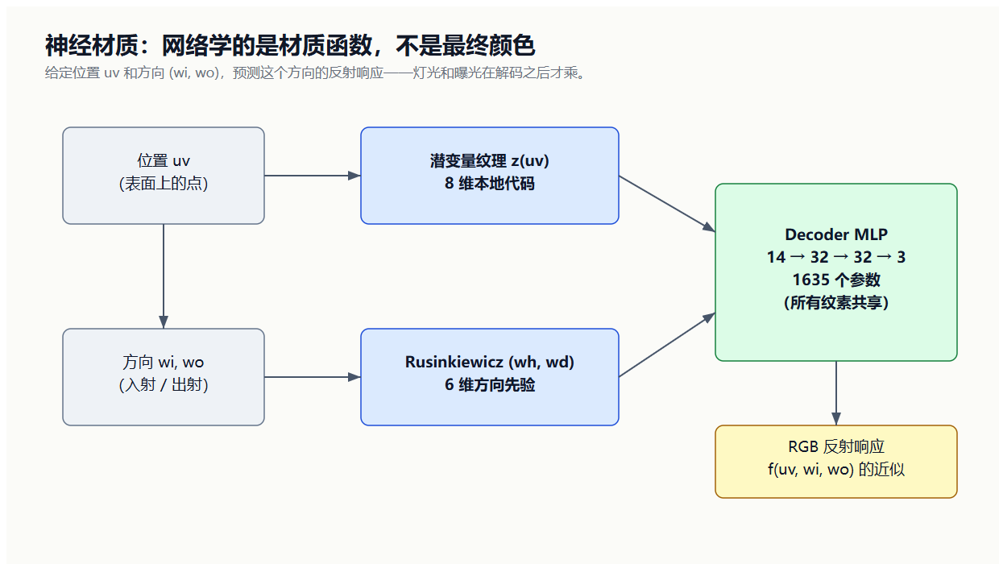
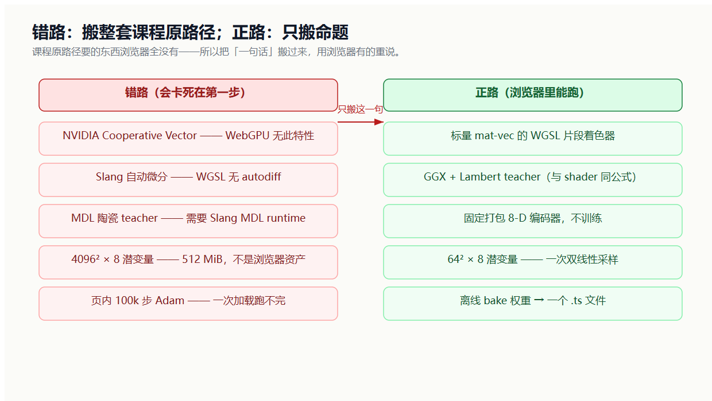
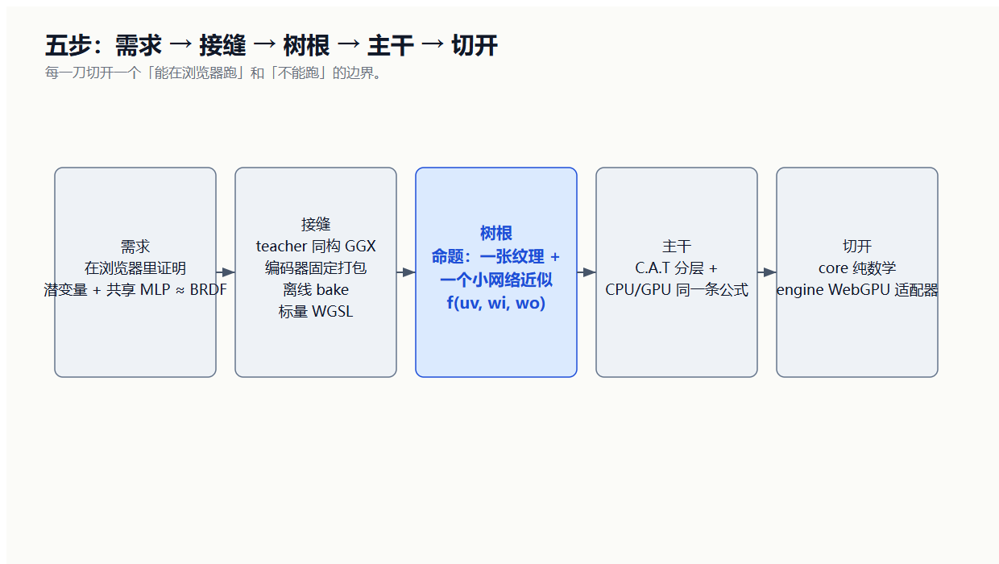
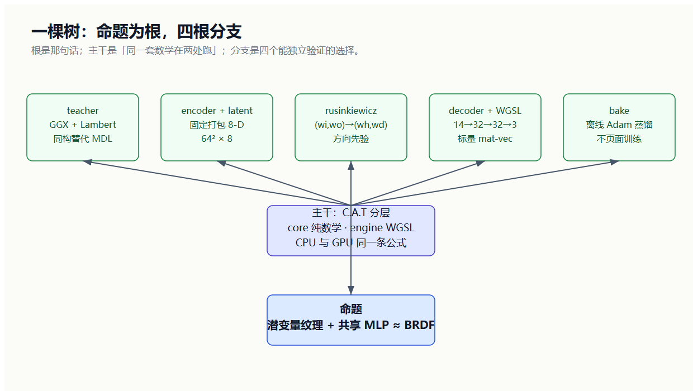
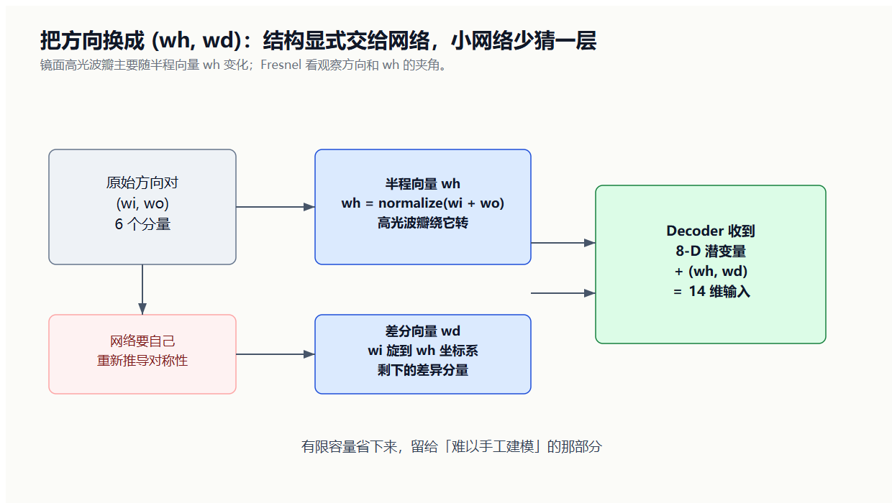
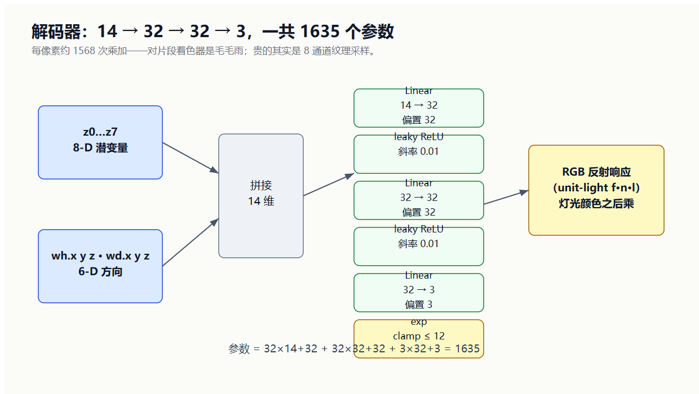
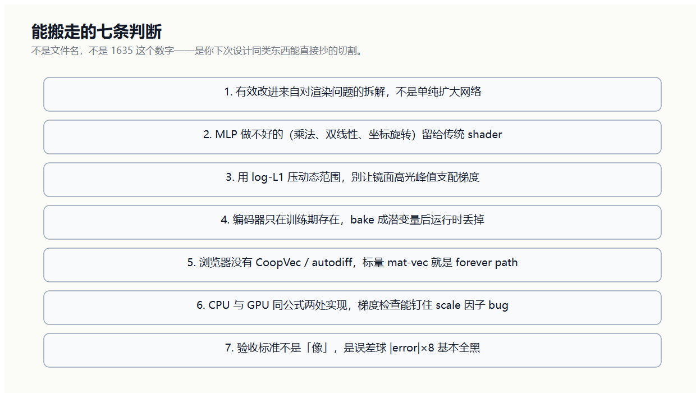

# 把 GGX 材质装进 1635 个参数：神经材质的浏览器最小实现

## TL;DR

- 神经材质的命题只有一句话：一张潜变量纹理 + 一个所有纹素共享的小 MLP，近似 `BRDF(uv, ωi, ωo)`。浏览器里照做，不需要 NVIDIA Cooperative Vector。
- 让结果变好的每一步（Rusinkiewicz 参数化、可学习坐标系、材质编码器）都来自对渲染问题的拆解，不是把网络做大。
- 课程原路径里浏览器没有的东西——CoopVec、Slang 自动微分、MDL 运行时、4096² 潜变量——全换成标量 WGSL、GGX teacher、固定编码器、离线 bake。
- 验收标准不是「看着像」，是误差球 |error|×8 基本全黑：右球才是判断依据。
- 顺手抓到一个真 bug：训练返回均值 loss，梯度却是「和」，等效学习率被放大了 3 倍。一个梯度检查就让它现形。

[作者补一句：一句第一人称亲历。比如「第一次 `npm run bake` 跑完、把三颗球摆进夜工作室、看暖光滑过中间那颗球的金线时……」——写你真实的那个瞬间，别编。]

## 为什么：验证的是一条运行时承诺

SIGGRAPH 2026 的课程 *An Introduction to Neural Shading*（[shader-slang/neural-shading-s26](https://github.com/shader-slang/neural-shading-s26)）教的是一套「神经材质」：把复杂材质在不同位置、入射方向、出射方向下的响应，压缩进一张潜变量纹理和一个很小的 MLP，运行时由 shader 解码。它继承的是 Zeltner 等人 2024 年的 *Real-Time Neural Appearance Models*（[DOI 10.1145/3659577](https://doi.org/10.1145/3659577)）。

这套东西落地，课程原路径靠三样：Slang 的自动微分做训练、Vulkan Cooperative Vector 做推理加速、MDL 陶瓷材质当 teacher。三样在浏览器里一个都没有——WebGPU 的特性表里没有 cooperative vector，WGSL 没有 autodiff，MDL 需要 Slang runtime。

所以这个 demo 验证的不是「神经材质牛不牛」，而是一条更窄的运行时承诺：**一个 1635 参数的标量 MLP，在 WebGPU 片段着色器里实时近似 GGX，误差小到三球 A/B 里分不出左右**。为了这条承诺，我把原路径里不能搬的东西全切掉，只留下那句话。

先钉一个概念：网络预测的是 unit-light 下的 `f(uv, wi, wo)`——材质对方向组合的反射响应，灯光颜色、衰减、曝光全在解码之后才乘。这是「把材质函数当函数来近似」，不是「让大模型在渲染时想象材质」。前者有明确的训练目标（对每个样本比对 teacher 输出），后者没有。

## 错路：搬整套原路径，会卡死在第一步

拿到课程仓库，最顺手的做法是照着 `neural/step_*` 一路抄。但那条路每一段都踩在浏览器没有的东西上。

所以我做的是反过来的：只搬「一句话」——潜变量纹理 + 共享 MLP ≈ BRDF——然后用浏览器里有的零件重说它。GGX 是浏览器里写得出、也写得快的经典材质，同一条公式做 teacher 和 shader，A/B 才成立。

## 脉络：五步切开

把需求到代码的路径画出来，每一步都在切「浏览器能跑 / 不能跑」的边界。

- **需求**：在浏览器里证明命题。
- **接缝**：teacher 同构 GGX、编码器固定打包、离线 bake、标量 WGSL——四个「切掉原路径」的决定。
- **树根**：命题本身。
- **主干**：C.A.T 分层 + CPU/GPU 同一条公式。
- **切开**：core 纯数学，engine WebGPU 适配器。

## 一棵树：命题为根，四根分支

下面按分支往下讲，每根分支回答一个问题。

### teacher：为什么是 GGX，不是 MDL 陶瓷

课程 teacher 是 NVIDIA 的 MDL 陶瓷导出，得靠 Slang 的 MDL runtime 求值，浏览器里没有这条 runtime。换成一个同构的 Cook-Torrance GGX + Lambert——同一份公式写在 TypeScript（训练用）和 WGSL（渲染用）里，teacher 和神经网络在完全相同的灯光下对拍，误差球才有意义。

### encoder + latent：固定打包，不训练

课程后期用 Material Encoder 把显式 BRDF 参数压成 8 维潜变量（step 07 是 `29→64→64→64→8`），训练完再 bake 掉。这个 demo 把 encoder 缩到最小：一个闭式函数，把 `(albedo, roughness, metallic)` 打包成 8 个数，不训练。潜变量 = `[albedo.r, g, b, roughness, metallic, albedo.r·metallic, 1−roughness, clayish]`。

课程潜变量是 4096² × 8 fp32 = 512 MiB。demo 用 64² × 8，约 128 KiB——足够展示釉、金缮线、粘土岛三块空间差异。命题要证明的是「结构能工作」，不是「大纹素量能压缩」。

### rusinkiewicz：把方向换成 (wh, wd)，网络少猜一层

直接把 wi、wo 六个分量喂给网络，小 MLP 得自己重新推导「镜面高光波瓣绕半程向量转」这条对称性。Rusinkiewicz 参数化（1998）把它显式化：`wh = normalize(wi + wo)`，再把 wi 旋进 wh 坐标系得到差分向量 wd。高光主要随 wh 变，Fresnel 看 wo 和 wh 的夹角——这些结构提前写进输入，有限的参数就省下来给「难手工建模」的那部分。

这是课程里最值得抄的一点：**神经网络没有取消材质理论，反而更依赖它。**

### decoder + WGSL：14 → 32 → 32 → 3，1635 个参数

解码器把 8 维潜变量和 6 维方向拼成 14 维，过两层 32 宽的 leaky ReLU（斜率 0.01），输出 3 维，再过 exp（clamp 到 ≤12 防溢出）。参数 = 32×14+32 + 32×32+32 + 3×32+3 = 1635。

每像素约 1568 次乘加（448 + 1024 + 96）。对片段着色器是毛毛雨；真正贵的是那 8 通道潜变量的双线性采样。这也解释了 Zeltner 为什么把 tensor core 押在「path tracer 里每个 hit 都求值」的场景，而不是单个 deferred blob。

WGSL 里没有 `mat14x32`，就用最朴素的标量循环：行 = 输出神经元，权重行主序，一行一个点积。这正是课程 `linear_layer.slang` 的 `#else` 标量回退路径——浏览器能表达的那条路，恰恰是 UTracer 在 Metal 上已经走通的路。

### bake：离线蒸馏，不页面训练

课程训练是 100k 步 Adam × 64² batch，靠 Slang autodiff + CoopVec。浏览器页面加载里跑这个不现实。于是全部搬到 Node：同一个 GGX teacher、同样的 Rusinkiewicz 采样、log-L1 损失，Adam 跑 8000 步，把权重写进一个 `baked.ts`。产物 val log-L1 ≈ 0.0459（Xavier 随机初值约 0.69）。

log-L1 这个选择值得单独说：GGX 镜面峰值可以比漫反射大几个数量级，直接 L1 会让少数亮点支配梯度。对 `log(1+x)` 做差再取绝对值，动态范围被压平，网络才肯去学釉面上那条几像素宽的高光。

### 主干：CPU 和 GPU 同一条公式，两处实现

C.A.T 分层的代价是：GGX、encoder、Rusinkiewicz、leaky ReLU、exp 这五样，`core/*.ts` 和 `NeuralMaterial.ts` 的 WGSL 各写一遍。改一边必须改另一边。

这条纪律这次就救了我。自检测试时写了个梯度检查——解析梯度对数值差分——当场抓出一个 bug：`backwardLogL1` 返回的是均值 loss，梯度累加的却是「和」（漏了 1/3）。等效学习率被放大 3 倍，而 loss 照样正常下降，肉眼根本看不出来。**梯度检查比「loss 在降」可信得多**：scale 因子错 3 倍，训练照样收敛。

## 收获和结论

**收获：**

1. 有效改进来自对渲染问题的拆解，不是单纯扩大网络。
2. MLP 做不好的（乘法、双线性、坐标旋转）留给传统 shader；网络只负责难显式表达的映射。
3. 用 log-L1 压动态范围，别让镜面高光峰值支配梯度。
4. 编码器只在训练期存在，bake 成潜变量后运行时丢掉。
5. 浏览器没有 CoopVec / autodiff，标量 mat-vec 就是 forever path。
6. CPU 与 GPU 同公式两处实现，梯度检查能钉住 scale 因子 bug。
7. 验收标准不是「像」，是误差球 |error|×8 基本全黑。

**结论：** 你从这篇能搬走的不是 1635 这个数、不是 `baked.ts` 这个文件，而是那把切割刀——把材质拆成「局部代码 + 共享解码器 + 显式方向先验」，把浏览器没有的东西（CoopVec、autodiff、MDL）切成离线或同构替代。命题本身，用浏览器有的零件就能说完整。

**讨论口：** 误差球该不该 ×8？这个放大倍数是我定的——不放大，右球黑到看不见细节；放大 8 倍，其实是在替观众做「误差大不大」的判断。如果是你，会把倍数定成多少，还是干脆换成 log 误差的色带？

## PS / PPS / PPPS

**PS.** 只带走一句：神经网络没有取消材质理论，它把有限参数留给了难以手工建模的部分。

**PPS.** 最容易混淆的邻概念：NTC 是「纹理压缩」——解压完还是跑经典 BRDF；神经材质是近似 BRDF 函数本身。两者不是一回事。

**PPPS.** 如果你自己的材质 eval 也要在 CPU 和 GPU 各写一遍，先写梯度检查和黄金向量两个测试再动手——它们能替你守住 scale 因子和符号这两类最阴的 bug。本 demo 的 WebGL2 回退目前未实现，只能在 WebGPU 下跑。

---

想对照源码：`src/core/`（ggx.ts / material.ts / rusinkiewicz.ts / mlp.ts / train.ts）、`src/engine/NeuralMaterial.ts`（WGSL 标量 MLP）、`scripts/bake.ts`（离线蒸馏）、`src/engine/baked.ts`（产物）。
