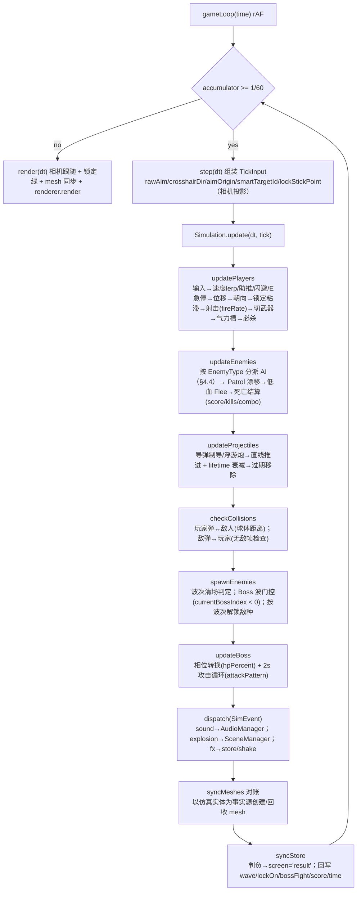
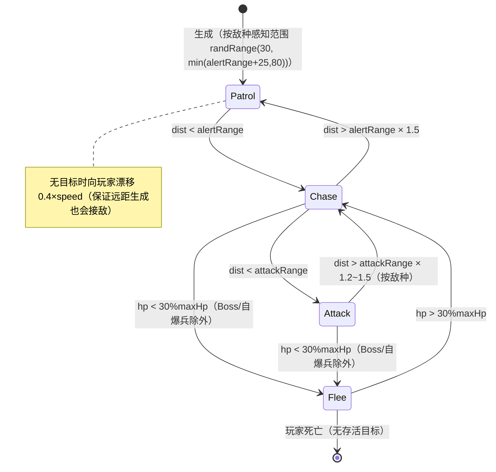
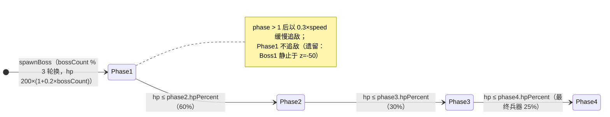

# 纯白枪骑兵 重制版 — 技术设计文档（TDD）

> 依据：`technical-design-document` skill 模板（§0-§8）；内容基线 = 仓库 HEAD `b45ca34` 之后的实现现状。
> 游戏设计意图见 `design-doc.md`（当前 v1.7）；验证与整改记录见 `verification-report.md`。
> 本仓库为 swarm 工作流，文档与实际代码保持一致：**以代码为准，文档树不先于实现**（`design-doc.md` §5 的文件树早于实现，实际结构见本 TDD §3.3 与 §6）。

## §0 封面 / 变更日志

| 项 | 值 |
|----|----|
| 项目 | 纯白枪骑兵 重制版（Pure White Lancer Remake） |
| 原作 | phixcat《纯白枪骑兵》（2008，Flash 空战射击） |
| 技术栈 | Vite 6 + React 19 + TypeScript (strict) + Three.js + Tailwind + Zustand + Web Audio |
| 平台 | 现代桌面浏览器（WebGL1/2），静态站点部署 |
| 本文版本 | 1.0 |
| 日期 | 2026-08-05 |
| 作者 | 技术负责人（KIMI3 swarm 工作流 / tdd-doc agent） |

### 0.1 仓库提交历史（基线至 b45ca34）

| 版本 | 提交 | 日期 | 变更 |
|------|------|------|------|
| 0.1 | `e3b379f` | 2026-08-04 | 仓库初始化：VibeGames monorepo（1/ 2/ 3/ 4_chunbai 四项目骨架） |
| 0.2 | `22c0263` | 2026-08-04 | 更新主/渲染/状态文件；新增 `3/showcase` |
| 0.3 | `c0bcfc5` | 2026-08-04 | 新增 4_chunbai 项目：`new_game/`（Vite 应用）、`src/`（FFDec 反编译原版资源，参考专用）、`reference/`（原版 SWF/EXE/操作笔记 d.md）；添加 .gitignore |
| 0.4 | `7dbe32e` | 2026-08-05 | 实施 4_chunbai 整改计划：单玩家化、全 3D 飞行、屏幕空间瞄准、太空视觉、`fireRate` 生效；同步 `design-doc.md` 与 `dist/` |
| 0.5 | `b45ca34` | 2026-08-05 | 新增音频播报契约桩：`AudioManager.playBossAnnounce(name)` / `playSpecialAnnounce()`（合成语音后续迭代实现） |
| 1.0 | 本文 | 2026-08-05 | 建立 TDD（本文件）；对应 design-doc v1.7 内容基线 |

### 0.2 实现变更明细（0.4 起，见 `verification-report.md` §6/§8）

**移除**：PVP 1v1 模式、本地分屏渲染、ModeSelect 界面、技能系统（未实现部分）。同步删除 `types.ts` / `store.ts` / `GameEngine.ts` / `SceneManager.ts` / 组件 / 设计文档中的相关声明。

**新增/修复**：
- 全 3D 飞行移动：WASD 水平 + Shift/Ctrl 垂直升降，速度矢量积分（阻尼 lerp、E 急停、空格助推、双击空格闪避 + 无敌帧 + 冷却），机甲随飞行方向俯仰/横滚
- 屏幕空间瞄准（含垂直分量）：准星射线对敌人球体求交，命中即精确瞄准；无目标时沿准星水平方向（玩家高度）发射（计划外修正 1：替代「相机射线对平面求交」——该方案在第三人称相机下有射线穿过玩家（速度退化为 0）与 28° 俯角（打低）两个致命缺陷）
- 敌人感知范围生成 + Patrol 状态向玩家漂移（0.4×speed）（计划外修正 2：修复敌人生成距离 200+ 而 alertRange 内才 Chase 导致的「敌人永久不动」）
- 按波次解锁敌种：W1-2 仅 scout/assault/shield，W3+ 狙击，W4+ 自爆，W5+ 指挥官（计划外修正 3：修复轰炸机从 W1 起近距离刷出即秒杀）
- Boss 击杀分改用 `getBoss(currentBossIndex+1).score`（+500）（计划外修正 4）
- `fireRate` 生效（武器按表冷却，替代 60 发/秒）
- 锁定/射击方向含垂直分量（Boss 可被击中）
- 移除幻影 P2；PVE 单玩家判负（`updateUI` 检查 `players[0].alive`）
- 太空视觉：星野 6000 点、白/蓝/暖色地球 + 白色云层 + 大气辉光、橙色太阳 + 暖点光源、纯白机甲（`0xf4f6fa/0xd8dce4/0xb8bcc6/0xcfd3da`）、移除地面/网格/雾
- `AudioManager.playDodge`（闪避上行扫频音效）
- Ctrl+W / Ctrl+R 在游戏中不触发（GameCanvas 组合键 preventDefault 拦截）

**遗留（本次范围外，见 §7 遗留清单）**：Boss 1 相位 1 不追敌（静止于 z=-50）；Boss 2/3 因 `currentBossIndex < 0` 门控不可达；`clone`/`fullLaser`/`shield`/`laserNet` 攻击模式已声明未实现；Tab 锁定为「最近敌人」而非准星指向；导弹无制导（直线飞行）。

## §1 目录

1. [§0 封面 / 变更日志](#§0-封面--变更日志)
2. [§2 引言](#§2-引言)
3. [§3 技术总览](#§3-技术总览)
4. [§4 机制结构](#§4-机制结构)
5. [§5 构建验收](#§5-构建验收)
6. [§6 资源管理与文件格式](#§6-资源管理与文件格式)
7. [§7 分支策略](#§7-分支策略)
8. [§8 工具说明](#§8-工具说明)

## §2 引言

### 2.1 目的与技术目标

对原版《纯白枪骑兵》进行 3D 第三人称空战射击重制，核心体验为 3D 自由飞行 + 鼠标瞄准 + 全向弹幕 + 波次生存与 Boss 战。技术目标：

- **零资产文件**：全部几何程序化生成（Three.js 原语拼装）、全部音频 Web Audio 合成
- **确定性手感**：固定时间步进 1/60，物理/弹道不依赖渲染帧率
- **单玩家专注**：仅 PVE，移除未实现的 PVP/分屏/技能系统（与原作玩法对齐）
- **验证门禁**：TypeScript strict + `tsc -b` 全量类型检查作为每个提交的门禁

### 2.2 目标平台

| 项 | 最低 | 推荐 |
|----|------|------|
| 浏览器 | 支持 WebGL 的现代浏览器（Chrome/Edge/Firefox/Safari 近两年版本） | Chrome/Edge 最新 |
| 设备 | 60fps 下保持本 TDD §3.2 场景预算即可 | 独立显卡桌面机 |
| 交互 | 键盘 + 鼠标（必须；无触屏支持） | 144Hz 显示器 |
| 网络 | 静态资源，本地/边缘部署无后端依赖 | — |

### 2.3 外部工具与开发流程

Vite 6 / TypeScript 5.6 / Three.js 0.170 / Zustand 5 / Tailwind 3.4 / Web Audio API；git worktree 分支隔离的 swarm 流程（见 §7）；构建验证 `npm run build`（见 §5）。

### 2.4 团队角色

| 角色 | 职责 |
|------|------|
| 编排 Agent（orchestrator） | 派发任务、合并分支、解决冲突、构建验证、维护文档与 dist |
| 设计 Agent | 产出 GDD（design-doc.md）与实施计划 |
| 并行 coder Agent | 各自 worktree 分支实现归属文件，tsc 自验证后提交 |
| 验证 Agent | `verification-report.md`：构建/浏览器冒烟/引擎内省验收 |

## §3 技术总览

### 3.1 命名规范

| 类别 | 规则 | 示例 |
|------|------|------|
| 方法/函数 | `camelCase` | `updatePlayers`、`computeAimDir`、`enemyShoot`、`getState` |
| 类型/接口/枚举 | `PascalCase`，成员 `PascalCase` | `PlayerState`、`EnemyDef`、`EnemyType.Scout`、`AIState.Patrol` |
| 常量 | `UPPER_SNAKE_CASE`（集中 `core/constants.ts`） | `FIXED_TIMESTEP`、`MAX_PROJECTILES`、`DODGE_COOLDOWN` |
| 文件/目录 | `kebab-case`（组件例外：与导出组件同名） | `GameEngine.ts`、`weapons.ts`、`GameCanvas.tsx` |
| 私有成员 | 无前缀，按 `private` 关键字约束（类图见 §4.1） | `private dodgeTimer`、`private accumulator` |
| CSS 类 | `kebab-case` + 语义前缀 | `pixel-border`、`pixel-btn-danger`、`text-neon-cyan` |
| 状态管理 | 单一 zustand store，`useGameStore` 单例 | `setGame(partial)`、`setPlayers(players)` |

代码约定：TypeScript strict 全开；状态用 zustand 而非 React Context；实体状态（`PlayerState`/`EnemyState`/`ProjectileState`）为纯数据对象 + 引擎类持有，避免 Three.js 对象进入 React 渲染路径；除 `useSpecial`/`createExplosion` 外不写注释（无注释约定，代码即文档）。

### 3.2 性能预算

**帧预算**（目标 60fps，每帧 16.67ms；渲染外逻辑应 ≤ 3ms）：

| 子系统 | 预算 | 硬上限 / 说明 |
|--------|------|---------------|
| 帧率 | 60fps | `requestAnimationFrame` 主循环；`dt` 钳制 ≤ 0.05s 防螺旋 |
| 模拟步长 | 固定 1/60 s | `FIXED_TIMESTEP`，accumulator 累加；渲染频率与模拟解耦 |
| 实体 | 敌人 ≤ **30**（`MAX_ENEMIES`） | 每敌人 1 Group（4-10 mesh + 边线） |
| 弹体 | 弹丸 ≤ **200**（`MAX_PROJECTILES`） | 玩家/敌弹共用；超限丢弃新弹（`playerShoot`/`enemyShoot` 检查） |
| 碰撞 | O(P×E) ≤ 200×30 = 6000 次距离检查/步 | 3D 球体距离；Boss 命中半径 4，其余 1.5，玩家 1.5 |
| 星野 | 6000 点，1 个 `THREE.Points` 绘制调用 | 顶点色 3 通道；恒定不更新 |
| 天体 | 地球 3 球（r90/92/97，24 段）+ 太阳 2 球（r55/80，16 段） | 静态 mesh，仅初始化构建 |
| 玩家 | 每玩家 ~100 mesh+边线（躯干/头/肩/臂/腿/背包） | 白底机甲 + 蓝色描边；静态组合 |
| 敌人/弹体 mesh | 低模：4-6 段球/锥/柱 | `createProjectileMesh` 球体 4 段、锥 6 段 |
| 粒子 | 爆炸 30 点/次（`createExplosion`） | AdditiveBlending，`depthWrite:false`，rAF 自衰减自清理 |
| 渲染器 | `pixelRatio = min(devicePixelRatio, 2)`，`antialias: true` | 远裁剪 2000；`PerspectiveCamera(fov 60)` |
| 音频节点 | 常驻 ≤ 5 节点（见下） | 瞬时 SFX 节点 ~2/次，0.1-0.5s 内 stop 自回收 |

**Web Audio 节点预算**：常驻节点 = `AudioContext` + `masterGain` + `bgmGain` + `sfxGain` + BGM 振荡器（55Hz sawtooth + 0.5Hz LFO → gain 调制，即 +2 节点）≈ 7；瞬时节点每音效 = 1 振荡器（或 1 BufferSource）+ 1 Gain，均以 `exponentialRampToValueAtTime(0.001)` 收尾后 `stop()`，并发峰值 ≤ 6-8。禁止无界创建（无蓄水池，靠极短寿命控制）。

**场景对象预算小结**：单帧最大 mesh 数 ≈ 星野 1 + 天体 5 + 玩家 ~100 + 敌人 30×7 + 弹体 200 + Boss ~9 + 爆炸/锁定线瞬时 ≈ **~550 mesh / ~1 万顶点级**，draw call 估算 < 400。

### 3.3 分析工具

| 工具 | 用途 | 使用时机 |
|------|------|----------|
| 浏览器 DevTools → Performance | rAF 帧时间、长任务、主线程占用；验证固定步长更新不拖垮渲染 | 帧率抖动、卡顿排查 |
| 浏览器 DevTools → Memory | 堆快照、Geometry/Material 泄漏（`dispose` 检查：`stop()`、`createExplosion` 自清理、弹体/敌人移除） | 长时间游玩后内存曲线 |
| DevTools → Console | 零 console error/page error 冒烟基线（验证报告流程） | 每次构建验收 |
| DevTools → Rendering → FPS meter / WebGL 层 | 实时帧率与合成层检查 | 视觉性能调优 |
| WebGL 性能面板（`renderer.info`，DevTools 控制台内省） | `draw.calls`、`render.triangles`、`memory.geometries/textures` 计数 | 对照 §3.2 预算核对 |
| Playwright + 引擎内省（仓库验证工作流） | 无头冒烟：菜单→PVE→暂停→返回、60s 连续射击、Shift/Ctrl/空格/闪避/E 数值断言 | 提交合并前由验证 Agent 执行 |

## §4 机制结构

### 4.1 核心类图（core/ 仿真 + engine/ 适配层）

> 架构遵循 GDC 2026《AI-Driven 3D Game Prototyping》C.A.T 框架：`core/`（平台无关核心）与 `engine/`（平台适配层）硬分离；仿真副作用以 `SimEvent` 事件流出，适配层消费。

```mermaid
classDiagram
    direction LR

    class Simulation {
        +players: PlayerState[]
        +enemies: EnemyState[]
        +projectiles: ProjectileState[]
        +wave: number
        +lockOn: boolean
        +lockTargetId: (number|null)
        +aimNormX / aimNormY: number
        +velocities: Vector3[]
        +enemyVels: Map
        +currentBossIndex: number
        +start(players) void
        +update(dt, tick) SimEvent[]
        -updatePlayers(dt, inputs, tick) void
        -updateLock(inp, p, tick) void
        -computeAimDir(player, tick) Vector3
        -playerShoot(player, index, tick) void
        -useSpecial(player, index) void
        -updateEnemies(dt, tick) void
        -enemyShoot(enemy, target) void
        -updateProjectiles(dt) void
        -steerMissile(p, dt) void
        -updateFunnel(p, dt) void
        -checkCollisions() void
        -spawnEnemies(dt) void
        -spawnBoss() void
        -updateBoss(dt) void
    }

    class TickInput {
        +input: InputState
        +rawAim: {x, y}
        +crosshairDir: Vector3
        +aimOrigin: Vector3
        +smartTargetId: (number|null)
        +lockStickPoint: ({x,y}|null)
    }

    class SimEvent {
        <<union>>
        +sound: SoundKind
        +explosion: pos/color/size
        +fx: edgePulse|timeDilation|shake
    }

    class GameEngine {
        +scene: SceneManager
        +input: InputManager
        +canvas: HTMLCanvasElement
        +sim: Simulation
        +active: boolean
        -accumulator / -lastTime: number
        -brakePitch / -cameraStiffness: number
        -cameraShake: number
        +start() void
        +stop() void
        +resize(width, height) void
        -gameLoop(time) void
        -step(dt) void
        -dispatch(events) void
        -syncMeshes() void
        -syncStore() void
        -worldToScreen(pos) {x,y}|null
        -pickSmartTarget(player) (number|null)
        -lockStickPoint() ({x,y}|null)
        -computeCrosshairDir(player) Vector3
        -renderLockVisuals(p, i) void
        -render(dt) void
    }

    GameEngine --> Simulation : 固定步 update()
    Simulation ..> SimEvent : 副作用
    GameEngine ..> TickInput : 组装
    GameEngine --> SceneManager : 渲染/事件

    class SceneManager {
        +scene: THREE.Scene
        +renderer: THREE.WebGLRenderer
        +camera: THREE.PerspectiveCamera
        +playerMeshes: Map~number, THREE.Group~
        +enemyMeshes: Map~number, THREE.Group~
        +bossMeshes: Map~number, THREE.Group~
        +projectileMeshes: Map~number, THREE.Mesh~
        +lockIndicators: Map~number, THREE.Line~
        +ambientLight / +dirLight / +pointLight
        +createPlayerMesh(color) THREE.Group
        +createEnemyMesh(color, size, type) THREE.Group
        +createBossMesh(color, size) THREE.Group
        +createProjectileMesh(color, type) THREE.Mesh
        +createExplosion(pos, color, size) void
        +updateCamera(target, dt, yaw) void
        +updateLockIndicator(playerId, from, to) void
        +resize(w, h) void
        +render() void
        +dispose() void
    }

    class InputManager {
        -keys: Set~string~
        -mouseNormX / -mouseNormY: number
        -mouseDown: boolean
        -_weaponSwitch / -_dodge / -_special: boolean|number
        -lastSpaceTime: number
        +setCanvasSize(w, h) void
        +getMouseNormX() / +getMouseNormY() number
        +getState() InputState
        +keyDown(key) void
        +keyUp(key) void
        +mouseMove(x, y) void
        +mouseDownFn() / +mouseUpFn() void
    }

    class AudioManager {
        -ctx: AudioContext
        -masterGain / -bgmGain / -sfxGain: GainNode
        -bgmOsc: OscillatorNode
        +init() void
        +playShoot(freq) void
        +playExplosion() void
        +playHit() void
        +playSpecial() void
        +playDodge() void
        +playBossWarning() void
        +startBGM() void
        +stopBGM() void
        +playBossAnnounce(name) void
        +playSpecialAnnounce() void
    }

    class useGameStore {
        +game: GameState
        +players: PlayerState[]
        +inputs: InputState[]
        +setGame(partial) void
        +setPlayers(players) void
        +setInputs(inputs) void
        +resetGame() void
    }

    class data_tables {
        <<module>>
        getWeapon(id) WeaponDef
        getEnemyDef(type) EnemyDef
        getBoss(id) BossDef
    }

    GameEngine --> SceneManager
    GameEngine --> InputManager
    GameEngine --> AudioManager
    GameEngine --> useGameStore : 读写实体/UI 状态
    GameEngine --> data_tables : 数据表只读消费
    SceneManager ..> THREE : WebGL 渲染
    AudioManager ..> AudioContext : Web Audio 合成
```

### 4.2 GameEngine 更新管线（fixed timestep）

`gameLoop`（rAF）→ 累加 `dt`（钳 0.05）→ 每满 `FIXED_TIMESTEP`(1/60) 执行一次 `step`，渲染在补间后执行：



**数据流**：`InputManager.getState()`（每帧取）+ 适配层相机投影 → `TickInput` → `Simulation.update(dt, tick)`（纯核心，无 THREE/DOM/store 依赖）→ 返回 `SimEvent[]` 由引擎分发；实体数组（`players`/`enemies`/`projectiles`）由引擎每帧对账 mesh、经 `syncStore` 回写 zustand → React HUD 订阅重渲染。Three.js mesh 仅由引擎持有，store 中无 mesh 引用。

### 4.3 InputManager 键位映射表

`getState()` 从按键集合/鼠标状态组装 `InputState`；边沿触发字段（`weaponSwitch`/`dodge`/`special`）读取后清零：

| 键位 | InputState 字段 | 功能 | 触发方式 |
|------|-----------------|------|----------|
| W / ↑ | `forward` | 前飞（-Z 方向速度分量） | 按住 |
| S / ↓ | `backward` | 后飞 | 按住 |
| A / ← | `left` | 左平移 | 按住 |
| D / → | `right` | 右平移 | 按住 |
| Shift | `up` | 上升（垂直轴 +Y） | 按住 |
| Control (Ctrl) | `down` | 下降（垂直轴 -Y） | 按住 |
| 鼠标移动 | `aimX` / `aimY` | 屏幕空间瞄准（归一化 0..1） | 移动 |
| 鼠标左键 | `shoot` | 射击（按武器 `fireRate` 冷却） | 按住 |
| 空格（按住） | `boost` | 引擎助推（速度上限 ×`BOOST_SPEED_MULT`=3） | 按住 |
| 空格（双击 <300ms） | `dodge` | 闪避冲刺（`DODGE_SPEED_MULT`=4，无敌 0.4s，冷却 2.5s） | 边沿（双击判定） |
| E | `brake` | 急停（`BRAKE_K`=10 强阻尼） | 按住 |
| 1 / 2 / 3 / 4 | `weaponSwitch` | 切换武器（仅限已持有的 `weapons[]`，初始 [1,2,3]） | 边沿 |
| Tab | `lockTarget` | 锁定切换：范围内（`weapon.lockRange`）最近敌人 | 按住（每帧重算） |
| Z | `special` | 必杀技（气力槽 ≥100 时消耗，全屏光束 150 伤/50 内） | 边沿 |
| Esc / Enter | （GameCanvas 处理） | 暂停：`setGame({screen:'pause'})`；Esc 同时退出 pointer lock | 边沿 |
| Ctrl+W / Ctrl+R | — | 页面拦截（`preventDefault`），防止误刷新 | 组合键 |

> 键位大小写兼容（`has()` 同时查询原始/小写/大写）；`PREVENT_KEYS` 列表（w/a/s/d/e/z/空格/Tab/1-4/Shift/Control/Enter）阻止默认浏览器行为。

### 4.4 敌人 AI 状态机

`AIState` 枚举定义 `Idle/Patrol/Alert/Chase/Attack/Cooldown/Flee/Phase1-4`；常规敌人实际使用 **Patrol → Chase → Attack → Flee**（Idle/Alert/Cooldown 为枚举预留）：



**敌种行为差异**（`updateAI*` 分派，参数 `(e, target, dist, def, dt)`）：

| 敌种（EnemyType） | 行为 | 数据要点（enemies.ts） |
|-------------------|------|------------------------|
| Scout 侦察兵 | Patrol 进 Chase；Attack 时绕目标环行（strafe）射击 | hp20/spd12/伤5，攻距20/警距40，10 分 |
| Assault 突击兵 | 全速扑向玩家，边冲边射 | hp40/spd18/伤10，攻距15/警距35，20 分 |
| Sniper 狙击手 | 保持距离：过近后退，过远 Chase，低频高伤射击 | hp15/spd8/伤25，攻距50/警距60，25 分 |
| Shield 护盾兵 | 慢速推进、身体阻挡，中频射击 | hp60/spd10/伤8，攻距18/警距30，30 分 |
| Bomber 自爆兵 | 全速冲刺；接触 <3u 自爆（40 伤，无视 Flee） | hp10/spd25/伤40，15 分 |
| Commander 指挥官 | 30u 内友军 speed ×1.3 buff + 中距射击 | hp80/spd8/伤15，攻距25/警距50，50 分 |

**Boss 相位状态机**（`updateBoss`）：`AIState.Phase1..Phase4` 由 `BossDef.phases[i].hpPercent` 阈值驱动；每 2s（`bossAttackTimer`）按当前相位 `attackPattern` 执行攻击循环：



攻击模式实现状态（`core/simulation/bossAttacks.ts` 纯函数，`runBossAttack` 按 `attackPattern` 分派）：`spread`（12 弹环）、`laser`/`finalBeam`（高速高伤光束）、`missile`（5 发散射）、`rush`（speed 20 突进）、`clone`（分身 5 向）、`fullLaser`（旋转平面扫射）、`shield`（力场减伤 4s）、`laserNet`（激光网扇）与 `spawn`（3 只 scout 杂兵）**全部实现**。

### 4.5 游戏屏幕流

`GameState.screen: 'menu' | 'pve' | 'pause' | 'result'`；`App.tsx` 按 screen 渲染；`GameCanvas` 仅在 `pve` 挂载（挂载即 `engine.start()`，卸载即 `engine.stop()` 并释放监听）：

```mermaid
flowchart TD
    M["menu 主菜单"] -->|START GAME| P["pve 游戏<br/>GameCanvas 挂载 → engine.start()"]
    P -->|Esc/Enter| PU["pause 暂停<br/>GameCanvas 卸载 → engine.stop()（引擎冻结）"]
    PU -->|CONTINUE| P["pve（重新挂载 → engine.start()，store 状态保留）"]
    PU -->|QUIT| M
    P -->|players[0].alive = false| R["result 结算<br/>syncStore 置 gameOver+screen → engine.stop()"]
    R -->|PLAY AGAIN| P["pve（resetGame 后重开）"]
    R -->|MAIN MENU| M
    M -->|resetGame| M
```

状态约束：`pve` 为唯一运行态（引擎 active）；`pause`/`result` 下引擎必已 stop；`gameOver` 仅由引擎 `syncStore` 置位（单玩家判负，无 PVP 胜利条件）；暂停不持久化。

## §5 构建验收

| 检查项 | 命令 | 判定 |
|--------|------|------|
| 类型检查（门禁） | `npx tsc -b --noEmit` | 0 错误；**每个提交前必须通过** |
| 生产构建 | `npm run build`（= `tsc -b && vite build`） | 成功产出 `dist/`（index.html + hashed assets）；基线 ~49-50 modules，主包 ~734 kB（含 three.js，可接受） |
| 开发服务器 | `npm run dev` | 端口 **3000**（`vite.config.ts` 固定，host 0.0.0.0） |
| 浏览器冒烟 | dev server + Playwright | 菜单→START GAME→PVE→Esc 暂停→CONTINUE→QUIT 回菜单，无 console/page error |
| 玩法数值冒烟 | Playwright 引擎内省 | 60s 连续射击 score>0（基线 150/9 击杀）；Shift 升/Ctrl 降、空格助推（~46 u/s）、双击空格闪避（~37.6u + 冷却拦截）、E 急停（~0.01 @700ms）；W5 Boss 可命中（hp 240→160） |
| 提交产物 | git | 源码变更与重建的 `dist/` 一并提交（仓库约定，见 §7） |

签名：`npm run build` 通过由验证 Agent（orchestrator）在合并后执行并记录于 `verification-report.md`。

## §6 资源管理与文件格式

**零资产文件策略**：不提交任何 png/jpg/glb/ogg/mp3 等资源（`reference/` 与 `src/` 反编译资源为参考专用，不参与构建）。全部运行时内容为代码：

| 类别 | 格式 | 生成方式 |
|------|------|----------|
| 3D 模型 | Three.js 原语组合（Box/Sphere/Cylinder/Cone/Octahedron/Dodecahedron/Torus + EdgesGeometry 边线） | `SceneManager.createPlayerMesh / createEnemyMesh / createBossMesh` |
| 弹道/粒子 | 低模 Mesh / `THREE.Points`（顶点色） | `createProjectileMesh / createExplosion` |
| 背景 | `THREE.Points` 星野 + 程序化球体天体 + 灯光 | `SceneManager` 构造器 |
| 音频 | Web Audio 节点图（Oscillator/Noise Buffer/Gain/LFO） | `AudioManager`（§3.2 节点预算） |
| 字体/UI | 系统字体 + Tailwind 工具类（`font-pixel` 等像素风定义） | CSS |

**目录布局**（实际代码结构，替代 design-doc §5 的旧文件树；C.A.T 分层：`core/` 平台无关核心 + `engine/` 平台适配层）：

```
4_chunbai/new_game/
├── index.html / vite.config.ts / tailwind.config / package.json
├── dist/                       # 构建产物（已提交，随源码同步）
└── src/
    ├── main.tsx / App.tsx      # 入口 + 屏幕路由
    ├── store.ts                # zustand：game/players/inputs + setGame/setPlayers/resetGame
    ├── core/                   # ★ 平台无关核心（零 THREE/DOM/store 依赖，可跨运行时复用）
    │   ├── types.ts            # 全类型/枚举契约（PlayerState/EnemyState/ProjectileState/AIState/...）
    │   ├── constants.ts        # 全部数值常量（手感/世界/锁定/相机调参）
    │   ├── math.ts             # vec3 纯函数工具
    │   ├── data/               # 武器/敌种/Boss/技能数据表（只读模块）
    │   ├── simulation/
    │   │   ├── Simulation.ts   # 仿真核心：规则/状态/AI/生成/Boss，副作用→SimEvent
    │   │   ├── enemyAI.ts      # 6+1 敌种行为（纯函数 + ctx 回调）
    │   │   ├── bossAttacks.ts  # 8 种 Boss 攻击模式（纯函数 + ctx 回调）
    │   │   └── events.ts       # SimEvent 联合（sound/explosion/fx）
    │   └── world/
    │       ├── world.ts        # WorldManifest：竞技场/碰撞体/命名标记/生成带/数据表（事实源）
    │       └── worldText.ts    # T 原则 token 化：describeWorld/describeRules/describeEntities
    ├── engine/                 # ★ 平台适配层（Three.js / DOM / Web Audio / store 绑定）
    │   ├── GameEngine.ts       # 编排器：固定步长主循环 + Tick 组装 + 事件分发 + mesh 对账（~530 行）
    │   ├── SceneManager.ts     # Three.js 场景/程序化模型/粒子/相机
    │   ├── InputManager.ts     # 键鼠 → InputState（§4.3 映射表）
    │   ├── AudioManager.ts     # Web Audio 合成器（SFX/BGM/播报桩）
    │   └── postfx.ts           # 后处理（色差/扫描线/颗粒/暗角）
    └── components/             # GameCanvas / HUD / Menu / PauseMenu / ResultScreen
```

数据表文件（`core/data/*.ts`）为纯函数只读模块：`getWeapon/getEnemyDef/getBoss` 带默认回退（`|| [0]`），仿真不直接持有表引用之外的写路径。DEV 构建暴露 `window.__gameManifest()`（`buildPromptContext` 完整 token 文本）与 `window.__sim`（仿真内省），生产构建无此接口。

## §7 分支策略

本仓库采用 KIMI3 **swarm 多 Agent 并行开发流程**（见根目录 `kimi3.md` 研究笔记与 `AGENTS.md`）：

```mermaid
gitGraph
    commit id: "master 基线"
    branch agent/tdd-doc
    branch agent/ai
    branch agent/weapons
    checkout agent/tdd-doc
    commit id: "TDD.md"
    checkout agent/ai
    commit id: "Boss AI 重做"
    checkout agent/weapons
    commit id: "武器 4-6 解锁"
    checkout master
    merge agent/ai id: "orchestrator 合并+冲突解决"
    merge agent/weapons
    merge agent/tdd-doc
    commit id: "构建验证 → dist"
```

| 规则 | 说明 |
|------|------|
| `master` | 唯一长驻分支 = 实现基线 + 交付物（含重建的 `dist/`）。不接受直接推送，由 orchestrator 合并 |
| `agent/<name>` | 每个并行 coder Agent 一个分支，**git worktree 隔离**（如 `agent/tdd-doc` 挂载于独立目录）；分支从基线 `b45ca34` 派生，各 agent 互不可见对方改动 |
| 文件归属隔离 | 每个 agent 只改归属文件（本任务仅 `4_chunbai/new_game/TDD.md`）；跨文件接口依赖以 `types.ts`/`store.ts` 契约为准，**签名冻结**，不得单方面改动 |
| 自验证闭环 | 每个 agent 提交前必须 `npx tsc -b --noEmit` 通过（文档类任务为纯 markdown 变更时不运行 npm）；**不启动 dev server 原则**——agent 只提交，orchestrator 负责构建验证 |
| 合并 | orchestrator 按分支逐个合并到 master，解决冲突；合并后跑 `npm run build` + 浏览器冒烟（`verification-report.md` 记录） |
| 提交规范 | 中文或英文短句描述，一行主题（如 `Add TDD.md technical design document`）；不推送（远端由 orchestrator 统一处理） |
| 簿记 | 根目录 `registered_agents.json` / `task_agent_mapping.json` 为 swarm 任务簿记（当前空 `{}`），由 orchestrator 维护，agent 不触碰 |
| 文档同步 | 设计文档（design-doc.md/TDD.md/verification-report.md）随实现演进保持同步；改动涉及行为/结构时需回写文档 |

## §8 工具说明

| 工具 | 版本 | 安装/配置 | 本项目的调用方式 |
|------|------|-----------|------------------|
| Vite | ^6.0 | npm 依赖（`devDependencies`） | `npm run dev`（端口 3000，host 0.0.0.0）；`npm run build` = `tsc -b && vite build`；`npm run preview` |
| TypeScript | ^5.6 | tsconfig 项目引用（`tsc -b`） | strict 全开；`npx tsc -b --noEmit` 为提交门禁 |
| React | ^19 | `@vitejs/plugin-react` | UI 层：App 屏幕路由 + HUD/Menu/PauseMenu/ResultScreen；无状态放组件外 |
| Three.js | ^0.170（`@types/three` 同版） | npm 依赖 | WebGL 渲染/程序化几何/粒子；`renderer.setPixelRatio(min(dpr,2))` |
| Zustand | ^5.0 | npm 依赖 | `useGameStore` 单例（`store.ts`）；引擎每帧回写，组件订阅 |
| Tailwind CSS | ^3.4 | tailwind.config + postcss | 工具类 UI；像素风自定义类（`pixel-border`/`pixel-btn`/`text-neon-cyan`/`font-pixel`） |
| Web Audio API | 浏览器内置 | 无依赖 | `AudioManager` 程序化合成；`init()` 需用户手势后调用（引擎 `start()` 时） |
| git | — | worktree + 分支流程见 §7 | `git add` 归属文件 + `git commit` 自验证；不 push |
| Playwright | 仓库验证环境 | 见根 AGENTS.md（webapp-testing skill） | 冒烟与数值内省（§5） |

工具变更时：package.json 变更由 orchestrator 提交；本表与 `design-doc.md` §2（技术栈）同步更新。

---

**遗留清单**（与 `verification-report.md` §7 一致，供后续迭代）：Boss 行为重做（3 Boss 全可达、clone/fullLaser/shield/laserNet、追敌移动）；武器 4/5/6 解锁路径；BGM 升级为循环音序 + 合成语音；浮游炮自动攻击与导弹制导；关卡结构（清场过关，非无限波次）；Bloom 后处理。
