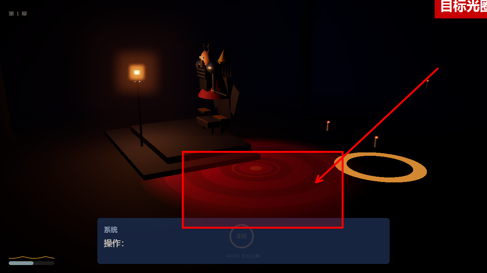
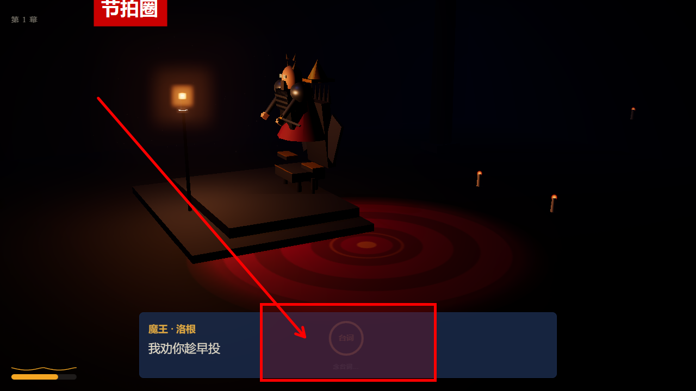
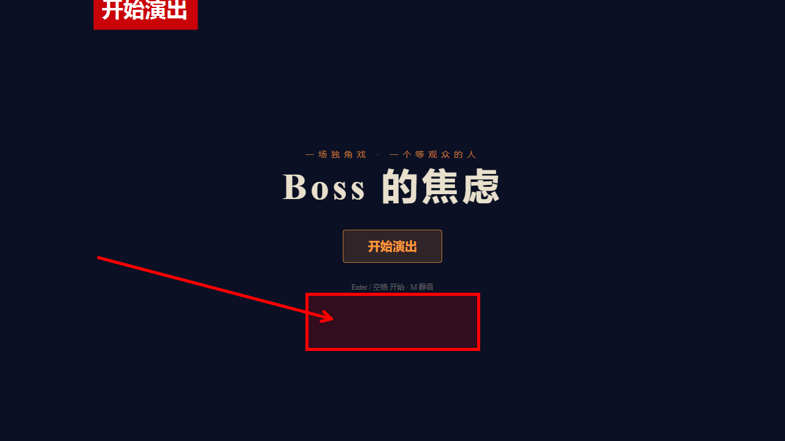
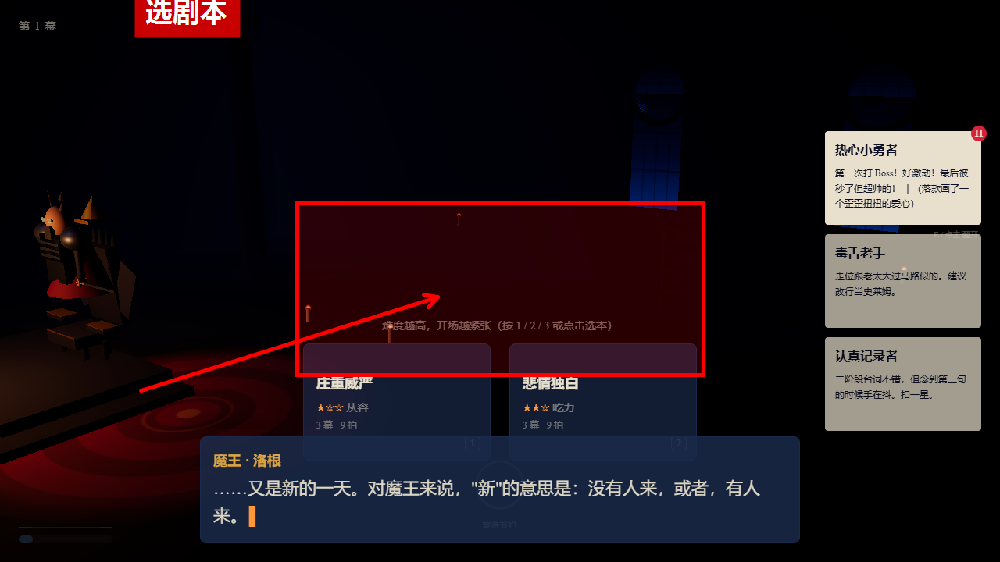
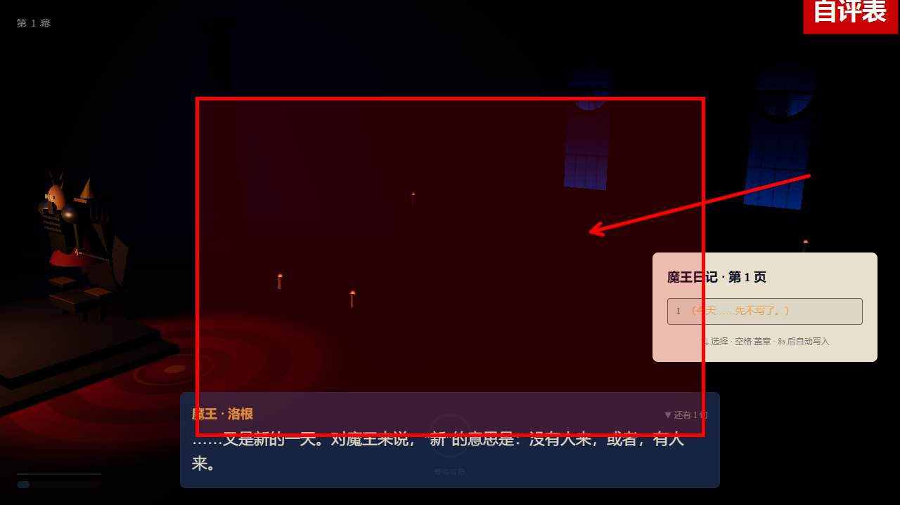
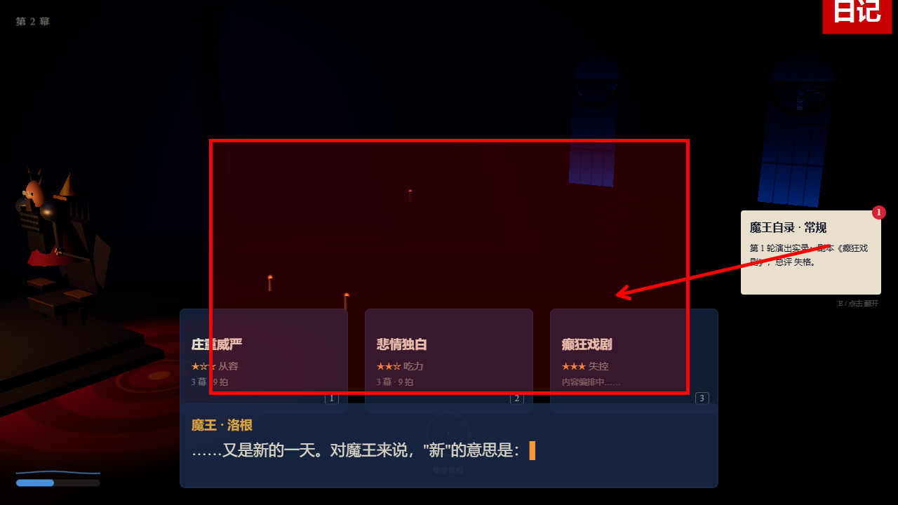
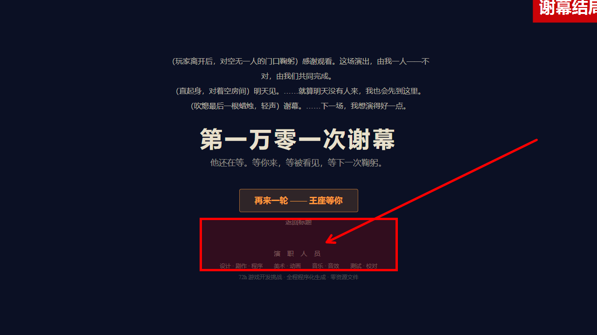

# 《Boss 的焦虑》— 怎么玩

> 你扮演 RPG 里的最终 Boss——一个在空房间里练习谢幕的演员。
> 玩家只是你的观众，也是你存在的理由。你不怕输，你怕"没人记住这场战斗"。

**在线试玩**：`npm run dev` 后打开 http://localhost:5173 （或直接打开 `dist/` 静态产物）

---

## 一、一句话玩法

**你操纵 Boss 在舞台上演出**：按剧本走位、在节拍圈亮起时出手、念台词。
玩家的影子会不断逼近并攻击你——你被击倒 3 次就提前谢幕，撑过 4 轮迎来最终结局。

游戏循环：

```
等玩家来 → 察觉 → 上台表演（3 幕） → 给自己打分 → 写日记 → 下一轮（或结局）
```

一轮约 2–3 分钟，最多 4 轮。

## 二、操作一览

| 按键 | 作用 |
|---|---|
| `W A S D` | **Boss 走位**——把 Boss 挪进金色光圈（走位节拍的目标点） |
| 鼠标左键 | **攻击**——节拍圈变红时按下，Boss 出手打退玩家的攻击 |
| `1` / `2` / `3` | 选剧本（庄重威严 / 悲情独白 / 癫狂戏剧） |
| `E` | 翻开挑战者档案 |
| `空格` / `Enter` | 开始游戏 · 跳过对白打字机 |
| `Esc` | 暂停 |
| `M` | 静音 |

## 三、WASD 到底在操纵什么？

看屏幕上的 **金色光圈**（地板上的圆环）：



- **光圈出现** = 当前是走位节拍。按 `WASD` 把 Boss 挪进光圈里。
- **光圈变绿** = 你站到位了（记入走位分）。
- 光圈消失 = 节拍结束，进入下一拍。

相机固定对着舞台中央（王座在左、舞台居中、玩家从右侧逼近），你不需要转视角。

## 四、节拍圈（屏幕下方的圆环）是什么意思？

HUD 底部有个圆环，**显示当前节拍和剩余时间**（弧线一圈 = 时间走完）：

| 圆环状态 | 含义 | 你要做的 |
|---|---|---|
| 灰色 · 等待节拍 | 演出间隙 | 等着 |
| 橙色 · 走位 | 站到地板光圈里 | `WASD` 走进光圈 |
| **红色 · 攻击** | 出手时机 | **按鼠标左键** |
| 橙色 · 台词 | Boss 在念台词 | 不用操作（焦虑高会忘词） |
| 橙色 · 特效 | 仪式光效 | 不用操作 |



## 五、一局怎么打（走读）

### 第 1 步：标题 → 开始



按 `Enter` 或点「开始演出」。开场字幕按任意键跳过。

### 第 2 步：等待 —— 选剧本



Boss 独坐王座，翻看「前任挑战者档案」（按 E 翻阅），挑今晚的剧本：

- **庄重威严**（按 1）—— 难度 ★，开场焦虑低，稳
- **悲情独白**（按 2）—— 难度 ★★，开场焦虑高，演好了更难忘
- **癫狂戏剧**（按 3）—— 难度 ★★★，开场焦虑最高，容易出戏但爆发力强
- 选完 2 秒内开演

> 难度 = 开场焦虑值。焦虑越高，手越抖、越容易忘词、攻击越乱。

### 第 3 步：察觉 —— 玩家来了

脚步声渐强，影子从走廊尽头逼近，飘来玩家看的「攻略弹幕」（比如"他剑在抖！往左闪！"）——弹幕会让你更紧张。

### 第 4 步：表演 —— 核心操作（3 幕）

开演时系统会提示：「**WASD 走进金色光圈 · 节拍圈变红时按左键出手 · 台词会自动念**」。

- **走位节拍**：按 WASD 走进金色光圈（站准 = 走位分）
- **攻击节拍**：圆环变红 + 倒计时，**按左键**——出手！没按 = 空挥落空（+焦虑）
- **台词节拍**：自动念白；焦虑越高越容易忘词/结巴（忘词又 +焦虑，恶性循环）
- 玩家的影子会命中你（屏幕红闪）——被击倒 3 次 = 提前谢幕

### 第 5 步：自评 —— 给自己打分



四轴 1–5 星：走位流畅度 / 台词感染力 / 视觉效果（自己打）+ 「有没有让玩家记住」（系统代填）。
总分 ≥4.5 完美、≥3.5 合格、否则失格。给高星 → 下轮焦虑降；给低星 → 更慌。

### 第 6 步：日记 → 下一轮 / 结局



写一句话（或等 8 秒自动写）。日记跨存档保留。

第 4 轮结束（或被击倒 3 次提前收场）→ 谢幕结局：



- 「再来一轮」：立刻重开
- 「返回标题」：回标题画面

## 六、焦虑值是什么？

隐藏数值 0–100，界面不显示数字，用画面表现：

| 阶段 | 表现 |
|---|---|
| 0–30 从容 | 手稳、台词完整 |
| 31–60 紧张 | 起手犹豫，偶尔结巴 |
| 61–85 发抖 | 攻速变慢、忘词概率大涨、打偏 |
| 86–100 恐慌 | 攻击乱套、可能剑脱手、跪地喘息 |

焦虑来源：玩家稳步逼近、弹幕、被命中、被完美闪避、忘词、被打断。
缓解：完成阶段、自评给高星、日记写正面的话、评估期自然呼吸。

## 七、FAQ

**Q：下面那个框是什么？能点吗？**
A：Boss 的台词框（对白框）。**可以点**——跳过打字机/切下一句；不点也会自动更新。

**Q：为什么有时候 Boss 不动了？**
A：被命中会倒地（HIT）→ 整理头发（RECOVER）→ 重新站起来。焦虑 100 会跪地喘息 2 秒。这些都是"演出事故"，本身也是戏。

**Q：怎么才算赢？**
A：没有"输赢"。每轮只有"演得好不好"：打满 3 幕 + 总评 ≥4.5 = 完美轮。累积"被看见度"决定结局是掌声谢幕还是空房间谢幕。

**Q：隐藏结局？**
A：写 3 次"我不够好"后，下一轮 SENSE 阶段会出现三个选项——选「我也累了」进入隐藏谢幕（黑场 → 静默 → Credits）。开关 `STRETCH_FLAGS.hiddenEnding`，v1.3 起默认开启。

---

*玩法文档 v1.2 · 截图来自 0.1.0 构建（红框/箭头标注关键区域）· 更多设计细节见 `docs/design/` 与 `TDD.md`*
