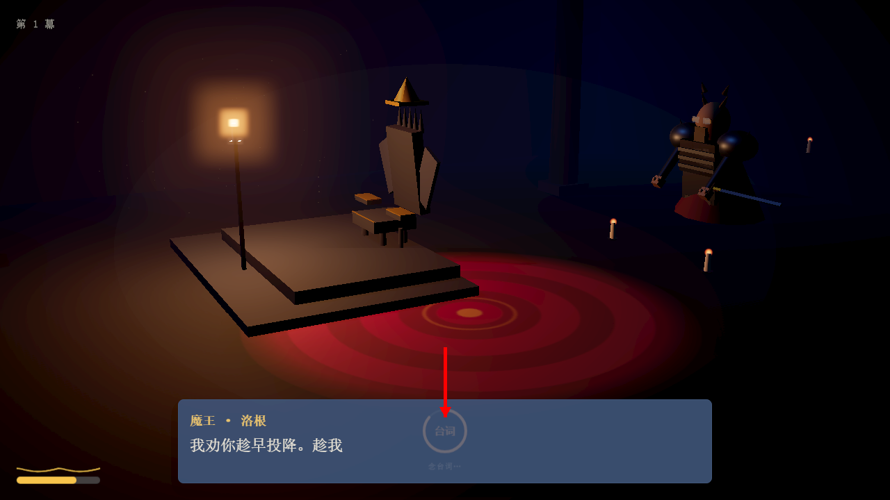
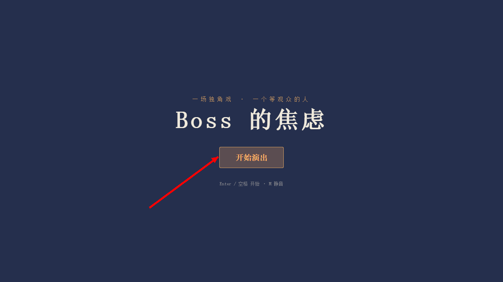
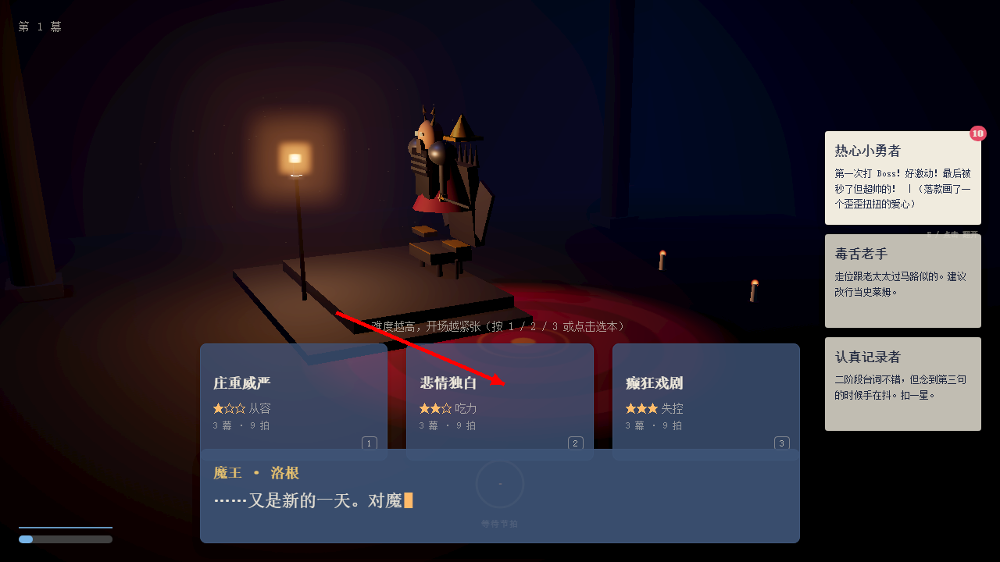
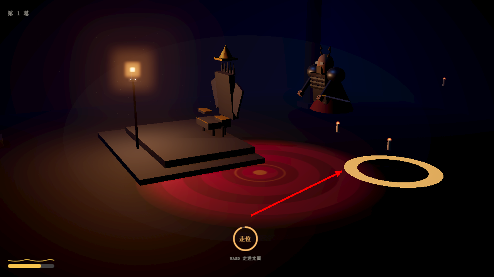
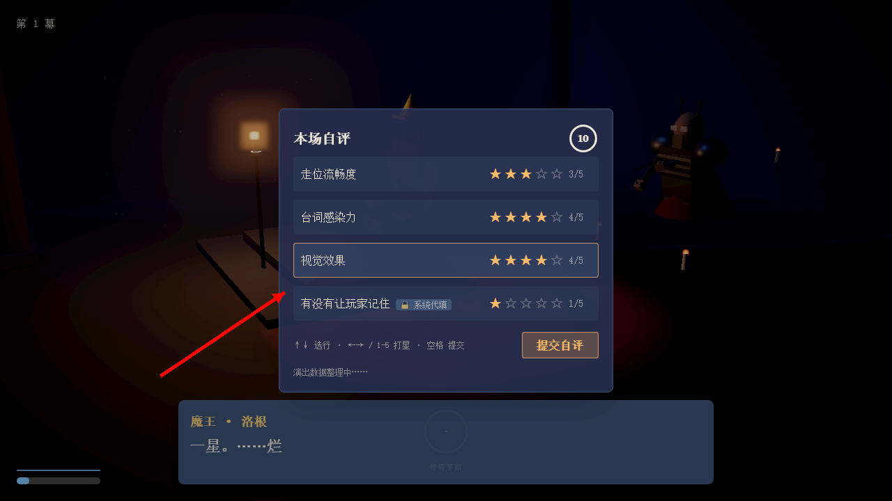
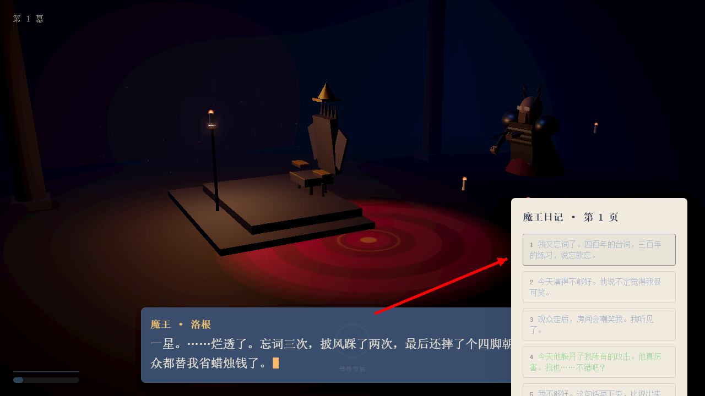
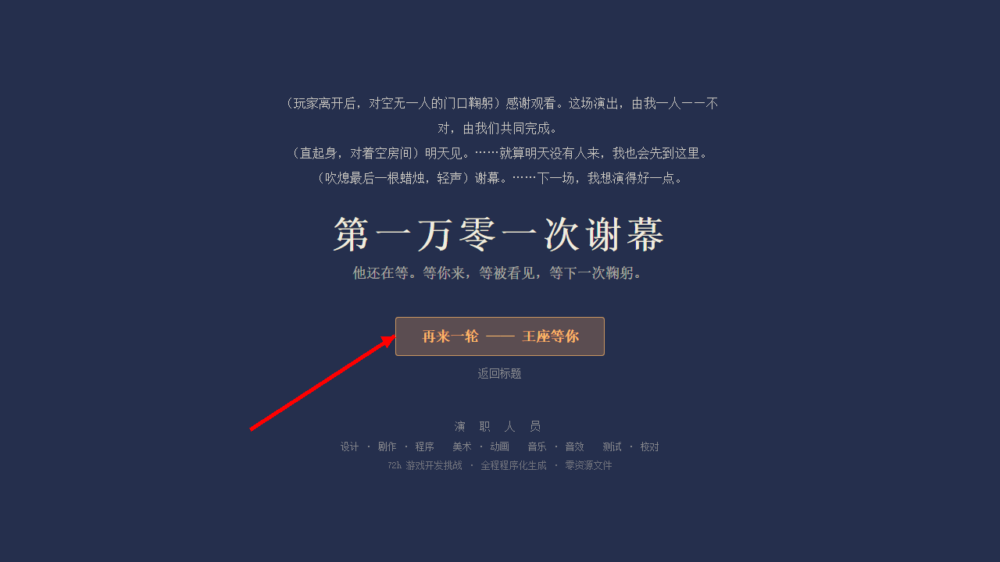

# 《Boss 的焦虑》— 怎么玩

> 你扮演最终 Boss——一个在空房间里练习谢幕的演员。
> 玩家是观众，也是你存在的理由。你不怕输，怕的是没人记住这场战斗。

**在线试玩**：`npm run dev` 后打开 http://localhost:5173

---

## 一、一句话玩法

你在舞台上按剧本演出：**走位、出手、念台词**。玩家的影子步步逼近并攻击你——被击倒 3 次提前谢幕，撑过 4 轮迎来结局。

```
等玩家 → 察觉 → 上台表演（3 幕） → 自评打分 → 写日记 → 下一轮 / 结局
```

一轮约 2–3 分钟，最多 4 轮。

## 二、操作

| 按键 | 作用 |
|---|---|
| `WASD` | **Boss 走位**（走进金色光圈） |
| 鼠标左键 | **攻击**（节拍圈变红时按下） |
| `1` / `2` / `3` | 选剧本（庄重 / 悲情 / 癫狂） |
| `空格` / `Enter` | 开始游戏 · 跳过对白 |
| `E` | 翻挑战者档案 |
| `Esc` | 暂停 |

## 三、节拍圈 = 你要做的事

屏幕下方的圆环显示**当前节拍和剩余时间**（弧线走完 = 时间到）：

| 圆环状态 | 含义 | 你要做的 |
|---|---|---|
| 橙色 · 走位 | 站到地板光圈里 | `WASD` 走进光圈 |
| **红色 · 攻击** | 出手时机 | **按鼠标左键** |
| 橙色 · 台词 | Boss 在念台词 | 不用操作（焦虑高会忘词） |
| 灰色 · 等待 | 演出间隙 | 等着 |



## 四、一局怎么打

### ① 标题 → 选剧本





- `1` 庄重威严 ★ / `2` 悲情独白 ★★ / `3` 癫狂戏剧 ★★★
- 选完 2 秒内开演，Boss 独坐王座，玩家影子从走廊尽头逼近。

### ② 走位



金色光圈出现 = 当前是走位节拍。按 `WASD` 把 Boss 挪进光圈，**变绿 = 站到位**。

### ③ 出手

节拍圈变红时**按左键**——出手！没按 = 空挥落空（+焦虑）。

### ④ 自评



四轴 1–5 星：走位 / 台词 / 视觉自己打，「有没有让玩家记住」系统代填。
总分 ≥4.5 完美、≥3.5 合格。给高星 → 下轮焦虑降。

### ⑤ 日记 → 结局



写一句话（或等 8 秒自动写）。第 4 轮结束（或被击倒 3 次提前收场）→ 谢幕结局：



## 五、焦虑值（隐藏 0–100）

界面不显示数字，用画面表现：

| 阶段 | 表现 |
|---|---|
| 0–30 从容 | 手稳、台词完整 |
| 31–60 紧张 | 起手犹豫，偶尔结巴 |
| 61–85 发抖 | 忘词、打偏 |
| 86–100 恐慌 | 剑脱手、跪地喘息 |

焦虑来源：被逼近、弹幕、被命中、忘词、被打断。缓解：完成阶段、自评高星、日记写正面的话。

## 六、小贴士

- **台词框能点**：跳过打字机 / 切下一句；不点也会自动更新。
- **Boss 有时会不动**：被命中会倒地、整理头发，焦虑满会跪地——这些都是"演出事故"，本身也是戏。
- **没有输赢**：只有"演得好不好"。打满 3 幕 + 总评 ≥4.5 = 完美轮，累积"被看见度"决定结局是掌声还是空房间。
- 写 3 次"我不够好"后，下一轮开头会出现隐藏选择——选「我也累了」进入隐藏谢幕。

---

*玩法文档 v1.3（归档）· 截图来自 v1 构建（红色箭头标注关键区域）· 更多设计细节见 `../design/` 与 `../../TDD.md`*
