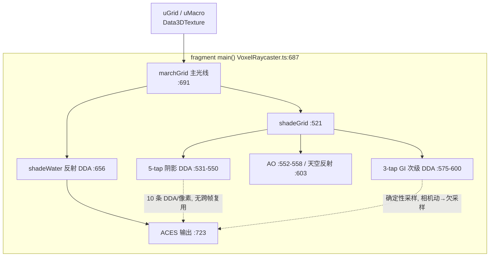
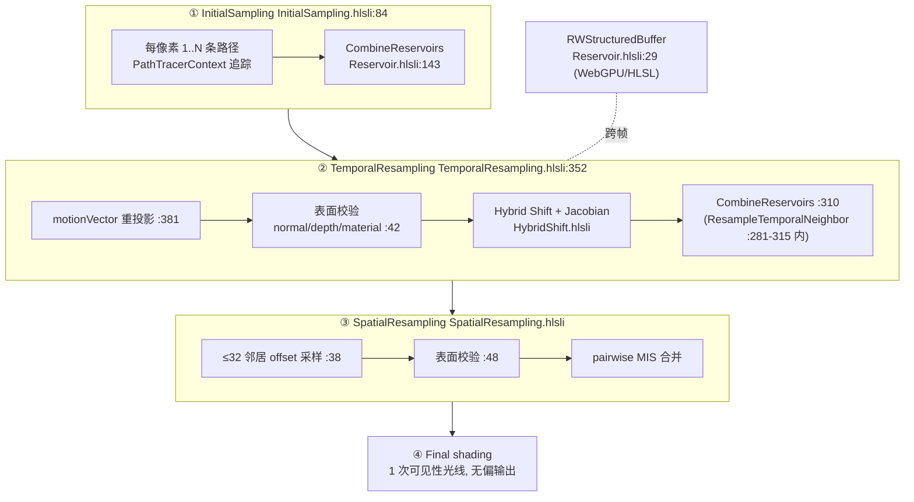
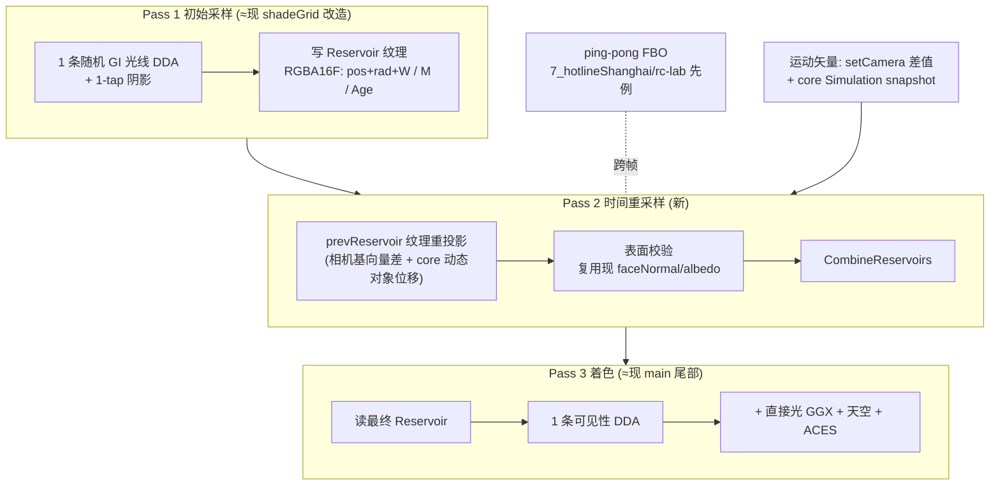

# 6_patapon3D ReSTIR 调研分析 —— 用 Reservoir 重采样替代暴力体素光线追踪

# 背景

需求原文：

> F:\XD\git-repo\VibeGames\6_patapon3D restir ray tracing algorithm instead of brute force ray tracing.
> 1. what is current ray tracing in 6?
> 2. what is restir ray tracing?
> 3. how to close the gap?
> take D:\GitRepo-My\RTXDI-Library\CMakeLists.txt as reference

参考实现：NVIDIA **RTXDI-Library**（生产级 ReSTIR 运行时，`D:\GitRepo-My\RTXDI-Library`，CMakeLists.txt 列出 DI / GI / PT / ReGIR / LightSampling / Utils 全部模块）。

**结论：6 的"光线追踪"是 WebGL2 片段着色器里每像素 ~10 条 DDA 体素光线、无任何跨帧/跨像素复用的暴力求交；ReSTIR 的核心是"每像素每帧只生成 1 条候选路径 + Reservoir 状态 + 时间/空间重采样"，把有效采样数从每帧 1 提升到数百而光线数不增。闭合差距的最短路是在现有单 pass 着色器上做 2–3 pass 的 WebGL2 ping-pong 管线，先落地 Reservoir + 时间重采样（贡献 ReSTIR 约 80% 的方差收益），空间重采样与 PT 完整版留作 M3/M4；完整 ReSTIR PT（Hybrid Shift、32 邻居、BoilingFilter、Checkerboard）需要 WebGPU compute（three r185 + TSL），超出 6 的 three 0.170 / WebGL2 冻结栈，应参照 `references/ddgi/` 的 WebGPU 路线另行立项。**

---

# 影响 <ReSTIR 落地> 的因素

> 限定范围：6_patapon3D 现有 `VoxelRaycaster`（WebGL2 + Data3DTexture，three 0.170，零新增依赖），目标是不破坏 TDD v2.1 冻结的 `SceneRenderer` 契约与 quality ladder。

**从 <当前渲染器> 角度（关注：每像素光线成本、pass 结构、可复用数据）：**

| 采集项 | 获取方式 | 是否已有 |
|---|---|---|
| 每像素主光线 DDA 步进 | `VoxelRaycaster.ts:687-691`（main 内 `marchGrid(ro, rd)`） | 已有 |
| 两级 DDA（4³ 宏格剪枝，等效均匀网格 BVH） | `VoxelRaycaster.ts:357-418` marchGrid + `:26-37` 宏格参数 | 已有（空间剪枝，非 BVH 树） |
| 5-tap 确定性软阴影（每像素 5 条额外 DDA） | `VoxelRaycaster.ts:531-550` | 已有 |
| 3-tap 单反弹 GI（每像素 3 条次级 DDA，确定性余弦瓣） | `VoxelRaycaster.ts:575-600` | 已有（手工展开，无随机抖动） |
| 水面单次反射光线 | `VoxelRaycaster.ts:656-685` | 已有（每水像素 +1 DDA） |
| 每像素 G-buffer（位置/法线/深度/材质） | 当前无独立 G-buffer，仅着色器内瞬时计算 | 无（ReSTIR 需要） |
| 运动矢量（相机 + 动态对象） | `setCamera()` 每帧传入基向量；core 模拟持有权威位置 | 无（需新增） |
| Reservoir 数据结构 / 跨帧存储 | — | 无 |
| 随机数发生器（每 pass 独立种子） | 着色器内 `hash11/hash33`（`VoxelRaycaster.ts:283-288`） | 部分（需 per-pass 种子） |
| 多 pass ping-pong 管线 | 现为单 fragment pass | 无（7_hotlineShanghai/rc-lab/pipeline.ts 是仓库先例） |

**从 <RTXDI 参考实现> 角度（关注：ReSTIR 需要哪些模块、WebGL2 哪些不可移植）：**

| 采集项 | 获取方式 | 是否已有 |
|---|---|---|
| Reservoir（W + M + 选中样本 + TargetFunction + Age） | `RTXDI-Library/Include/Rtxdi/PT/Reservoir.hlsli:36-82` | 参考有；6 无 |
| 流式合并（算法 4：加权接受/拒绝） | `Reservoir.hlsli:99-146`（InternalSimpleResample / CombineReservoirs） | 参考有；6 无 |
| 初始采样（每像素 1..N 条候选路径） | `PT/InitialSampling.hlsli:84-117` | 参考有；6 的 3-tap GI 可视为初始采样雏形 |
| 时间重采样（运动矢量重投影 + 表面校验 + Jacobian） | `PT/TemporalResampling.hlsli:352-434` | 参考有；6 无 |
| Hybrid Shift / 路径重连（完整 PT 复用） | `PT/HybridShift.hlsli` + `PT/PathReconnectibility.hlsli` | 参考有；WebGL2 下为 M3+ 项 |
| 空间重采样（≤32 邻居 + pairwise MIS） | `PT/SpatialResampling.hlsli:20-21,38-46` | 参考有；6 无 |
| BoilingFilter（萤火虫钳制）/ Checkerboard（半分辨率） | `Utils/BoilingFilter.hlsli` / `Utils/Checkerboard.hlsli` | 参考有；6 无 |
| 通用 compute / RWStructuredBuffer / atomics | RTXDI 的 `RTXDI_PT_RESERVOIR_BUFFER`（RWStructuredBuffer） | **WebGL2 无 compute**，只能纹理 ping-pong |
| 每帧多 pass 调度 + 跨帧纹理读取 | RTXDI 依赖 HLSL pass 串联 | 需新增（WebGL2 FBO ping-pong 可行） |

---

# 影响链条分析

## 1. 现状：暴力 = 每像素 10 条光线、零复用

`VoxelRaycaster.ts` 是单 fragment pass 全屏光线步进：

```
main()                       // :687
├─ marchGrid(ro, rd)         // :691  主光线 → 最近体素命中（两级 DDA :357）
├─ shadeGrid(h, ...)         // :521
│  ├─ 5× marchGrid 阴影光线  // :531-550  sunDisk 固定 5-tap（q≥3 时 1-tap）
│  ├─ voxel AO 3 方向        // :552-558
│  ├─ 3× marchGrid GI 次级   // :575-600  确定性余弦瓣 d0/d1/d2，bounceShade 廉价着色
│  └─ spec>0.5 时 1× 天空反射 // :603-606
└─ shadeWater()              // :656  每水像素 1× 反射 marchGrid（q≤4 时降为纯天空）
```

- **直接原因（慢）**：最坏像素 = 1 主光 + 5 阴影 + 3 GI + 1 水面反射 = **10 条 DDA 光线**；且 GI/阴影光线是确定性固定方向，**同一像素跨帧不共享任何信息**——每帧把全部光照从零重算。
- **根本原因（架构）**：单 pass、无跨帧存储、无 Reservoir。SwiftShader 软件 GL 实测（`verification-report.md:157-161`）：intro 1280×720 平均 177ms/帧、battle 平均 38ms/帧，直接打穿 60FPS 预算，靠 quality ladder 降级（q6）与 raster 回退兜底。真 GPU 上可跑，但这是"暴力求交"的天花板。

## 2. ReSTIR：1 条光线 + Reservoir 复用，等效数百采样

RTXDI（`CMakeLists.txt:2-64` 列出 DI/GI/PT 三套同构管线）的标准管线是 **4 pass**：

```
① InitialSampling   每像素生成 1..N 条候选路径 → 写入 Reservoir（M=候选数, W=权重和）
② TemporalResampling 运动矢量重投影到上一帧 → 表面校验（法线/深度/材质相似性）
                      → Hybrid Shift 重连路径（乘 Jacobian）→ CombineReservoirs 流式合并
③ SpatialResampling  读 ≤32 个邻居像素的 Reservoir → 表面校验 → pairwise MIS 合并
④ Final shading      只对 Reservoir 最终选中的样本做 1 次可见性光线 → 无偏估计
```

- **Reservoir 是核心**（`Reservoir.hlsli:36-82`）：`(WeightSum, M, 选中样本的 TranslatedWorldPosition/Radiance/WorldNormal/TargetFunction, Age, PathLength, RandomSeed/RandomIndex)`。`M` 记录"看到过的候选总数"——时间+空间合并后 `M` 逐帧累积，**每像素的有效采样数 = M（可达数百），而每帧实际光线数仍是 ~1**。
- **无偏性的来源**（`Reservoir.hlsli:99-146` `InternalSimpleResample`）：按 `Random * WeightSum < 新候选权重` 做加权接受/拒绝，等价于对"已见候选池"做加权水库采样——重用的样本只要带正确权重，就不是作弊而是无偏估计；`FinalizeResampling` 用 `W / (M·p̂)` 归一化。
- **为什么能跨帧复用**：时间重采样（`TemporalResampling.hlsli:352-434`）用 `motionVector` 把当前像素重投影到上一帧像素，经 `IsValidNeighborSurface`（法线/深度/材质阈值 `:42-45`）+ `Reservoir.Age` 上限（`RTXDI_PTRESERVOIR_AGE_MAX=31`，`Reservoir.hlsli:32`）防幽灵/错误累积；空间重采样（`SpatialResampling.hlsli:48-69`）用同样的表面相似性校验过滤邻居。
- **PT 版额外复杂度**：完整路径复用需要 Hybrid Shift/路径重连（`HybridShift.hlsli`、`PathReconnectibility.hlsli`）+ 重连 Jacobian + 每样本存 RNG 种子做路径重放（`Reservoir.hlsli:74-77,175-178`）——这是"把上一帧的整条路径搬到新表面"的数学，也是 WebGL2 移植最贵的部分。
- **工程配套**：`Utils/Checkerboard.hlsli`（半分辨率省一半初始采样）、`Utils/BoilingFilter.hlsli`（M 上限防萤火虫）、`Utils/RandomSamplerPerPassSeeds.hlsli`（每 pass 独立 RNG 种子防相关性）、`LightSampling/`（RIS 缓冲区管理，DI 多光源专用）。

## 3. 差距闭合：WebGL2 能做什么、不能做什么

- **能**：Reservoir 状态用 2D 纹理（R32F/RGBA16F）存；初始采样→时间→空间→着色拆成 **4 个 fragment pass，FBO ping-pong 读写**——WebGL2 片段着色器可以读取"上一帧/上一 pass"的纹理（同帧读写同一纹理是禁的，ping-pong 即可）。仓库已有同款先例：`7_hotlineShanghai/rc-lab/pipeline.ts`（6-stage 片段着色器 ping-pong 管线，Radiance Cascades）。
- **不能**：RWStructuredBuffer、general atomics、groupshared——所以 RTXDI 的 `RTXDI_PT_RESERVOIR_BUFFER` 与 PT 路径重放要改写为纹理读写；spatial 邻居用纹理采样实现（≤32 邻居在 WebGL2 是 32 次 texture fetch，可行）。
- **ReSTIR 对 6 的直接收益**：把最贵的 3-tap GI（3 条次级 DDA）重写为"1 条随机次级光线 → Reservoir → 时间复用"，GI 亮度方差收敛速度提升 `∝ M` 个数量级，代价是每帧多 2–3 个 pass（无新增 DDA 光线）。阴影 5-tap 也可用同一机制减到 1-tap + 复用。水面反射同理。
- **顺序建议（与 `references/ddgi/implementation-plan.md` 同一纪律）**：先 `core/` 纯函数（Reservoir 数学）→ 再引擎 adapter（pass 管线）→ 最后质量阶梯与回退。~~**§10.0 同类门**~~（**2026-08-18 已决**：见 `JOURNEY.md` §7 与下方待确认 §0/§1——用户拍板走 A 路线，价值主张接受，门已通过）。

---

# 整体流程

## 现状（单 pass 暴力，6_patapon3D）



## RTXDI ReSTIR PT（参考实现，4 pass）



## 建议：WebGL2 ping-pong 落地版（差距闭合路径）



---

# 关键机制

## 1. Reservoir 流式合并（无偏重用的心脏）—— `Reservoir.hlsli:99-146`

```
InternalSimpleResample(target, new, rand, p̂_new, norm, M_new):
    w = luminance(p̂_new) × norm                // 新候选权重
    target.M      += M_new                      // 候选总数累积
    target.WeightSum += w
    if rand × target.WeightSum < w:            // ← 唯一决策点
        复制 new 的样本字段到 target            // 选中即替换
```

- 逐条合并不是"平均"，而是**加权水库采样**：`M` 越大，最终选中样本携带的历史越多。
- 无偏证明要点：任何一次替换都以"概率 ∝ 权重"发生，期望不变；`FinalizeResampling` 用 `W/(M·p̂)` 归一化后即为无偏积分估计。
- **移植到 6**：`core/reservoir.ts` 写成纯函数（`combineReservoir()` / `finalize()`），与 GPU 着色器同一实现（C.A.T 纪律，参照 `references/ddgi/implementation-plan.md` §3）。

## 2. 时间重投影 + 表面校验 —— `TemporalResampling.hlsli:381-409`

- 重投影：`prevPos = round(pixelPos + motionVector.xy)`；`ExpectedPrevLinearDepth = depth + motionVector.z`。
- 校验三件套（`:42-45`）：`normalThreshold`、`depthThreshold`、材质相似——任一超阈值 → 拒绝复用（防错误样本污染）。
- 历史管理：`Age` 递增、超 `maxReservoirAge` 弃用（`:211-216`）；disocclusion（运动矢量无效区）用零矢量 fallback 样本（`:72-77`）。
- **6 的简化机会**：动态对象只有 army/boss/鼓垫（core sim 权威），运动矢量 = 相机差 + core 快照内对象位移；静态体素层（地面/山）零运动矢量，复用近乎免费。

## 3. Hybrid Shift / 路径重连（PT 完整版才需要，M3+）

- `TemporalResampling.hlsli:281-315`：把上一帧 Reservoir 的路径"重放到新表面"——重连顶点之前的 prefix 重放（随机路径重放，靠 Reservoir 内 RNG 种子 `Reservoir.hlsli:74-77`），重连后乘 Jacobian（`:303`）。
- WebGL2 无 compute、单文件 fragment shader 下，**跳过完整 PT 重连、只做"次级光线 + 表面校验 + 合并"是合理裁剪**——这正是 ReSTIR GI（`GI/` 目录）与 ReSTIR PT 的差距，GI 版不需要路径重放。

---

# 官方/替代方案对比

| 维度 | 现状（暴力 DDA） | 方案 A：WebGL2 Reservoir-lite（推荐） | 方案 B：完整 ReSTIR PT（WebGPU） |
|---|---|---|---|
| 每像素光线 | ~10（1 主 + 5 阴影 + 3 GI + 1 水） | ~3（1 主 + 1 阴影 + 1 随机 GI） | ~1 路径 + 1 可见性 |
| 有效采样数/像素 | 1/帧 | M 累积（时间复用） | M 累积 + 32 邻居（时空复用） |
| GI 噪声（相机动时） | 高（确定性欠采样） | 中（时间复用收敛） | 低（全 ReSTIR） |
| 改动面 | — | `VoxelRaycaster.ts` 拆 3 pass + `core/reservoir.ts` + 运动矢量 | three r185 WebGPU + TSL（违背 three 0.170/WebGL2 冻结栈） |
| 依赖 RTXDI 代码 | — | 无（从公式/算法级移植，见 `Reservoir.hlsli` 注释与 LICENSE） | 无（NVIDIA 专有许可，只移植技术不抄 HLSL） |
| 仓库先例 | `11_blackhole` 全屏光线步进风格 | `7_hotlineShanghai/rc-lab/pipeline.ts` 片段 ping-pong | `references/ddgi/implementation-plan.md`（WebGPU compute 路线） |
| 优化层次 | — | **从直接原因解决**（每帧重算 → 跨帧复用） | **从根本原因解决**（完整时空复用 + 无偏路径重连） |
| 风险 | 天花板已到（SwiftShader 177ms） | 拆 pass 引入读写带宽；同帧读写纹理禁用需 ping-pong | 三版本升级 + WebGPU 可用性（Firefox/Safari） |

**结论（方案对比）：方案 A 是 6 在冻结栈内可达的 80% 收益（时间复用单独贡献 ReSTIR 大部分方差削减）；方案 B 是 `references/ddgi` 已立项的 WebGPU 路线的自然扩展，二者不冲突——A 先落地、B 按需再上。**

---

# 注意事项 / 风险与待确认 / 里程碑

## 待确认（M1 之前，硬门，仿 `references/ddgi/implementation-plan.md` §10.0）

> **2026-08-18 已决**（见 `JOURNEY.md` §7）：用户拍板 **走 A 路线（WebGL2 Reservoir-lite）**，
> 并同步更新「禁逐像素抖动」契约 → 双模采样（确定性基线 / ReSTIR 随机初始采样 + 时间收敛去噪），
> 已写入 `docs/design/2026-08-10-global-voxel-raytrace-water-design.md` 顶部修订块。
> 以下 0/1/2 已全部回答（2 于 M1 拍板）。

0. **~~谁真的需要更强的 GI？~~（已决：接受 A 路线的价值主张）** 当前月夜风格化画面在真 GPU 上已 60FPS；ReSTIR 的收益是"相机剧烈运动时的 GI 收敛 + 为更复杂场景腾预算"。拍板后按 A 路线推进，M1 以 `core/reservoir.ts` + 运动矢量起步。
1. **~~GI 视觉目标~~（已决：接受"动态噪声→收敛"过渡，契约已更新）** 原设计契约（确定性、禁逐像素抖动）已修订为双模：ReSTIR 模式允许初始采样随机，静态颗粒由 Reservoir 时间/空间重采样收敛消除，最终输出仍要求无可见椒盐噪声/闪烁。
2. **~~运动矢量来源~~（M1 已决：`setCamera` 差值 + core 快照，不建 3D 位移纹理）** `SceneContract.CameraState` 新增 `motionVector`（屏幕空间：xy=像素位移，z=线性深度差）；静止相机为零矢量（`IntroEngine.buildCameraState` 已填零），动态对象位移由 M2 从 snapshot 前后帧差分补充。动态层（army/boss/鼓垫）由 core sim 权威位置驱动，无需独立位移纹理。

## 风险

| 风险 | 缓解 |
|---|---|
| 拆多 pass 增加读写带宽（现单 pass 全屏 1 次写入） | 初始采样 + 时间重采样可合并为 1 pass（ReSTIR 参考实现亦常合并）；纹理用半精度 |
| 同帧读写同一纹理被 WebGL2 禁止 | 严格 ping-pong（双纹理交换），先例见 `7_hotlineShanghai/rc-lab/pipeline.ts` |
| 确定性→随机采样违背现有视觉契约 | 仅对 GI 光线引入随机；阴影保持确定性 1-tap + 时间复用；契约变更走 TDD changelog |
| 质量阶梯 / raster 回退被拆 pass 破坏 | 每个 pass 保留现 quality ladder 对应参数（shadow/GI taps、render scale）；q 高时跳过时间复用 |
| Reservoir 精度（RGBA16F 存 W/M/Age） | `TypePacking.hlsli` 式打包；必要时 R32F 双纹理 |
| 许可证 | 只移植算法/公式，不复制 HLSL（RTXDI LICENSE 为 NVIDIA 专有） |

## 里程碑

| 里程碑 | 交付物 | 验收 |
|---|---|---|
| **M1 — Reservoir 纯函数 + 运动矢量** | `src/core/reservoir.ts`（combine/finalize/pack）+ `SceneContract` 增加运动矢量字段 + `IntroEngine`/`RaytraceAdapter` 传值 | `npx tsc -b --noEmit` 绿；单测 golden 向量（参考 `Reservoir.hlsli` 手算值）；现有 smoke 不回归 |
| **M2 — Pass 拆分 + 时间重采样** | `VoxelRaycaster` 拆 初始采样 / 时间合并 / 着色 3 pass（ping-pong FBO）；GI 改 1 条随机次级光线 + 时间复用；阴影改 1-tap + 复用 | 静态场景画面与现版等效；相机晃动时 GI 噪声明显收敛（同帧对比截图）；SwiftShader 帧时下降 ≥2× |
| **M3 — 空间重采样** | 第 4 pass：4–8 邻居 Reservoir 合并（surface 校验），M 再累积 | 相机大幅移动时噪声进一步下降；无错误颜色渗漏（邻居校验生效） |
| **M4 — 质量阶梯与回退** | 新 pass 纳入 quality ladder（0-6）；`?rt=0` 回退 raster 不丢状态 | `node scripts/smoke.mjs` ALL PASS；watchdog 阶梯依旧生效；verification-report 更新 |
| **RC — 验证与文档** | GDD/TDD 同步（GI 确定性契约变更）、RESTIR.md 收尾、真实 GPU 人工试玩 | 真 GPU 60FPS @ 展示分辨率；零 console/WebGL 错误；用户拍板 |

## 直接回答

1. **当前 6 的光线追踪**：`src/engine/raytrace/VoxelRaycaster.ts` 的 WebGL2 片段着色器暴力体素 DDA——每像素 1 主光线 + 5 阴影 + 3 GI + 1 水面反射 ≈ 10 条光线，两级 4³ 宏格剪枝（等效均匀网格 BVH），确定性采样、零跨帧复用、单 pass。
2. **ReSTIR 光线追踪**：NVIDIA RTXDI 的 Reservoir 时空重要性重采样——每像素每帧只生成 1 条候选（初始采样），经运动矢量重投影做时间合并、读邻居做空间合并，Reservoir 的 `M` 把有效采样数累积到数百，最终只对选中的样本做 1 次可见性光线，全程无偏（加权水库采样）。
3. **如何闭合差距**：在现有 `VoxelRaycaster` 上拆 3–4 pass 的 WebGL2 ping-pong 管线，先做 Reservoir + 时间重采样（方案 A，改 `core/reservoir.ts` + `VoxelRaycaster` 拆分 + 运动矢量，约 2–3 个里程碑），完整 ReSTIR PT（Hybrid Shift/32 邻居/BoilingFilter）留给 WebGPU 路线（方案 B，`references/ddgi` 已立项同款技术栈）。
