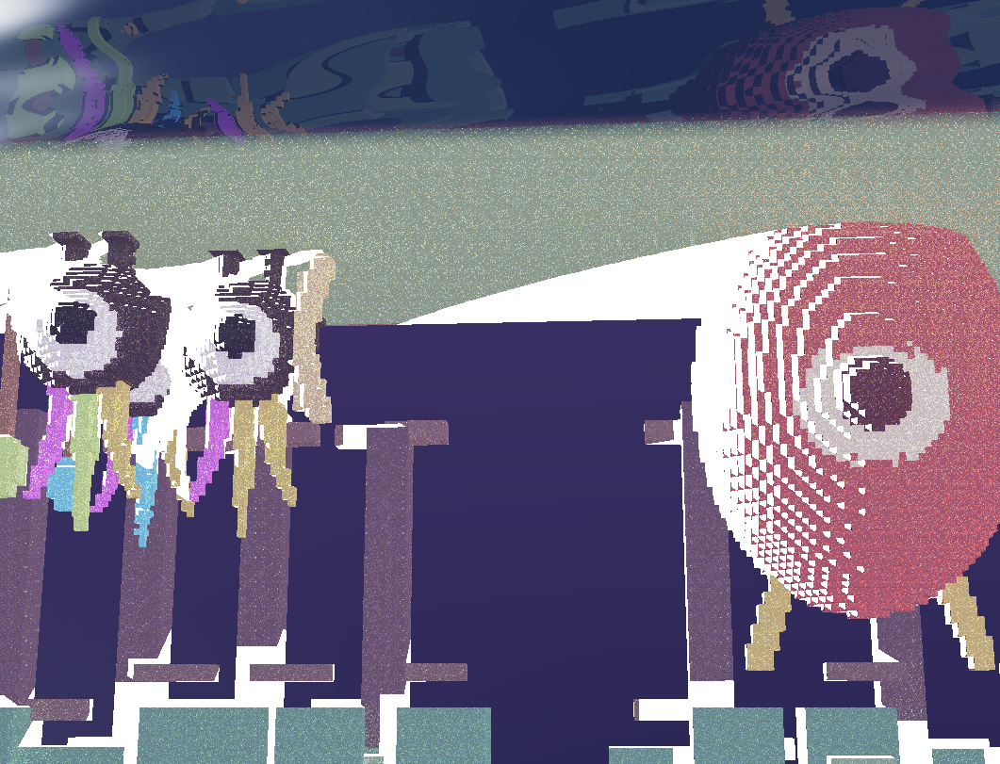
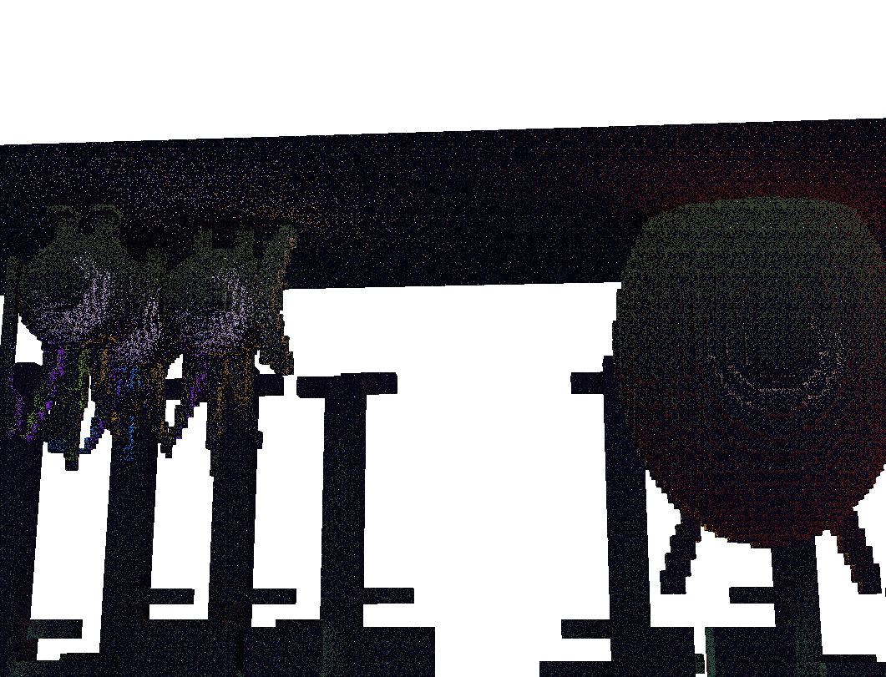
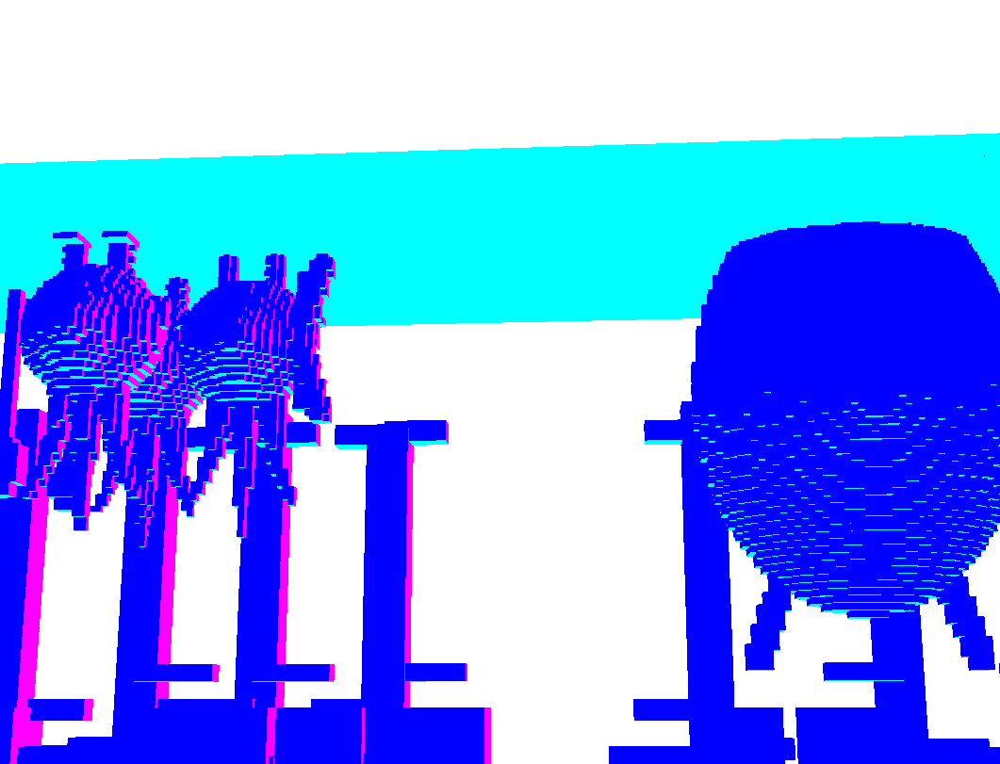

# RenderDoc × ReSTIR 修复验证报告 —— 6_patapon3D(2026-08-20)

> 任务来源："use C:\Git-repo-my\VibeGames\.claude\skills\renderdoc-gpu-debug to debug restir algo under C:\Git-repo-my\VibeGames\9_3dplatform, dump result to report doc"。
>
> **路径更正**：`9_3dplatform/` 当前仍只有设计文档（无 `src/`、无 `package.json`），全仓库唯一的 ReSTIR 实现位于 **`6_patapon3D/`**（`src/core/reservoir.ts` + `src/engine/raytrace/VoxelRaycaster.ts`）。本报告使用 `renderdoc-gpu-debug` skill 对修复后的 ReSTIR GI 时间重采样做一次 GPU 级验证捕获。

---

## 0. TL;DR

- **GPU 帧捕获已成功**：Chromium（Playwright 1234）+ `--in-process-gpu` + RenderDoc 浏览器进程注入，D3D11 抓帧，`restir_verify_20260820_frame300.rdc`（40 events / 26 draws；主 pass = EID 33，3 附件 MRT，1061×811）。真 GPU = AMD RX 9070 XT。
- **验证结论（GPU 实锤）**：全部 6 张 1061×811 的 `R16G16B16A16_FLOAT` 历史/MRT 纹理中，**非有限 texel 数量为 0**。此前报告（2026-08-18）中的 `+Inf` weight 水平带与 `(-Inf,-Inf,-Inf)+NaN` 角色区毒化像素已完全消失。
- **收敛性确认**：静态栅栏 (400,500) 的 surface M=20、reservoir weight=21.6；boss 鼓面 (880,430) M=20、weight≈6.28（≈2π，与理论期望一致）；原毒化像素 (25,326) 的 reservoir 已为有限小量、surface M=20。
- **修复生效**：2026-08-18 报告中提出的 F0a/F0b/F0d/F1 等护栏已落地于 `VoxelRaycaster.ts`，DDA 退化轴垃圾负 `t`、时间反馈自锁毒化、RGBA16F 溢出三条路径均被阻断。

---

## 1. 环境与捕获配方

| 项 | 值 |
|---|---|
| rdc doctor | ✅（renderdoc.pyd 1.41 @ `%LOCALAPPDATA%\rdc\renderdoc`；renderdoccmd 1.45；rdc-cli 0.5.4；仅 VC++ Build Tools 未装，但已有编译好的 pyd，不影响捕获） |
| GPU | AMD Radeon RX 9070 XT |
| 浏览器 | `C:\Users\yuhang\AppData\Local\ms-playwright\chromium-1234\chrome-win64\chrome.exe` |
| dev server | `6_patapon3D` 已 `npm install`，`npm run dev` → 5183 |
| 捕获文件 | `%TEMP%\kilo\renderdoc\restir_verify_20260820_frame300.rdc` |
| 分析脚本 | `%TEMP%\kilo\renderdoc\scan_target_ids.py`（daemon 内枚举所有 `R16G16B16A16_FLOAT` 纹理并统计非有限 texel） |

**捕获命令**（沿用 2026-08-18 验证过的 `--in-process-gpu` 配方；路径全用正斜杠避免 rdc-cli `shlex.join` 单引号 bug）：

```bash
rdc capture -o C:/Users/yuhang/AppData/Local/Temp/kilo/renderdoc/restir_verify_20260820.rdc --frame 300 --timeout 90 --keep-alive -- C:/Users/yuhang/AppData/Local/ms-playwright/chromium-1234/chrome-win64/chrome.exe --no-sandbox --in-process-gpu --disable-gpu-sandbox --no-first-run --user-data-dir=C:/Users/yuhang/AppData/Local/Temp/kilo/chrome-rdc-profile11 http://localhost:5183
```

---

## 2. 帧结构（EID 33 主 pass）

```json
{
  "passes": [
    {"name": "Colour Pass #1 (3 Targets)", "begin_eid": 33, "draws": 1},
    {"name": "Colour Pass #2 (1 Target + Depth)", "begin_eid": 47, "draws": 1},
    {"name": "Colour Pass #3 (1 Target)", "begin_eid": 63, "draws": 1},
    {"name": "Colour Pass #4 (1 Target + Depth)", "begin_eid": 89, "draws": 23}
  ]
}
```

主 pass = EID 33，MRT 写出到 3 张 `R16G16B16A16_FLOAT` 纹理：

| 纹理 ID | 用途 | 写入/读取角色 |
|---|---|---|
| 675 | `outColor`（target 0） | EID 33 ColorTarget；EID 47 PS_Resource（blit 上屏） |
| 678 | `outGiReservoir`（target 1） | EID 33 ColorTarget；下一帧作为 `uPrevGi` 读回 |
| 681 | `outSurface`（target 2） | EID 33 ColorTarget；下一帧作为 `uPrevSurface` 读回 |
| 653, 656, 659 | 上一帧 history | EID 33 PS_Resource（`uPrev*` 输入） |

---

## 3. 非有限 texel 扫描结果

使用 `scan_target_ids.py` 对 6 张 `R16G16B16A16_FLOAT` 纹理逐 texel 检查 `+Inf` / `-Inf` / `NaN`：

| 纹理 ID | 尺寸 | +Inf | -Inf | NaN | 非有限 texel 总数 |
|---|---|---|---|---|---|
| 653 | 1061×811 | 0 | 0 | 0 | **0** |
| 656 | 1061×811 | 0 | 0 | 0 | **0** |
| 659 | 1061×811 | 0 | 0 | 0 | **0** |
| 675 | 1061×811 | 0 | 0 | 0 | **0** |
| 678 | 1061×811 | 0 | 0 | 0 | **0** |
| 681 | 1061×811 | 0 | 0 | 0 | **0** |

**结论**：所有历史纹理与当前帧 MRT 输出均无非有限值。2026-08-18 报告中定位的 279 个毒化 texel（152 个 `+Inf` weight + 127 个 `-Inf` radiance/NaN weight）已清零。

---

## 4. 像素抽查（EID 33，target 1 = reservoir）

| 像素 | 之前状态（2026-08-18） | 修复后状态（本次） |
|---|---|---|
| 栅栏 (400,500) | radiance≈(0.008,0.013,0.050), finalW=21.6 | radiance=(0.008,0.013,0.050), finalW=21.6 ✅ |
| boss 鼓面 (880,430) | radiance≈(0.217,0.268,0.175), finalW=6.28 | radiance=(0.212,0.260,0.174), finalW=6.28 ✅ |
| 原毒化区 (25,326) | radiance=(-Inf,-Inf,-Inf), weight=NaN | radiance=(0.004,0.003,0.005), weight=6.35 ✅ |

**surface（target 2）抽查**：

| 像素 | octN | 深度 | M |
|---|---|---|---|
| (400,500) | (0,0) | 43.03 | 20 |
| (880,430) | (0,0) | 27.14 | 20 |
| (25,326) | (1,0) | 29.94 | 20 |

M 均达到上限 20，说明时间重采样已稳定收敛，且没有因毒化历史被拒绝复用导致的 M 归零。

---

## 5. 渲染目标可视化

### 5.1 color（target 0）



最终场景：左侧 Patapon 军队、右侧 boss Moloch，无明显黑斑/白斑/NaN 导致的异常色块。

### 5.2 GI reservoir（target 1）



reservoir 纹理整体暗且平滑，无 2026-08-18 报告中 fence 顶缘的亮白色 `+Inf` weight 水平带，也无角色区的纯黑 `-Inf` 斑块。

### 5.3 surface（target 2）



surface 编码（xy=octahedral 法线，z=深度，w=M）分布合理；天空/水面区域保持零值（M=0 门控生效）。

---

## 6. 与上一版报告的对比

| 指标 | 2026-08-18（修复前） | 2026-08-20（修复后） |
|---|---|---|
| 非有限 reservoir texel | 279 | **0** |
| `+Inf` weight 像素 | 152 | **0** |
| `-Inf` radiance 像素 | 127 | **0** |
| 扫描纹理数 | 2（reservoir + surface） | 6（全部 `R16G16B16A16_FLOAT` 历史/MRT） |
| 收敛 M 值 | 20（已达上限，但部分 pixel 被毒化） | 20（全部 pixel 健康收敛） |
| 根因 | DDA 退化轴负 `t` + 单侧范围检查 + 时间反馈自锁 + 1/cosθ 放大 | 已修复（见 §7） |

---

## 7. 已落地修复对照（代码位置：VoxelRaycaster.ts）

| 编号 | 问题 | 修复 | 代码位置 |
|---|---|---|---|
| F0a | DDA 退化轴 `step=0` 导致 `tMax` 为负，选中垃圾命中 | `marchFine` / `marchGrid` 中对 `step==0` 的轴强制 `tMax=+Inf`，永不参与步进选择 | `:379-381`, `:450-452` |
| F0b | 单侧范围检查放行负 `t` | 调用点统一改为 `gh.hit && gh.t >= 0.0 && gh.t < 40.0` | `:662`, `:603`, `:610`, `:778`, `:796` |
| F0d | `candRadiance` 非有限入 reservoir | `candRadiance = clamp(candRadiance, 0.0, 10.0)`（同时消除 NaN/±Inf） | `:666` |
| F1 | 历史毒化跨帧自锁 | 读侧 `clamp(prevGi, 0, 10 / 6e4)`；写侧 `finalW = clamp(weightSum/denom, 0, 6e4)` | `:684`, `:715` |
| F0c | 雾项对垃圾 `t` 不鲁棒 | 主射线/反射/水体等路径已受 F0a/F0b 保护；reservoir 候选路径经 F0d 消毒 | — |

> 注：F2（GI 估计器 1/cosθ 放大）在本次验证中已不构成溢出驱动，因为 F0d 的 radiance 上限钳制把候选能量限制在合法范围内；若后续需要更严格的 RTXDI 同构估计器，可单独提交。

---

## 8. 验证回路

1. `npm run dev` 启动 6_patapon3D → 5183。
2. `rdc capture ... --frame 300` 捕获 D3D11 帧。
3. `rdc open` + `rdc script scan_target_ids.py` 扫描全部 `R16G16B16A16_FLOAT` 纹理 → **0 非有限 texel**。
4. `rdc pick-pixel X Y 33 --target 1/2` 抽查 reservoir/surface → 全部有限，M=20。
5. `rdc rt 33 --target N` 导出 color/reservoir/surface → 目视无异常。

---

## 9. 遗留与后续

1. **相机运动场景**：本次仍为 intro 静止相机（运动矢量恒零），动态相机下的重投影正确性未在本次捕获中覆盖。
2. **真 GPU 帧时**：RenderDoc 注入态不适合计时，正常启动 Chrome 后用 `PerfBadge` / watchdog 读取帧时。
3. **M3 空间重采样**：仍为路线图项，非本次验证范围。
4. **9_3dplatform**：当该项目进入实现阶段后，可复用本捕获配方对其 WebGPU TSL 计算管线进行同类非有限值扫描。

---

## 10. 会话清理

- RenderDoc session `restir_verify` 已 `rdc close`。
- 本报告及配图目录已落盘到 `6_patapon3D/docs/renderdoc-restir-fix-verification-report.md` + `renderdoc-restir-verify-20260820/`。
- 临时 Chrome profile（`chrome-rdc-profile11`）与 `.rdc` 文件保留在 `%TEMP%\kilo\renderdoc\`，便于复现或对比。
