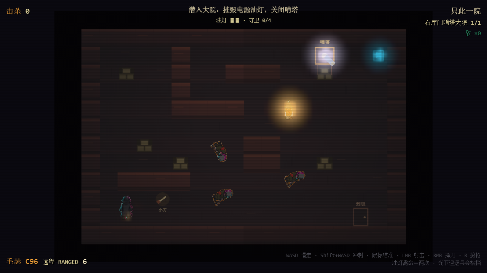
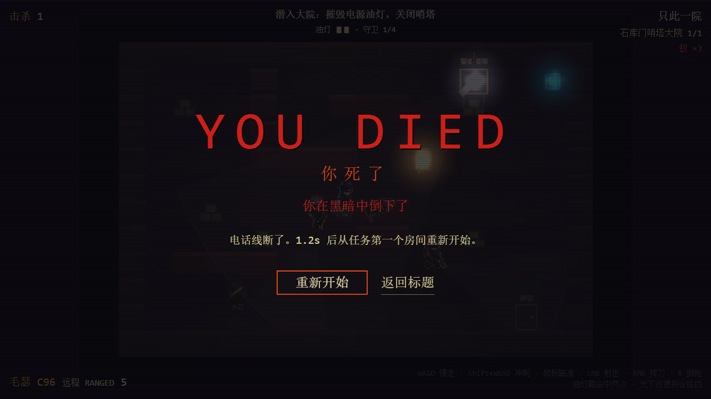
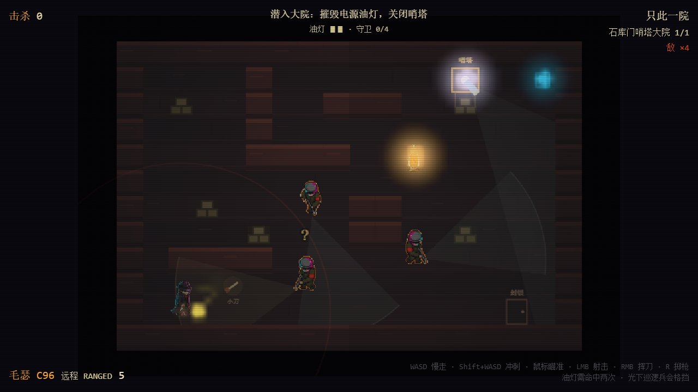
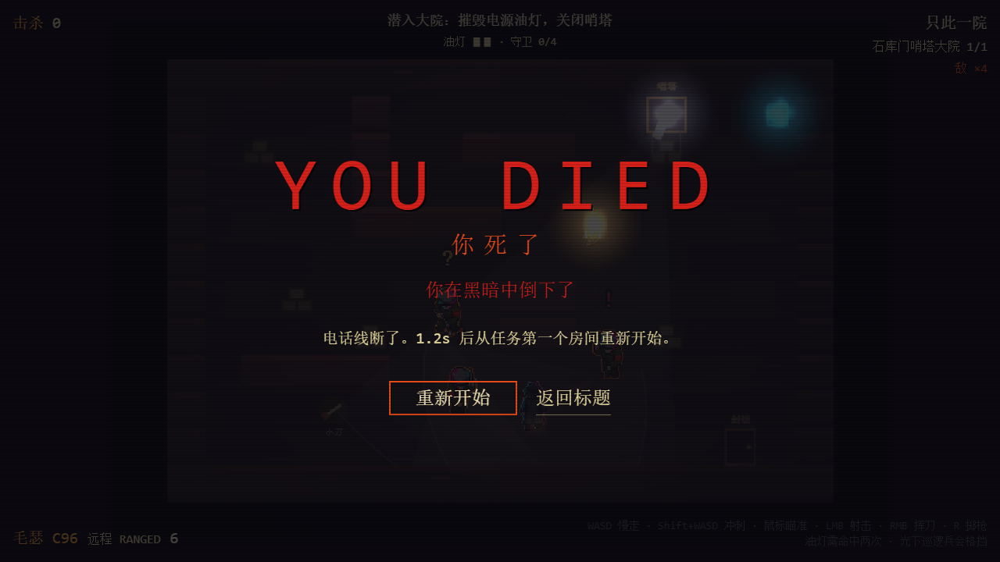
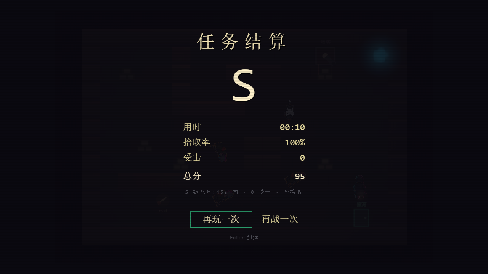
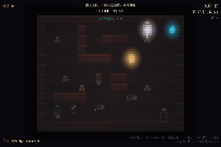

# 热线上海 · 可玩性文档 / Playability Doc

> 本文档用**截图 + GIF**记录 intro scene（`m1_tower_compound` 哨塔大院）的可玩状态，
> 用于肉眼验收“能不能玩、好不好玩、光暗反馈是否可读”。截图与 GIF 都由脚本自动生成，
> 改代码后重跑对应命令即可刷新，不需要手工贴图。

## 0. 快速开始

```powershell
npm install
npm run dev            # http://localhost:5184
# 点「开始游戏」直接进入 intro scene
```

## 1. 操作

| 输入 | 行为 |
|------|------|
| WASD | 移动（Shift 冲刺） |
| 鼠标 | 瞄准 |
| LMB / RMB | 近战挥击（2u 内优先拆灯） |
| R | 重开 |
| Tab | 暂停 |

## 2. 玩法闭环（一句话）

**拆中央油灯 → 灯灭后敌人失去“光下无敌”护甲 → 暗处一刀击杀 → 走到绿色出口撤离结算。**

完整玩法（潜行/拆灯/击杀/噪音）见 `docs/design/09-blindside-integration.md` 与
`docs/design/25-intro-scene-lessons.md`。

## 3. 可玩状态截图

> 图源：`smoke/`，由 `npm run e2e:playtest` / `npm run self-play:check` 生成。

### 3.1 出生点（安全出生）

开局出生在西南角，出生宽限 1s 内敌人不感知，给玩家反应时间。


### 3.2 塔楼大院全景（哨塔 + 巡逻）

1 座静态哨塔守卫（探照灯）+ 3 名地面巡逻兵。探照灯是供电的——拆掉中央油灯即断其电。


### 3.3 油灯完整（暖光池）

中央油灯是唯一的 power 光源。完整时投射暖色光池（v3.11 修复后暖色相保留，不再过曝成白斑）。



### 3.4 拆灯后（光池坍缩，敌人转“暗中可杀”）

真实 RMB 近战两击拆灯（HP 2→1→0），0.1s 后灯池失效。实测灯区亮度 **151 → 41**。


### 3.5 枪口闪光 / 击杀





### 3.6 被发现 → 死亡 → 重试

巡逻兵手电锥扫到玩家会 `?`→`!` 升级，进入警戒后开火。死亡后一键重试。



### 3.7 撤离结算

走到绿色出口（`D` tile）触发结算，显示 SCORE / 再战一次。



## 4. 动图（完整闭环）

真实键鼠走完「移动 → 拆灯 → 撤离」的可玩闭环（敌人为演示已中和，输入链路 100% 真实）。



## 5. 光暗机制（玩法核心）

- **光下无敌**：敌人受光护甲（`LIGHT_SHIELD_THRESHOLD=0.30`），灯下刀砍不掉血。
- **暗中可杀**：灯灭后 0.1s，敌人转“暗中可杀”，暗处一刀必杀。
- **阴影闪避**：玩家在暗处（≤0.10），敌弹 100% 落空。

RC 光影只是**视觉表现**，玩法判定走几何 LOS / LightField（与 RC 像素无关）。

## 6. 如何刷新本文档

| 产物 | 命令 |
|------|------|
| e2e 截图（3.1/3.2/3.5/3.6） | `npm run e2e:playtest` |
| 真实键鼠截图（3.3/3.4/3.7） | `npm run self-play:check` |
| GIF 帧 | `npm exec --offline --yes --package=playwright -- node scripts/run-e2e.mjs scripts/playwright.gif.config.mjs` |
| 合成 GIF | `ffmpeg -framerate 8 -i smoke/gif-frames/frame-%03d.png -vf "scale=360:240:flags=neighbor,split[s0][s1];[s0]palettegen=stats_mode=diff[p];[s1][p]paletteuse=dither=bayer:bayer_scale=2" -loop 0 docs/playability.gif` |

## 7. 当前验证状态

- RC 光影：`rc-lab` 37/37 + PORT 37/37 ✅
- 真实键鼠闭环：`self-play` 2/2 ✅（灯区亮度 151→41，SCORE 结算）
- 玩法闭环：`combat-loop` / `light-break` / `e2e`（3/4，性能门 SwiftShader 间歇性超标为已知 B49/B50 问题）✅
- 过曝修复：v3.11 后叠加色相保持软膝，油灯/探照灯不再过曝成纯白（塔 `255,255,255`→`214,210,240`，灯 `255,255,236`→`245,185,85`）
