# 可玩性文档 · 股神模拟器 Intro Scene

> 一句话: 你是一个 2014 年进入大学的小镇做题家(或金融世家),用 17 周(一学期 13 周 + 寒假 3 周 + 新学期开学)在校园地图上自主选择去哪、掷骰子决定际遇、模拟盘炒股、追逐"觉醒",并在结局里看清同一把骰子下两种出身的差距。
>
> 这份文档回答"这游戏怎么玩、每一步看到什么、好玩在哪",所有配图来自 `showcase/` 目录的确定性回放截图(种子固定 0.5),随每次 `scripts/showcase*.mjs` 回放自动刷新。

---

## 1. 核心循环 — 每回合 5 步

每回合玩家自主选择,系统用骰子决定际遇,构成一个完整的"选择 → 掷骰 → 际遇 → 交易 → 复盘"闭环:

1. **走** — 在校园地图点一栋建筑(去哪,你自己定)。
2. **掷** — 2d6 + 4 项修正,决定这一格发生什么。
3. **遇** — 抽一张地点事件卡(机会/中立/陷阱),或一张人生抉择卡。
4. **投** — 在模拟盘买入/卖出/持有 7 种真实资产。
5. **复盘** — AI 教练点出这回合是"出身/时代/认知/情绪"哪个维度在主导,并与平行命运(另一种出身)对照。

重复 17 周,进入小结。

---

## 2. 开场电影 — 2 步定人生

开局不是直接给棋盘,而是一段 2 步电影,先立人设、再立目标。

**第 1 步 · 出身故事**(小镇做题家: 凌晨五点半的教室 / 绿皮火车; 金融世家: 季度汇报会 / 后街的车):


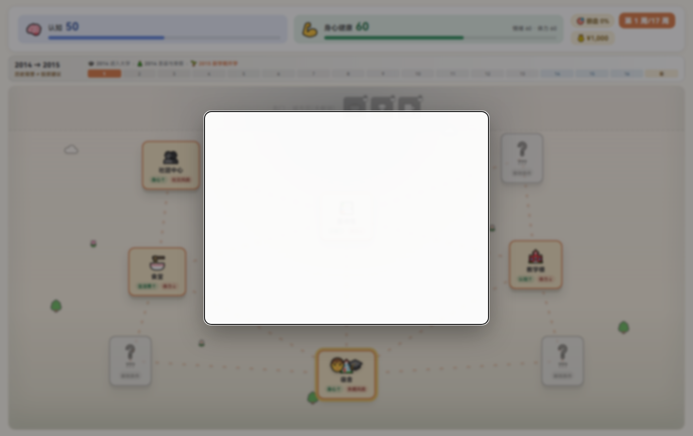

**第 2 步 · 人生目标**:这一学期,你想成为谁?财富目标 · 第一桶金 —— 模拟盘翻盘(小镇 ¥100,000→¥200,000 / 世家 ¥300,000→¥500,000)+ 爱情目标(迎新晚会上主动认识一个人)。

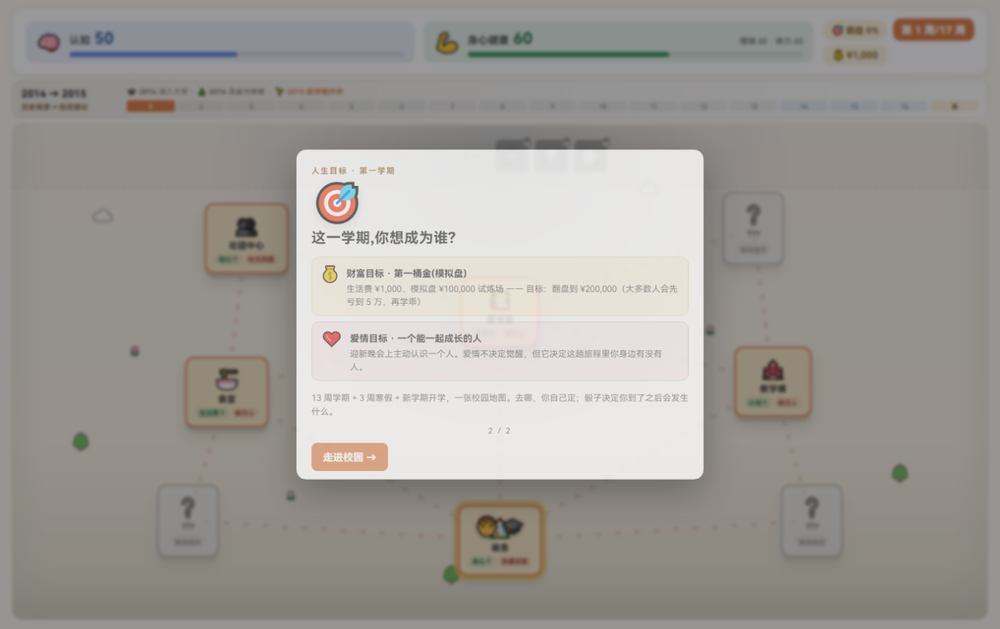

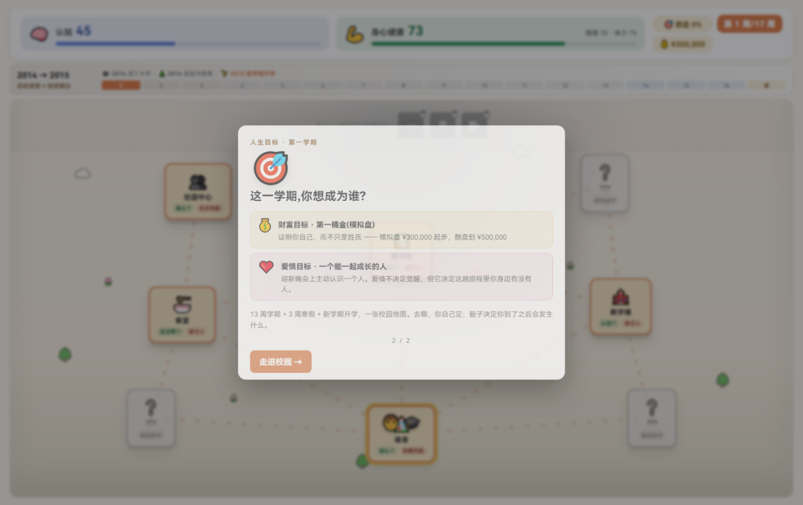

---

## 3. 校园地图 — 8 栋建筑 + 1 条天际线

地图上 6 栋开局可见(宿舍/图书馆/食堂/社团中心/教学楼/贵人办公室)+ 2 栋需要解锁(健身房、对外交流中心),北门外是 3 座锁定城市楼(私董会/PE 圈/投行内推)作"可见但不可及"的出身栅栏。

每栋建筑在点击前会预览它的**价值方向**(如 图书馆: 认知↑ / 风险 体力↓),贵人办公室开局显示 `???` 认知锁,要先去图书馆"发现"它。

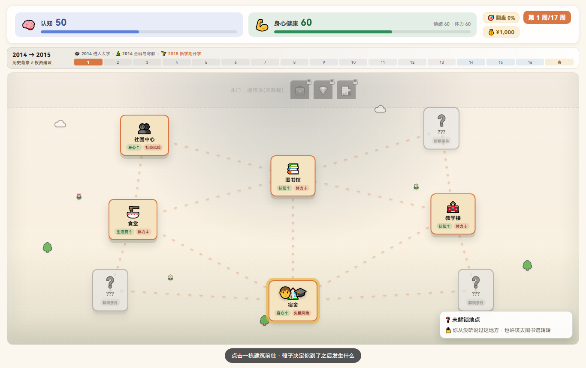

---

## 4. 骰子 — 核心 juice

掷骰是每回合的高光时刻: 两颗骰子**减速翻滚**(先停第 1 颗、再停第 2 颗),然后公式逐项打字(骰1 + 骰2 + 出身 + 时代 + 状态 + 事件),最后定格判定档位并爆出粒子。

- 公式: `2d6 + 出身修正 + 时代修正(本场景恒 0) + 状态修正 + 事件修正`
- 5 档: **重挫 / 失手 / 成功(≥7)/ 大成功 / 觉醒(≥13)**
- 出身修正: 小镇做题家 −2,金融世家 +2(出身差距从第一颗骰子就开始)

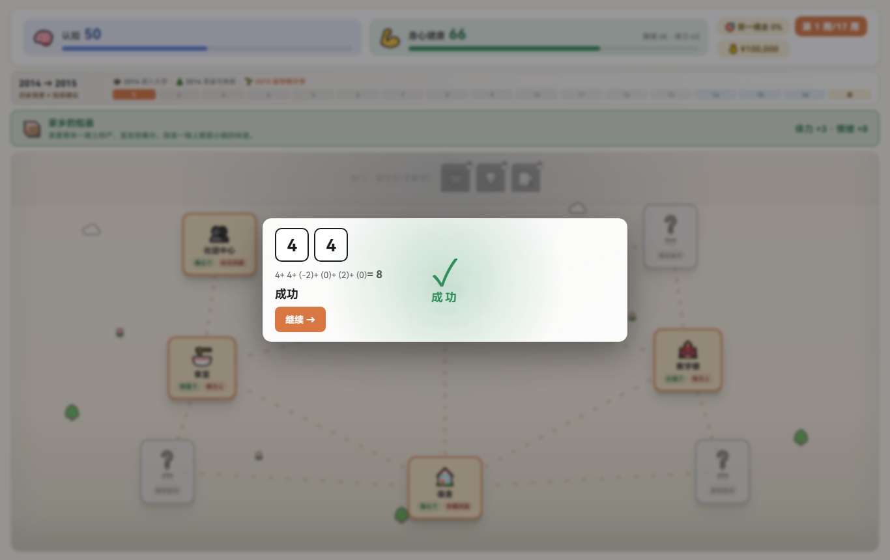

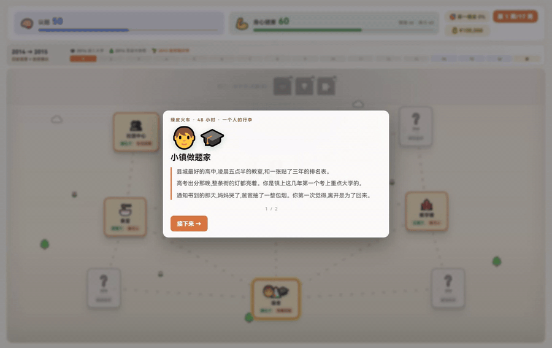

---

## 5. 事件 — 地点表 + 人生抉择

每栋建筑有一张 3 事件的加权表(机会 2 / 中立 3 / 陷阱 1)。此外还有**强制剧情 beat** 织进流程: 第 1 周开户、首次去图书馆发现贵人、首次去教学楼选方向(金融/传统行业/AI/读研)、首次回宿舍办健身卡。

`⚡` 特殊事件池(小镇 51 个 / 世家 40 个,24 个市场·朋友·健康两出身共享)在每次到达时按概率触发;其中 3 个是**人生抉择卡**(借钱给朋友 / 家里的汇款 / 彩票),先于地点卡弹出,带玩家选择权。


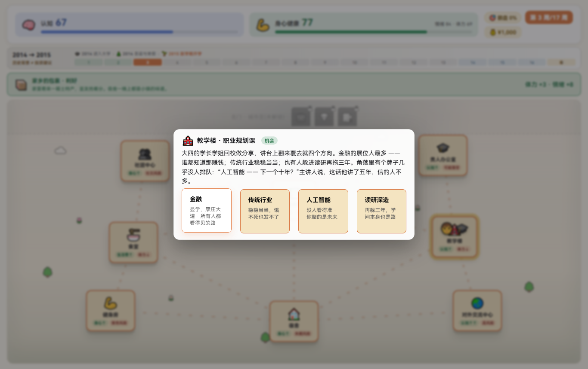

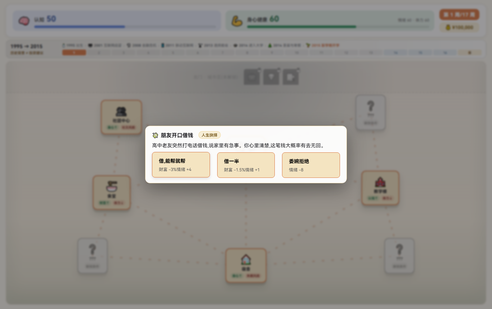

---

## 6. 模拟盘交易 — 真实资产 + K 线

模拟盘有每出身的初始资金(小镇 ¥100,000 / 世家 ¥300,000),可**买入/卖出 7 种真实资产**(沪指/恒指/BTC/黄金等,佣金万三),持仓跨周保留、按均价成本结算。**v2.8 渐进解锁**: 开户只给货币基金 + 债券两个练手品种,投资导师、损友、骗子在路上一一出现、每人都教你解锁一点,直到 7 个品种全开(锁定品种显示 🔒 尚未解锁,不露价格/K线/新闻)。K 线提供 **日/周/月/半年/年** 五种周期,回溯 2014 年历史走势。

**v2.7 真实交易规则**:每类资产有真实的规则与限制 —— **T+1**(A股/港股/基金/黄金今天买、明天才能卖;BTC 是 T+0 当天可卖)、**涨跌停**(A股 ±10%,其余无)、**最小交易单位**(BTC 可细到 0.0001 份)、**佣金万三**(买卖双向)。面板顶部有**市场温度**指示器(📉低迷 / 🌡️震荡 / 📈亢奋,由本周全资产平均涨跌派生),选中的资产会亮出**属性卡**(所属市场 / 交易规则 / 涨跌停 / 最小单位 + 一句话"它跟别的品种有什么不同"),右上角 **`? 规则`** 打开一本给金融新手写的**交易规则手册**(佣金 → T+1 → 涨跌停 → 最小单位 → 产品区别)。新手在卖出当日刚买的 T+1 资产、首见 BTC、或遇到市场亢奋/低迷时,会收到**一次性渐进提示**。


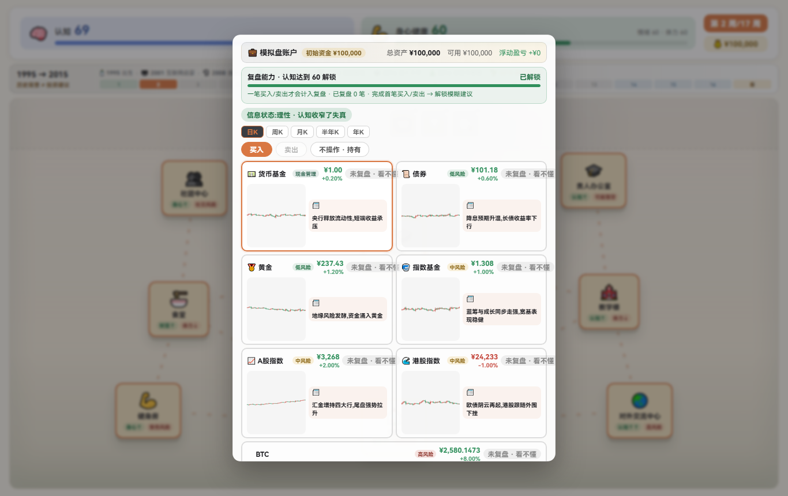

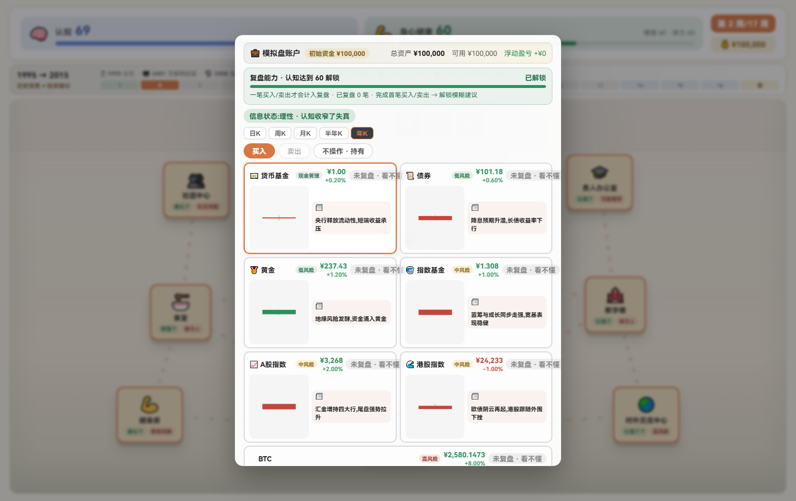

---

## 7. AI 教练 + 平行命运

每回合结算是一张**宽幅结果卡**: 左半是 AI 教练(班主任人设)—— 打字机逐字出复盘,按"出身/时代/认知/情绪"四维归因;右半是**平行命运卡** —— 同一把骰子、两种出身,逐项对决(财富/认知/投资),胜者金边。

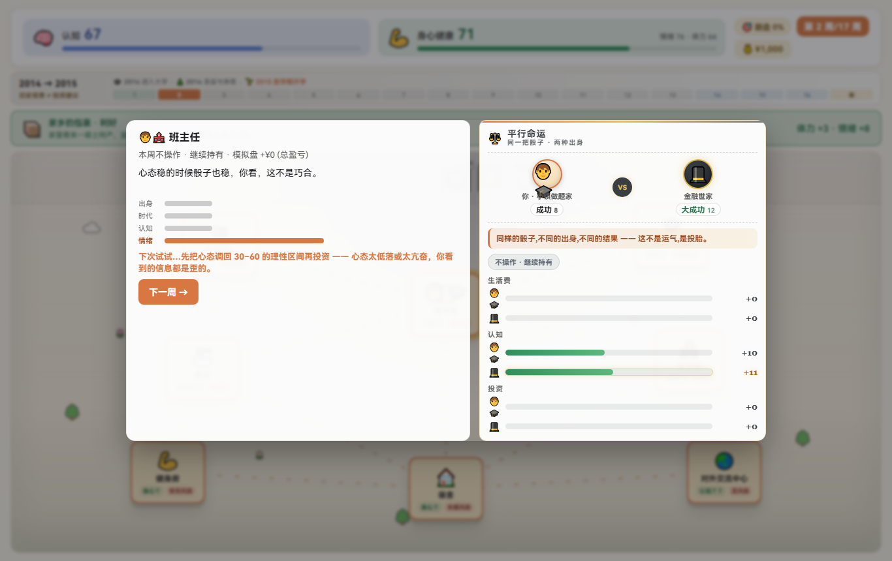

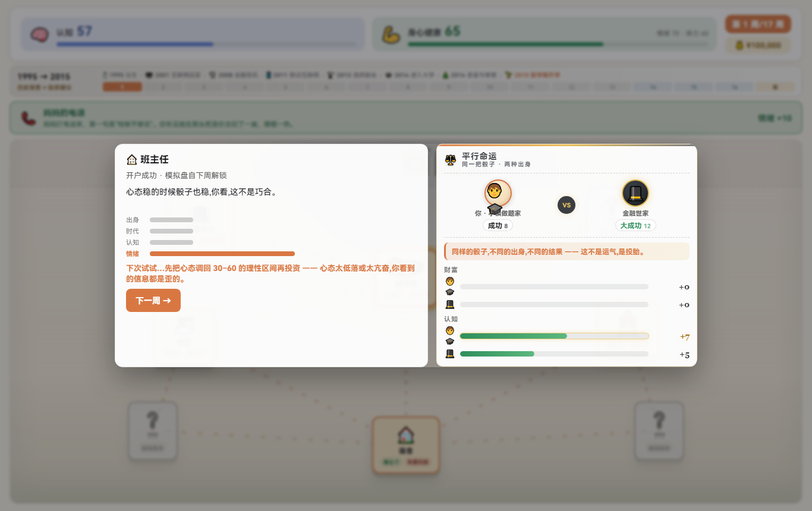

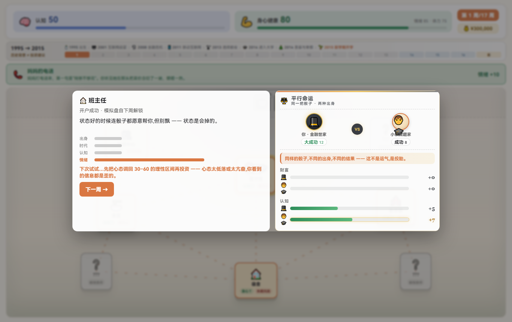

---

## 8. 三条隐藏线 — 爱情 / 关系 / 贵人

- **爱情线**(两出身都有): 迎新晚会初遇(t2+)→ 期中图书馆(t6+)→ 期末跨年邀约(t10+,接受 → 并肩);圣诞夜文案随阶段变化;寒假重逢由"圣诞好印象"或"已并肩"触发。**爱情永不决定觉醒结局。**
- **关系线**(世家专属): 第 3/7/11 周三次危机(他们喜欢的是谁?/银行卡被推回来/情感危机),选择决定信任走向,坦白可修复。

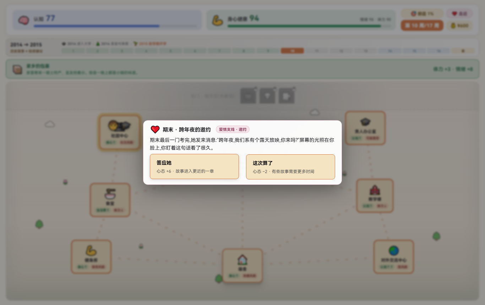

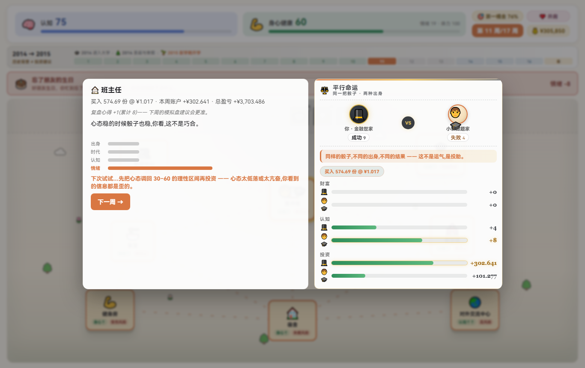

- **贵人线**: 贵人不一定是办公室里那个人 —— **三人行必有贵人**,路上遇到的投资导师、损友、骗子(甚至教授、同学)任何一个都可能是指点你的贵人:他们解锁品种、给认知、给建议。但**觉醒**(最终认可)仍只在贵人办公室等你去认 —— 4 种人设(随选方向变化: AI 技术前辈/券商经理/厂长/退休教授),信任 = 有能力(认知 ≥60)× 对口(押注 AI);另有"贵人好感"通道(5 个故事事件 +1 好感,提升命中概率)。**v2.7 换向**:如果你当初没选 AI 方向,第一次得到贵人指点后,会解锁**一次**"改押人工智能"的机会 —— 换方向,从此对口信任到手;放弃或不选,这次机会就没了。

---

## 9. 两种出身 — 同一把骰子,不同本金

| | 小镇做题家 | 金融世家 |
|---|---|---|
| 生活费(开局) | ¥1,000 | ¥300,000 |
| 模拟盘初始(本金) | ¥100,000 | ¥300,000 |
| 认知/身心 | 认知 50 · 身心 60 | 认知 45 · 身心 75 |
| 骰子修正 | −2 | +2 |
| 学习系数 | ×1.3 | ×0.9 |
| 贵人免费命中 | 10% | 30% |
| 专属事件池 | 27(家乡/小钱/人情) | 16(家族/信托/继承人) |

两种出身在**同一套骰子**下走完全程,结尾用"平行命运"直接对照 —— 差距是本金,不是手气。

---

## 10. 结局 — 17 周小结

小结屏给出: 每周骰运明细(胜率/运气值)、模拟盘翻盘目标达成与否、爱情目标达成与否、觉醒原因诊断、以及一张"如果你玩完整局(32 回合)6.4 倍差距"的 teaser。觉醒 = 新学期开学贵人的认可,解锁金融世家出身 → 可重开。

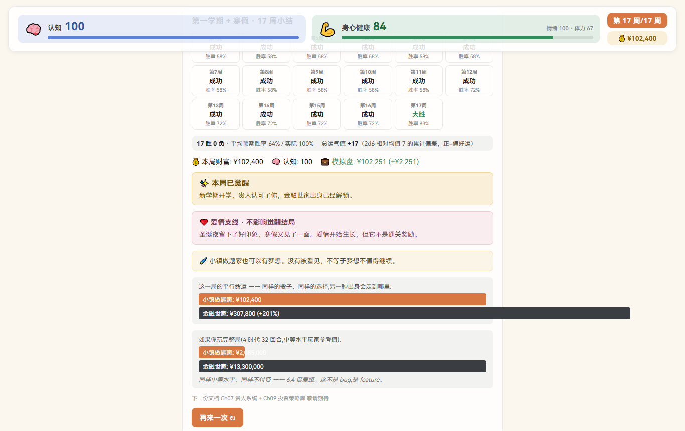

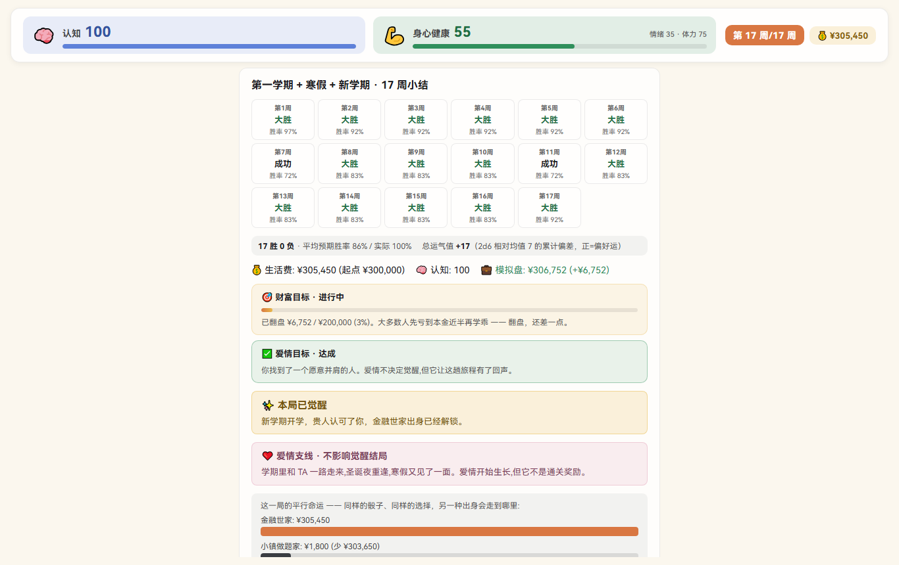

---

## 11. 截图索引

`showcase/` 下按回放阶段命名,全部由确定性种子(0.5)生成,可直接对照代码回放:

- **开场**: `01-opening.png` / `01b-goals.png` / `dyn-01-opening.png` / `dyn-01b-goals.png`
- **地图**: `02-map.png` / `live-01-map.png`
- **逐周**(town): `t{1..17}-2-dice.png`(骰)、`t{1,3,6,8,13}-3-event.png`(事件)、`t{2,4}-4-invest.png`(交易)、`t{1..17}-5-results.png`(结算)、`t{4,7,10}-love.png`(爱情)
- **逐周**(dynasty): `dyn-t{4,5,6,7,10,11}-{relationship,love}.png`
- **平行命运卡**: `fate-town.png` / `fate-dynasty.png` / `fate-fancy.png`
- **K 线周期**: `v24-frame-{day,week,month,halfYear,year}.png`
- **交易/抉择**: `v24-trading-panel.png` / `v24-special-choice.png` / `v24-results.png`
- **小结**: `18-summary.png` / `dyn-18-summary.png` / `14-summary.png`

---

## 12. 动图 (gif)

核心动画的逐帧 gif(由 `scripts/gifs.mjs` 捕获 + ffmpeg 编码):

- **掷骰**: `dice-roll.gif` — 减速翻滚 → 公式打字 → 判定爆粒子(见 §4)

> 生成命令: `npm exec --offline --yes --package=playwright -- node scripts/gifs.mjs`(用 `recordVideo` 录 `showcase/gif-frames/dice.webm`,并打印骰子起点偏移),再两段式 ffmpeg(先 `palettegen` 出调色板,再 `paletteuse` 合成,`-ss` 从骰子起点裁剪):
> ```bash
> ffmpeg -y -ss <offset> -t 2.5 -i gif-frames/dice.webm -vf "fps=20,scale=900:-1:flags=lanczos,palettegen=stats_mode=diff" /tmp/dice-palette.png
> ffmpeg -y -ss <offset> -t 2.5 -i gif-frames/dice.webm -i /tmp/dice-palette.png -lavfi "fps=20,scale=900:-1:flags=lanczos [x]; [x][1:v] paletteuse=dither=bayer:bayer_scale=5:diff_mode=rectangle" -loop 0 showcase/dice-roll.gif
> ```
