# 股神模拟器 · 第一学期 —— 通关全流程攻略

> 一份**逐屏**走完全部游戏进度的图文攻略:从「选择出身」到「觉醒诊断」,每一步配截图 + 机制讲解。
> 所有截图来自确定性回放(种子固定、0 console error),截图目录与本文件同目录(`docs/playthrough/`)。

---

## 0. 这游戏到底在玩什么

你是一名 2014 年秋入学的大一新生,在一个学期(17 周)的校园生活里,同时做三件事:

1. **过校园生活** —— 每周选一栋楼去(图书馆 / 食堂 / 教学楼 / 社团……),掷骰子、撞事件、做抉择,涨「认知」和「身心」。
2. **炒模拟盘** —— 手里一笔模拟资金(小镇 ¥100,000 / 世家 ¥300,000),每周对 7 个品种(货基 → BTC)做买卖,赚够你开局的「人生目标」。
3. **等一个贵人** —— 只有被「贵人办公室」认可,你才会**觉醒**(本局真正的胜利条件)。

三者不是并列的:校园事件决定你的**认知**(学习能力)和**心态/体力**;认知高了,才看得懂盘、才有**复盘能力**、才够格进贵人的门;而贵人的「信任」又要求你**认知 ≥ 60** 且**押对了方向(人工智能)**。

一句话总结:**认知是钥匙,方向是门,模拟盘是你练手的战场,觉醒是终点。**

---

## 1. 第 0 步 · 选择出身(二选一)

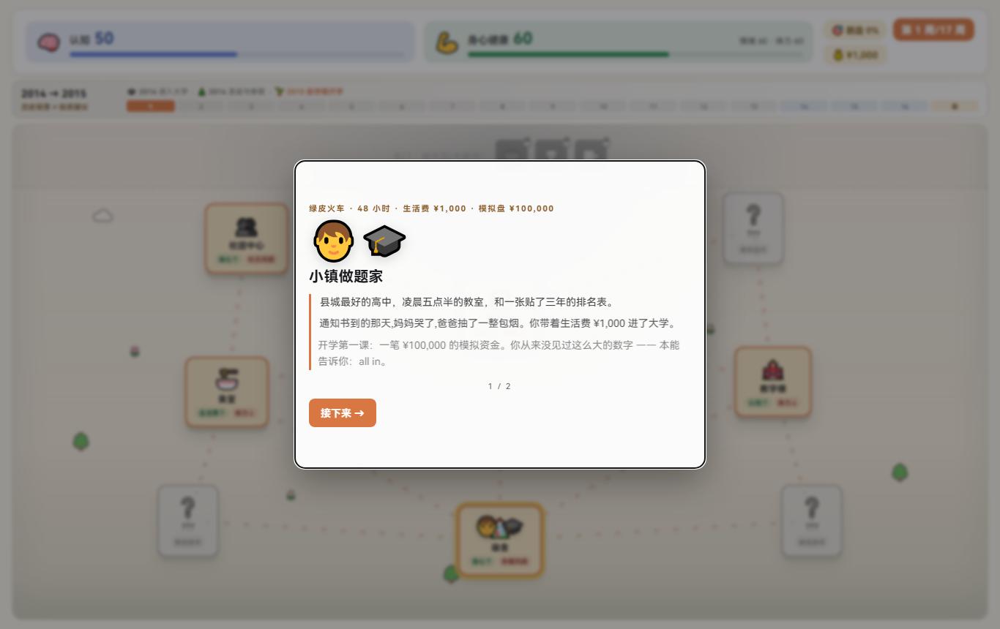

开局二选一,两条路线差异很大,但**玩法机制完全一样**(只是初始数值、骰子修正、模拟盘起点不同):

| | 🧑‍🎓 小镇做题家 | 🎩 金融世家 |
|---|---|---|
| 生活费 / 财富 | ¥1,000 生活费 | ¥300,000 |
| 模拟盘初始资金 | **¥100,000** | **¥300,000** |
| 初始认知 | 50 | 45 |
| 初始体力 / 心态 | 60 / 60 | 75 / 75 |
| 骰子修正 | **−2**(手气差) | **+2**(命好) |
| 贵人免费命中率 | 10% | 30% |
| 财富目标 | 翻盘到 **¥200,000** | 证明自己到 **¥500,000** |

**新手建议:先玩「小镇做题家」**。它才是这个游戏的原生叙事——穷小子凭认知逆袭,「第一桶金 = 把模拟盘从 5 万翻到 20 万」这条弧线最完整、也最能讲清楚机制。

---

## 2. 第 0.5 步 · 设定人生目标

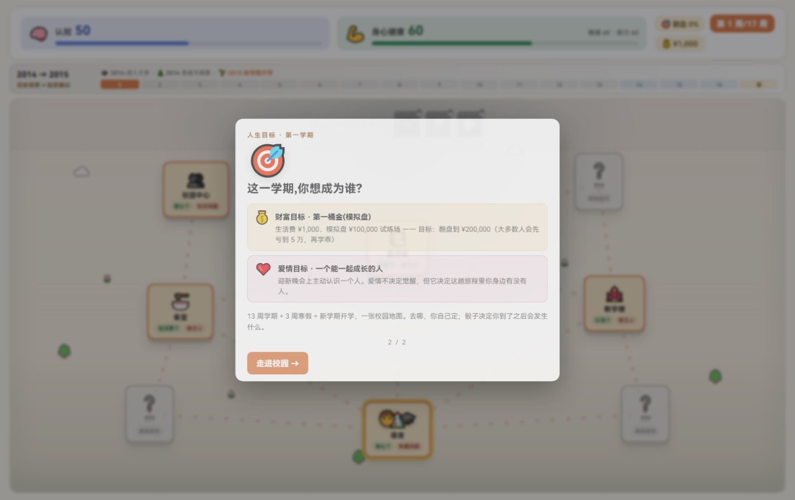

接着是一张「人生目标」卡,给你定下两条验收线:

- **财富目标**:把模拟盘做到一个具体数字(小镇 ¥200,000 / 世家 ¥500,000)。
- **爱情目标**:一条贯穿学期的感情支线(见 §9),不是数字,而是一个「阶段」。

> 这张卡是 UI-only,不消耗周数;点「走进校园」才正式开始计时。

---

## 3. 第 1 步 · 走进校园,认识地图

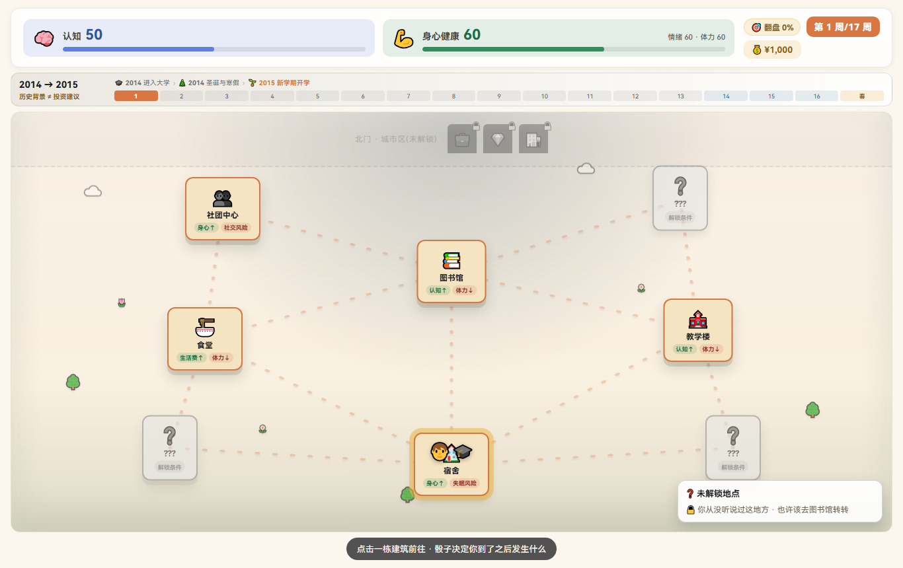

左边是**校园地图**(8 栋可进的楼),右边是**17 周日历**(学期周 + 寒假周,锚点 2014 秋 → 2015 春)。

**8 栋楼,各管一条线**(鼠标悬停可见「价值方向」提示条):

| 楼 | 图标 | 主要产出 | 风险 |
|---|---|---|---|
| 宿舍 | 🏠 | 身心 ↑ | 失眠时身心 ↓ |
| 图书馆 | 📚 | **认知 ↑** | 消耗体力 |
| 食堂 | 🍜 | 生活费 ↑ | 打工出错时 ↓ |
| 社团中心 | 👥 | 心态/体力 ↑ | 社交冲突时 ↓ |
| 教学楼 | 🏫 | 认知 ↑ + **可选方向** | 消耗体力 |
| 贵人办公室 | 🎓 | 认知 ↑ + **觉醒**(初始锁定「???」) | 需要能力 + 对口 |
| 健身房 | 💪 | 身心 ↑(先要解锁) | 过度训练时 ↓ |
| 对外交流中心 | 🌏 | **认知 ↑↑**(认知 ≥ 60 解锁) | 展示失败时 ↓ |

北门外还有三栋灰掉的城市楼(私董会 / PE 圈 / 投行内推)——那是**完整版**的内容,本 intro scene 不开。

**几个硬门槛先记住**:

- **贵人办公室**:第一周锁着,先去图书馆「发现贵人」才解锁。
- **健身房**:要等「办卡」事件触发才解锁。
- **对外交流中心**:认知 ≥ 60 才进得去。
- **教学楼第一访**:触发「选方向」(§8)。

---

## 4. 每周的固定循环(8 步)

每一周都是同一个循环,理解它 = 理解整个游戏:

```
选楼 → 到达(触发事件) → 掷骰子 → 继续 → 事件卡 → 抉择 → 模拟盘投资 → 结果 → 下一周
```

- **选楼**:点地图上一栋楼,棋子滑过去。
- **到达**:从该楼的 3 个事件里确定性抽一个(有些「教学事件」是强制触发的,见 §6/§8/§9)。
- **掷骰子**:决定这一局你的「手气档位」。
- **事件卡**:有时先弹一张「人生抉择卡」(全局随机),再弹「地点卡」。
- **抉择**:选一个选项,产生数值增减(认知 / 心态 / 体力 / 财富)。
- **模拟盘投资**:第 2 周起每周一次的买卖窗口(§7)。
- **结果**:AI 教练复盘 + 本周结算。
- **下一周**:进入下周,直到第 17 周结束看总结。

---

## 5. 掷骰子 · 命运的分水岭

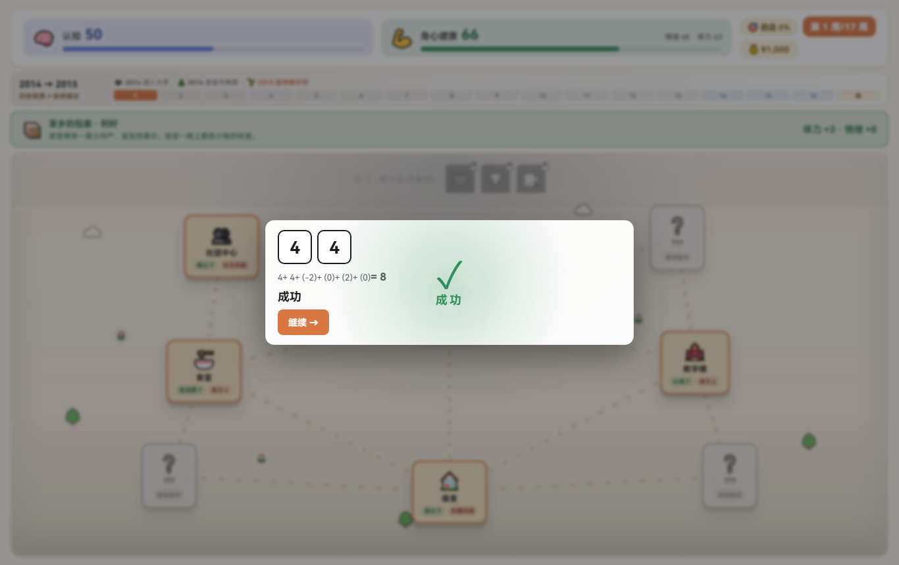

掷骰子不是「走几步」,而是决定**这一局你的档次**:

- 骰点(1–6)+ 出身修正(小镇 −2 / 世家 +2)= 最终档位:`awaken`(觉醒) > `big_success` > `success` > `neutral` > `big_fail`。
- 档次再和**事件性质**交叉:`opportunity`(机会)、`trap`(陷阱)、`neutral`(中性)。
- 交叉结果决定数值缩放的倍数——例如 `awaken × trap = 0`(觉醒的人不会踩坑),`big_fail × opportunity = 0`(大失败的人抓不住机会)。

**要点**:骰子好 + 事件好 = 大赚;骰子差 + 事件差 = 大亏。所以「选楼」其实是在赌:你去的地方,事件方向要和你当前的手气、认知匹配。

---

## 6. 第 1 周 · 开户(强制事件)

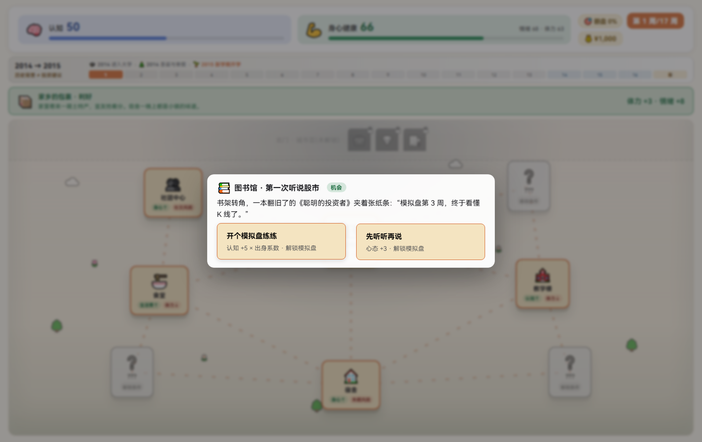

第 1 周不管你点哪栋楼,**强制触发「开户」故事事件**——这是定番,也是唯一不吃模拟盘的周(开户周直接事件 → 结果,跳过投资)。

这一周的意义:

- 给你讲清「模拟盘」是怎么回事(一笔你从没见过的 ¥100,000)。
- 埋下「本能 vs 认知」的题眼:穷惯了的脑子,第一反应是 all in。

---

## 7. 模拟盘 · 两步走交易(核心机制,重点)

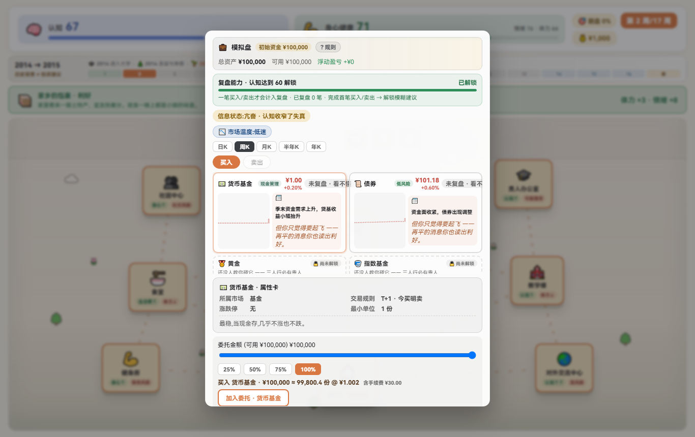

从第 2 周开始,每周有一次买卖窗口。这是游戏里**最需要搞懂**的界面,分三块:

### 7.1 七个品种(按风险从低到高)

| 品种 | 图标 | 风险档 | 规则要点 |
|---|---|---|---|
| 货币基金 | 💵 | 现金 | 无波动,保底 |
| 债券 | 📜 | 低 | 温和 |
| 黄金 | 🥇 | 低 | 震荡,抗跌 |
| 指数基金 | 🧺 | 中 | 均衡 |
| A股指数 | 📈 | 中 | **T+1 + 涨跌停 ±10%**(说明性) |
| 港股指数 | 🌊 | 中 | T+1,无涨跌停 |
| BTC | 🪙 | **高** | **无 T+1**,最小单位 0.0001,高波动 |

**渐进解锁**:开局不是 7 个全亮。随着「导师 / 损友 / 骗子」等引导事件,依次解锁 2 → 4 → 6 个品种(未解锁的只显示 🔒 预览卡)。

### 7.2 交易规则(机械执行,不是装饰)

- **佣金**:万三(0.03%),买卖双向都收。
- **T+1**:今天买的,明天才能卖(A股 / 港股 / 基金 / 黄金);**BTC 例外**,当日可卖。
- **最小单位**:多数品种 1 份;BTC 0.0001。
- **涨跌停**:A股 ±10% 是「教学说明」(周频 mock 绑不了日内 ±10%),不做机械限制。

### 7.3 两步走(「提交 → 改 → 确认」)

这是模拟盘最重要的交互规则,记住它就不会误操作:

```
步骤 1「加入委托」:选品种 + 方向(买/卖) + 金额 → 点描边的「加入委托」按钮,订单进篮。
                     (同一个品种再点 = 更新,不是追加;可点 ✕ 撤单、可「清空」)
步骤 2「确认 N 笔下单」:篮非空时,主按钮亮起 → 点它,篮子里的订单一次性生效。
```

- **篮空时主按钮禁用**,并显示「①② 两步走」提示(上图就是篮空状态)。
- 你可以**先加多笔委托,再改、再撤,最后一次性确认**——所以「模拟盘只能买卖一次」是错觉,它支持**一篮子多笔订单**。

> **实操套路**:每周点「50%」快速按钮 → 「加入委托」→ 观察篮子 → 「确认下单」。或者什么都不做,点「不操作,继续持有」(空仓也算一种决策)。

---

## 8. 选方向 · 押注人工智能(决定能不能被贵人信任)

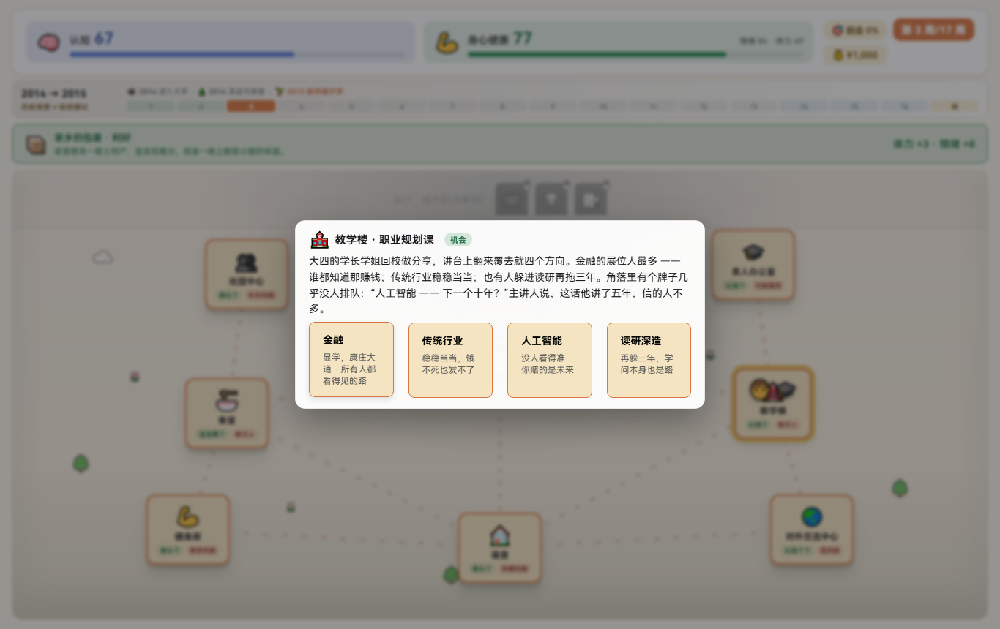

第一次去**教学楼**,触发「选方向」四选一。**这个选择几乎决定了本局的成败**,因为贵人的「信任」有一个硬条件:**你押的方向必须「对口」**。

- 贵人心目中的下一波 = **人工智能(AI)**。
- 只有选「人工智能」+ 认知 ≥ 60,才能触发「有能力 × 对口」→ **贵人信任**(命中率 90%)。
- 选别的方向,也不是死路——第一次得到贵人指点后,会解锁一次「改押 AI」的机会(详见设计文档 12-v2.7)。

**想觉醒,选「人工智能」**。

---

## 9. 爱情支线(贯穿学期)

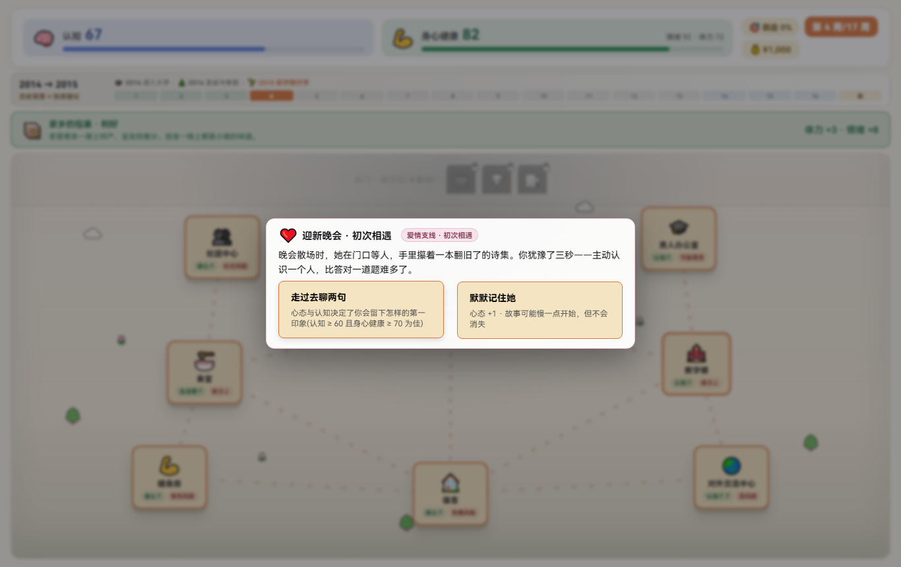

除了投资和贵人,还有一条感情线,按学期注入三次,和主事件交叉推进:

- **初遇**:第 2 周之后(迎新派对)。
- **期中**:第 6 周之后(图书馆那次见面)。
- **期末**:第 10 周之后(期末派对)。

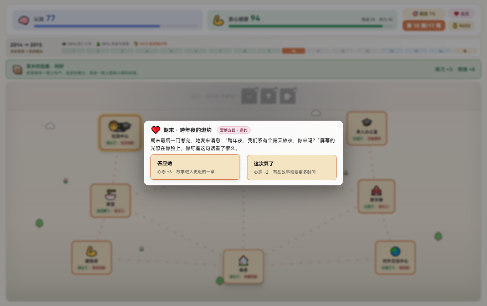

爱情不是「数值」,而是一个**阶段**(`impression → meet → close`),期末收尾时看结局;寒假还可能有一次「重逢」。这条线同时喂你的「爱情目标」验收。

> 世家路线(金融世家)还有另一条专属的「世家关系线」(信任值 3 段:听对方说 → 承认不知道 → 坦白),和小镇的爱情线并列。

---

## 10. 解锁新地图 · 办卡 + 对外交流中心

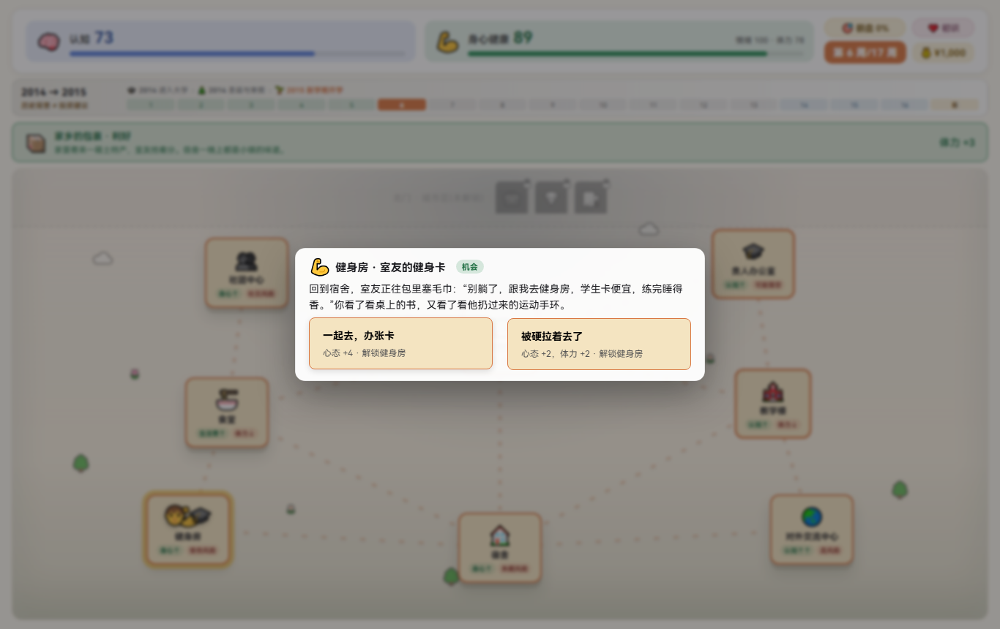

随着进度,校园会「长大」,两栋新楼陆续解锁:

- **健身房(办卡事件)**:第一次去宿舍附近,触发「办卡」,之后健身房可进(身心 ↑)。
- **对外交流中心**:认知 ≥ 60 才开放——这是后期刷认知的主场(认知 ↑↑),但展示失败会反噬。

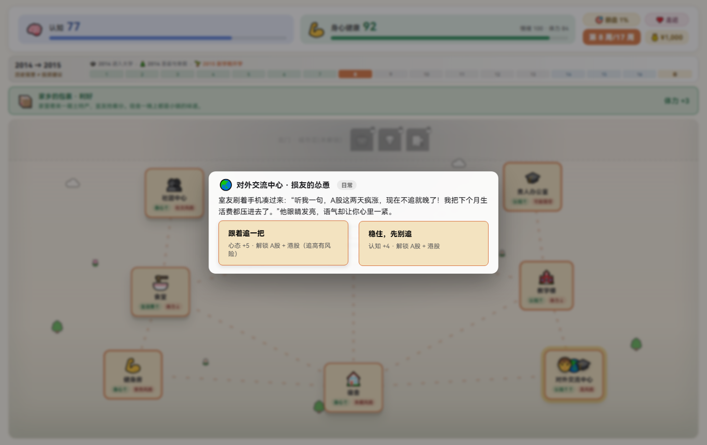

**节奏建议**:前期(第 1–5 周)猛刷**图书馆 + 教学楼**把认知堆到 60(顺便选方向、发现贵人),第 6 周之后解锁健身房和对外交流,回头用对外交流把认知冲上 90+。

---

## 11. 学期末 + 寒假(第 14–17 周)

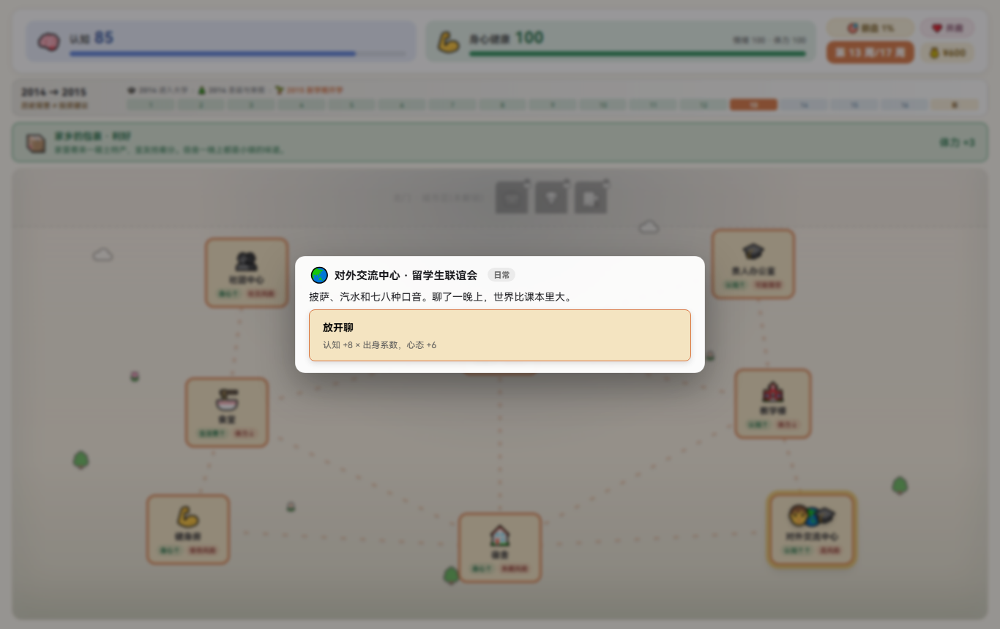

日历走到学期末,进入**寒假特殊事件**:

- **第 14 周 · 圣诞节**:圣诞邂逅。
- **第 15 周 · 寒假成长**:冬日自我成长。
- **第 16 周 · 寒假重聚 / 反思**:感情线收尾。
- **第 17 周 · 新学期开学**:回校,贵人线最后一击(能不能被认可,看这一周)。

寒假周**没有模拟盘交易**(学期收盘了),纯事件驱动,是感情线和贵人线的终章。

---

## 12. 每周结果(结算 + AI 教练复盘)

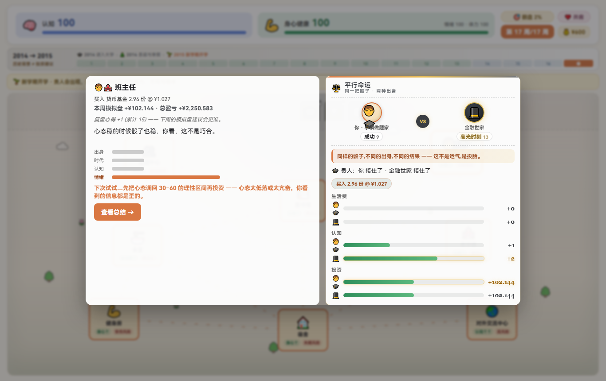

每周末的结算屏,信息很密:

- **本周事件结果**:你选了什么、数值涨跌多少。
- **模拟盘结算**:持仓 / 现金 / 总盈亏(如果你这周有真实买卖)。
- **AI 教练复盘**:一句点评 + 一句「平行宇宙」对照(另一个出身/选择的你会怎样)。

> **复盘能力是隐藏收益**:认知 ≥ 60 且本周有真实交易,这笔交易会变成「心得」,下一次的建议就越来越准——从「看不懂(blind)」→ 噪音(noisy)→ 清晰(clear)→ 犀利(sharp)。这就是「学习 → 试错 → 复利」的闭环。

---

## 13. 结局 · 总结与觉醒诊断

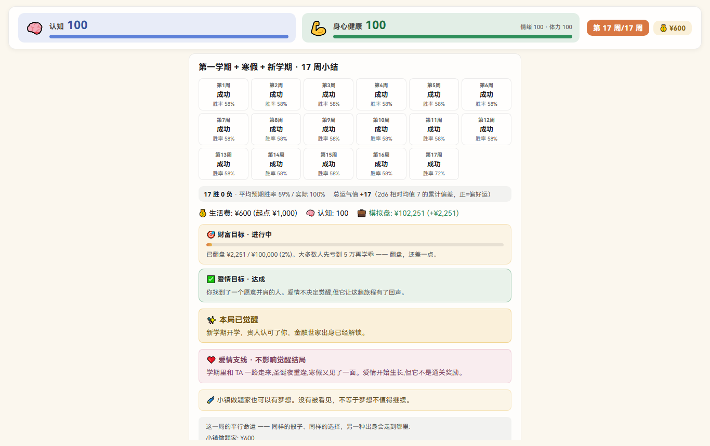

第 17 周结束,点「查看总结」,一张大总结屏:

1. **双轨对比**:你和「平行世界的另一个你」(另一种出身/选择)并列,看谁走得更远。
2. **人生目标验收**:财富目标、爱情目标,各自「达成 / 未达成」。
3. **觉醒诊断**(本局的最终答案):
   - **已觉醒**:本局通关——你在贵人办公室得到了认可。
   - **尚未觉醒**:会列出「原因」(常见:没去贵人办公室 / 认知没到 60 / 方向没对口)。
4. **差距预览(gap teaser)**:告诉你完整版 32 回合能到多少身家(小镇约 ¥208 万 / 世家约 ¥1330 万)——让这个 17 周 demo 的「复利」显得有分量。

---

## 14. 两条隐藏主线(攻略核心)

游戏把最重要的信息藏在两条「隐藏线」里,看懂它们才算会玩:

### 主线 A · 贵人信任(觉醒的唯一钥匙)

```
觉醒 = 被贵人办公室认可
认可 = 「有能力(认知 ≥ 60)」×「对口(选了 AI 方向)」 → 命中率 90%
```

- 认知是门槛,方向是钥匙,二者缺一不可。
- 此外还有一条「贵人好感」辅助线:某些事件会 +好感,每点好感让命中率 +12%(上限 4 点)——它只是「推你一把」,不是主杠杆。
- **觉醒只在贵人办公室发生**,别处刷认知刷不到觉醒。

### 主线 B · 复盘能力(财富目标的放大器)

```
真实交易(买入/卖出、金额 > 0) + 认知 ≥ 60 → 本周交易变成「心得」
心得越多 → 建议越准(blind → noisy → clear → sharp)
```

- 认知不够(＜60),交易白打;不操作,无可复盘。
- 这就是为什么**先堆认知、再开始认真炒盘**:认知解锁复盘,复盘反哺盘面,盘面翻盘达成财富目标,三者闭环。

---

## 15. 一局推荐打法(速通觉醒 + 财富目标)

按「小镇做题家」路线,一条能稳定达成双目标的节奏:

| 周 | 去哪 | 为什么 |
|---|---|---|
| 1 | (任意) | 强制开户,熟悉地图 |
| 2 | 图书馆 | **发现贵人** + 第一笔交易(先「不操作」也行) |
| 3 | 教学楼 | **选方向 → 人工智能** |
| 4–5 | 图书馆 / 教学楼 | 堆认知,往 60 走 |
| 6 | 宿舍附近 | **办卡**,解锁健身房 |
| 7–9 | 图书馆 + 对外交流(认知 ≥ 60 后) | 认知冲 90+,同时认真炒盘 |
| 10–13 | 均衡 + 贵人办公室 | 攒好感,试贵人认可 |
| 14–16 | 寒假事件(自动) | 收尾感情线 |
| 17 | 新学期(贵人线终章) | **最后一击,拿觉醒** |

炒盘侧:第 2 周起每周「50% → 加入委托 → 确认」买入低风险品种(货基 / 债券)练手;认知 ≥ 60 且建议变「清晰/犀利」后,再逐步切到指数基金 / A股 / 港股吃波段;**BTC 留给高认知 + 明确信号时**再碰。

---

## 附 · 本攻略覆盖的版本

- 版本:**v2.12**(两步走交易确认)及之前已合入的所有机制(v1.2 认知信息、v1.3 开户、v1.6 选方向+贵人信任、v1.7 办卡+对外交流、v2.4 模拟盘、v2.5 爱情+人生目标、v2.6 贫困逻辑、v2.8 渐进解锁、v2.11 委托篮)。
- 截图来源:确定性回放脚本 `scripts/showcase.mjs`(小镇路线),种子固定,0 console error。
- 相关设计文档:`docs/design/` 下 01–18 号(尤其 12-v2.7 规则/换向、17-v2.11 委托篮、18-v2.12 两步走)。
