# PRISM LEDGE CONCEPT EXHIBITION — 12 款概念游戏展出

> **9_3dplatform 概念展** · 2026-08-13 · 12 个「几乎没见过」的 Three.js 3D 平台游戏
> 每个展位 = 概念草稿的**极致瞬间**实景渲染（程序化几何，零资产，`showcase/index.html` 可交互浏览）
> 文档结构遵循 intro-scene-until-perfect：每个游戏 = 1 个 intro scene 命题证明
> 完整设计文档：`../concepts/NN-*.md` ｜ 选型矩阵：`../concepts/README.md`

---

## BOOTH 01 · SHADOWSTEP 影跃

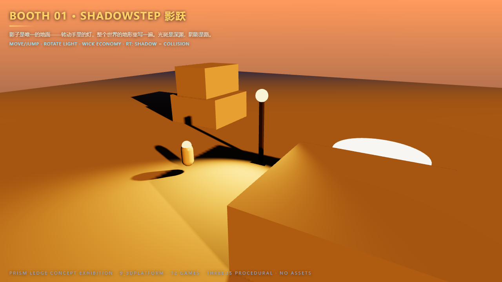

> **影子是唯一的地面——光斑是深渊，阴影是路。**

- **命题**: 光定义碰撞。转动手里的灯，整个世界的地形重写一遍。
- **操作**: 移动/跳跃 · Q/E 转灯 · 灯油经济
- **极致瞬间**: 傍晚斜阳 12° 低角射入庭院，90% 地面在阴影里——玩家站在唯一的光斑旁，意识到脚下的"安全区"其实是深渊。
- **渲染**: ★★★ 光追阴影 = 碰撞数据本身（`raycastBvh` 生成 solidMap）
- **状态**: 概念草稿 · MGP 5.5–6 天

---

## BOOTH 02 · ECHO FORGE 回声铸台

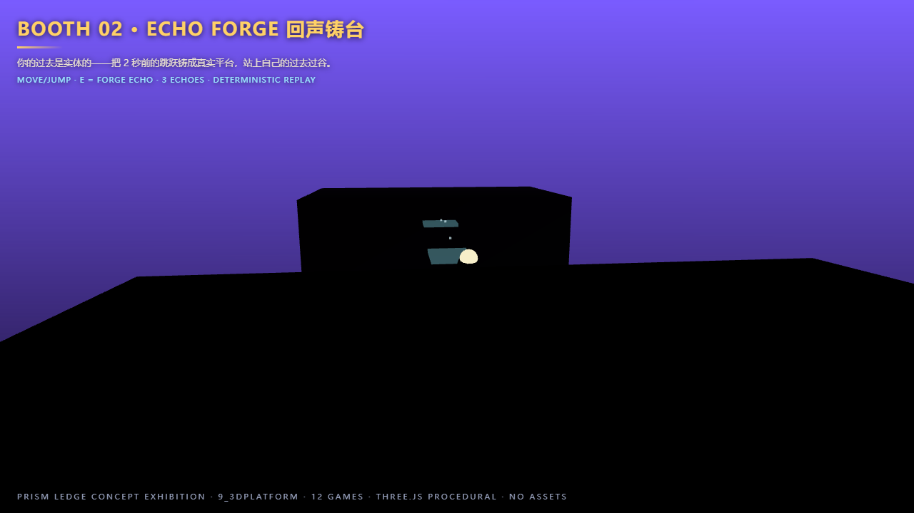

> **你的过去是实体的——把 2 秒前的跳跃铸成平台，站上自己的过去。**

- **命题**: 时间变成建材。回声不消失，而是成为下一个跳跃的踏脚石。
- **操作**: 移动/二段跳 · E 铸回声 · 3 回声并存
- **极致瞬间**: 12m 峡谷需要 4 连跳——其中 3 跳踩在自己身上，屏幕上一串 4 个渐隐的自己。
- **渲染**: ★☆ 回声板 = 半透明镜面
- **状态**: 概念草稿 · MGP 5.5–6 天

---

## BOOTH 03 · FERRO 铁磁滴

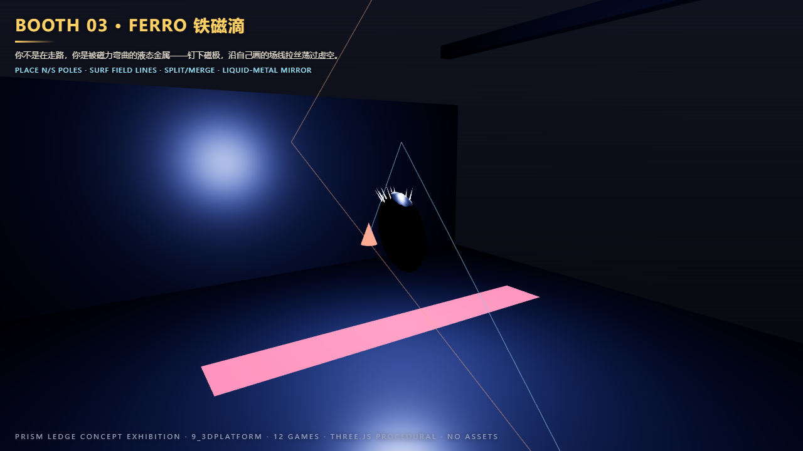

> **你不是在走路，你是被磁力弯曲的液态金属——沿自己画的场线拉丝荡过虚空。**

- **命题**: 移动 = 塑形场。钉下磁极，磁场线实时重排，身体沿场线滑行。
- **操作**: LMB/RMB 钉 N/S 磁极 · F 分身 · Q 收回
- **极致瞬间**: 8m 虚空裂缝上方唯一的通路 = 两侧 N 极 + 顶部 S 极形成一条拱形磁弧，身体拉成 6m 金属丝贴弧荡过。
- **渲染**: ★★ 液态金属真镜面
- **状态**: 概念草稿 · MGP 5.5–6 天

---

## BOOTH 04 · KALEIDO 万花镜

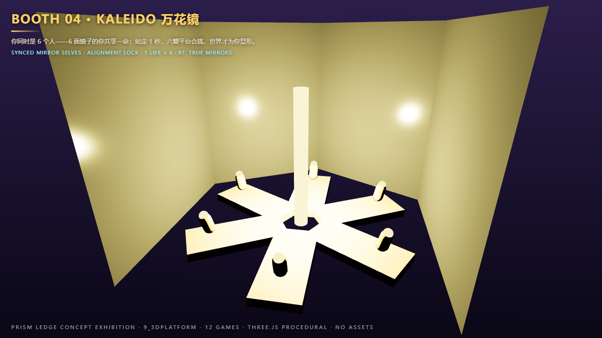

> **你同时是 6 个人——6 面镜子的你共享一命；站定 1 秒，六瓣平台合拢。**

- **命题**: 对齐是碰撞。6 个镜像共享同一套输入、同一套物理，处在 6 个旋转后的空间里。
- **操作**: 同步移动 · 对齐锁（站定 1s）· 1 命 × 6
- **极致瞬间**: 6 个你在各自扇区同时到达顶角 → 6 块扇形地面合拢成一朵完整的六瓣平台——屏幕上 6 个自己围成一个圆，面朝圆心。
- **渲染**: ★★★ 真镜面（raster 平面反射 / RT 光追反射）
- **状态**: 概念草稿 · MGP 5.5–6 天

---

## BOOTH 05 · PHASEWALK 四相行者

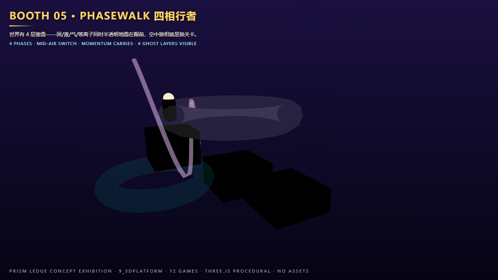

> **世界有 4 层重叠——固/液/气/等离子同时半透明地叠在眼前，空中换相就是换关卡。**

- **命题**: 4 个世界同时可见。解谜不是猜，是对比 4 层找通路。
- **操作**: 1/2/3/4 切相 · 相弹（空中切相动量守恒）
- **极致瞬间**: 塔中层断口无石阶——坠落中连切 3 相：固（跳）→ 液（穿管）→ 气（乘风）→ 等离子（沿电线）一气呵成。
- **渲染**: ★☆ 幽灵层互反射
- **状态**: 概念草稿 · MGP 5.5–6 天

---

## BOOTH 06 · SONAR 声呐

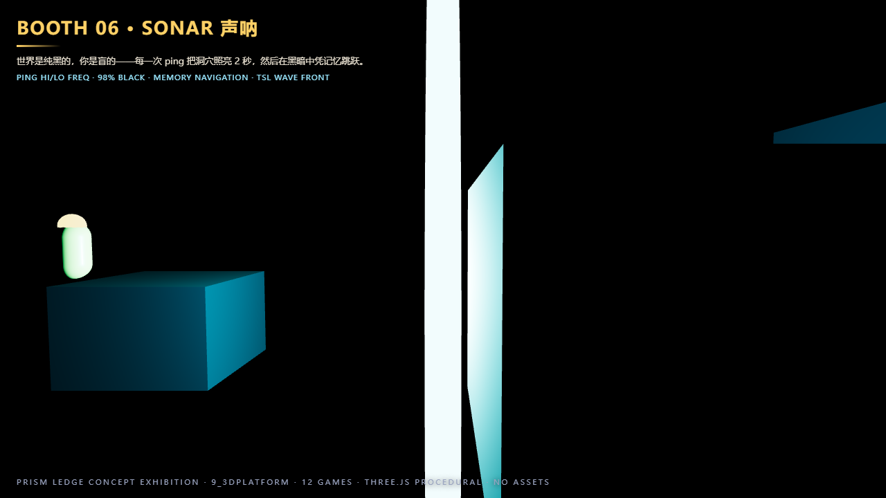

> **世界是纯黑的，你是盲的——每一次 ping 把洞穴照亮 2 秒，然后在黑暗中凭记忆跳跃。**

- **命题**: 可见度是资源。高频 ping 短促清晰，低频 ping 深远模糊——路线规划发生在黑暗里。
- **操作**: 空格短按/长按双频 ping · 记忆导航 · 回声记忆残影
- **极致瞬间**: 屏幕 98% 像素纯黑；最后一段 8m 深渊——ping 一次看清对面平台，然后闭眼跳。
- **渲染**: ★★ TSL 球面波纹 = 轻量光追（raycastBvh）
- **状态**: 概念草稿 · MGP 5.5–6 天

---

## BOOTH 07 · BONE TOWER 骨塔

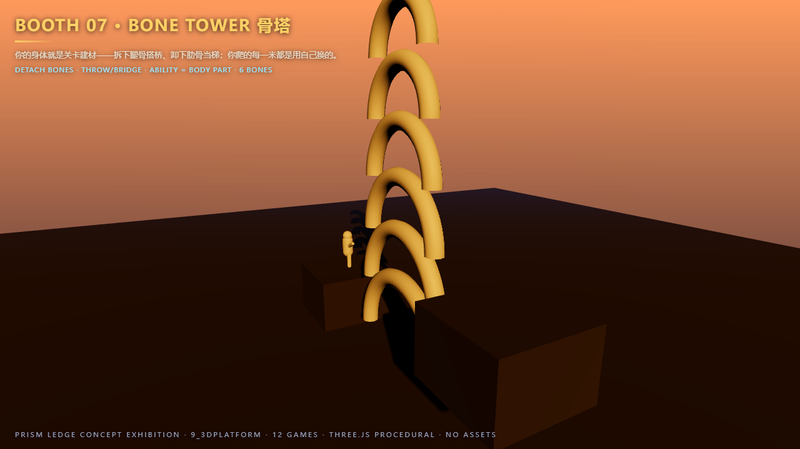

> **你的身体就是关卡建材——拆下腿骨搭桥，你爬的每一米都是用自己换的。**

- **命题**: 身体 = 资源 = 能力。拆腿不能跳，拆臂不能抓，拆颅视野收缩。
- **操作**: E 拆骨 · LMB 掷骨 · 走到骨旁接回 · 6 根骨经济
- **极致瞬间**: 当着玩家的面拆下左腿骨掷到断口变成骨桥，单腿跳过——整个过程 20 秒，玩家永久记住"身体是耗材"。
- **渲染**: ★☆ 骨质次表面高光
- **状态**: 概念草稿 · MGP 5.5–6 天

---

## BOOTH 08 · COMPASS ROT 罗盘坠

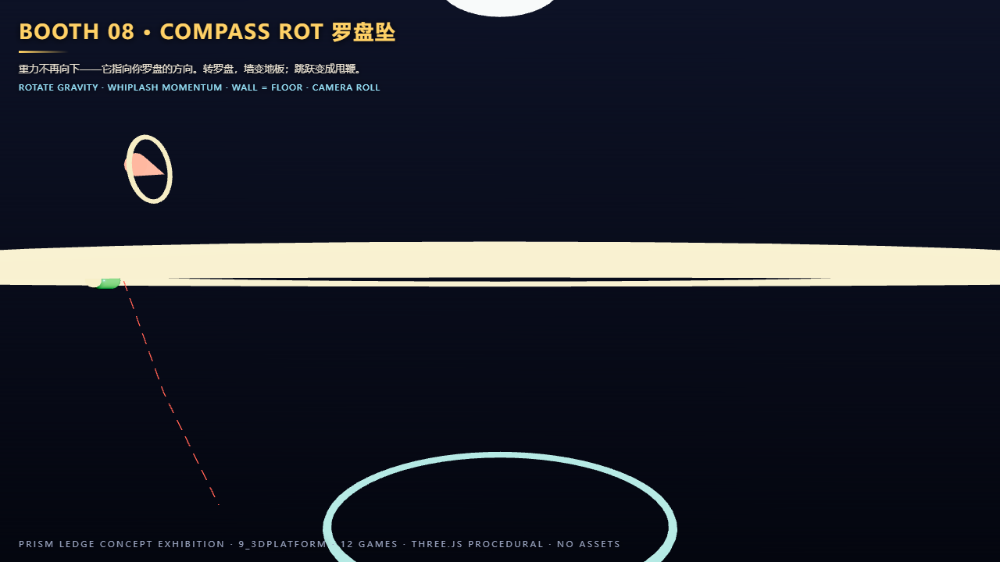

> **重力不再向下——它指向你罗盘的方向。转罗盘，墙变地板；跳跃变成甩鞭。**

- **命题**: 重力绕你转。转罗盘不是瞬移，是坠落在弧线上甩尾——平台跳跃变成甩鞭。
- **操作**: 滚轮/QE 转罗盘 · 甩鞭（空中转罗盘动量切向保留）· 镜头随重力滚转
- **极致瞬间**: 无平台的 12m 轮房——逆时针甩 3 鞭：坠向右墙 → 甩上墙跑 → 甩上天花板 → 甩上轮顶，12 秒内"上"变了 4 次。
- **渲染**: ★★ 抛光墙全景镜面
- **状态**: 概念草稿 · MGP 5.5–6 天

---

## BOOTH 09 · JENGA REACH 拆塔攀

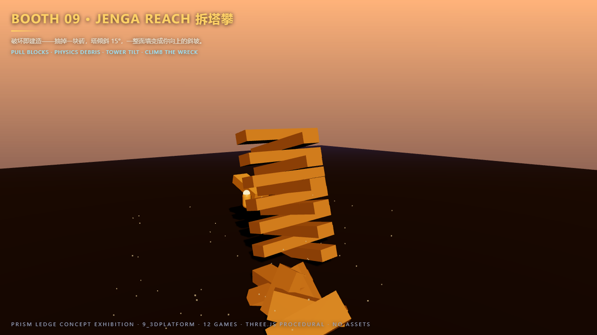

> **破坏即建造——抽掉一块砖，塔倾斜 15°，一整面墙变成你向上的斜坡。**

- **命题**: 破坏 = 建造。塔的结构强度 = 你的攀爬路线；每抽一块都是与物理的谈判。
- **操作**: 准星 + LMB 抽块 · 借力（抽块反冲 +1.5 m/s）· 塔稳定度资源
- **极致瞬间**: 抽掉支撑砖 → 塔身倾斜 15° 成 45° 斜坡，踩着正在下滑的砖狂奔 3 秒，在散架前跳上悬挑——身后 20 块砖轰然落地。
- **渲染**: ★☆ 废墟尘雾 + 塔顶灯火反射
- **状态**: 概念草稿 · MGP 5.5–6 天（物理抖动风险最高，附 Plan B）

---

## BOOTH 10 · WEATHERVANE 四季水灵

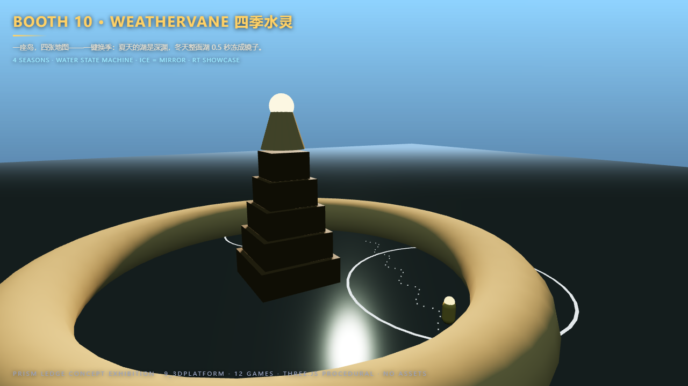

> **一座岛，四张地图——一键换季：夏天的湖是深渊，冬天整面湖 0.5 秒冻成镜子。**

- **命题**: 一座岛 = 四张地图。季节 = 水体状态机，换季不是换贴图，是换关卡。
- **操作**: 1/2/3/4 换季（夏水/秋滩/冬冰/春藤）· 冰面滑行 · 冰裂 20s 时效
- **极致瞬间**: 环岛全是湖水无路——按一下冬，30m 湖面冻成镜面冰（冰下光棱如藏宝图），踩冰逃过冰裂倒计时，一键换春攀藤登塔。
- **渲染**: ★★★ 冰镜 = 全游戏最强光追展示（SSR/RT 双层等价）
- **状态**: 概念草稿 · MGP 5.5–6 天

---

## BOOTH 11 · INKLINE 墨线

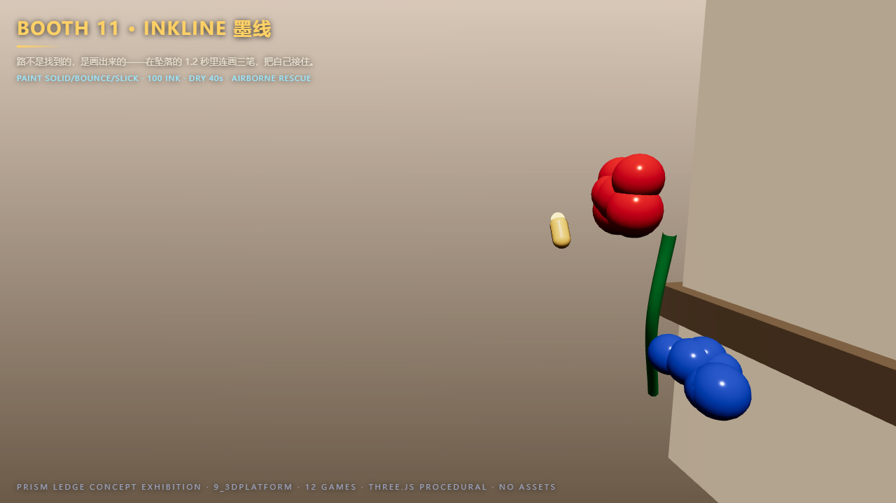

> **路不是找到的，是画出来的——在坠落的 1.2 秒里连画三笔，把自己接住。**

- **命题**: 创作 = 移动。射出的墨点在空中凝固成实体，连成线就是平台——玩家坠落的每一秒都是创造窗口。
- **操作**: LMB 红墨（实心）/ RMB 蓝墨（弹床）/ 滚轮绿墨（滑轨）· 墨量 100 · E 擦除回收
- **极致瞬间**: 8m 纯虚空——自由落体 1.2 秒里连画 3 笔：红接落点、蓝弹起、红再接，全程不落地，回放如书法。
- **渲染**: ★☆ 湿墨光泽反射
- **状态**: 概念草稿 · MGP 5.5–6 天

---

## BOOTH 12 · ORBITFALL 轨道坠

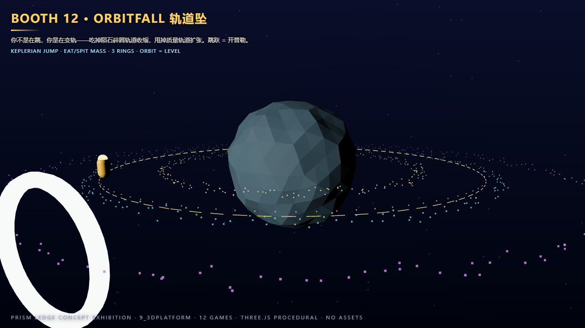

> **你不是在跳，你是在变轨——吃掉陨石碎屑轨道收缩，甩掉质量轨道扩张。跳跃 = 开普勒。**

- **命题**: 平台跳跃完全轨道化。唯一操作 = 切向脉冲 + 质量变化；玩家 30 秒内建立"低轨快、高轨慢"直觉。
- **操作**: Space 切向脉冲 · 接触吃碎屑 · E 吐质量 · WASD 相位调整
- **极致瞬间**: 从星球表面到外环 2 次变轨——切向跳起进入内环轨道（星球在脚下滚过），吃 3 块碎屑擦着星面掠过，甩掉全部质量被弹弓甩向外环。
- **渲染**: ★★ 星球表面反射玩家 + 轨道虚线
- **状态**: 概念草稿 · MGP 5.5–6 天

---

## 展后信息

- **实景渲染程序**: `../showcase/index.html`（`?scene=1..12` 切换展位，纯 three 0.170 core，零 addons、零 importmap、零资产文件）
- **截图**: `../showcase/screens/`（1280×720，每个场景 = 概念的极致瞬间冻结画面 + 展位铭牌）
- **选型**: 按 intro-scene-until-perfect Phase 0 决策树——命题证明力 > 教学力 > 极致 case。RT 主题契合最高 = 01/04/10；最 novelty = 02/03/07/09；风险最低 = 05/12
- **晋升**: 选定 1 个 → 拆 3 件套（GDD/Art Book/TDD）→ 顶层 `NN_xxx/` 项目（端口 5187+）
